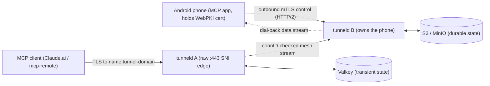

# tunneld — self-hosted end-to-end-encrypted tunnel

`tunneld` gives the Android MCP app a stable public hostname. The phone terminates TLS itself with a
publicly-trusted (WebPKI) certificate for `<name>.<tunnel-domain>`, earned by **attested enrollment**;
tunneld is the internet edge on raw TCP `:443`, peeks each ClientHello, routes on SNI, and splices the
**opaque encrypted byte stream** to the phone over an internal mTLS mesh — it can NEVER read tunnel
traffic. There is no reverse proxy (no Cloudflare, no Traefik).

See [`docs/PROJECT.md`](docs/PROJECT.md) for the operational reference,
[`docs/ARCHITECTURE.md`](docs/ARCHITECTURE.md) for the system map, and
[`docs/PROTOCOL.md`](docs/PROTOCOL.md) for the wire protocol.

## Architecture



The client's TLS lands on any replica (entry node A); A resolves `name → owner` via Valkey and either
bridges locally (fast path) or over the mesh to the owner (B), which dials back to the phone. The phone
terminates TLS — tunneld relays opaque bytes end to end.

## Deployment quickstart

Run **one replica per host** (this single-host compose runs one). Durable state is any plain-S3 bucket
(MinIO locally); transient state is Valkey.

1. **Generate the internal CA** (once) — the phone earns an identity cert signed by it:
   ```sh
   deploy/scripts/gen-ca.sh deploy/ca      # creates deploy/ca/{ca.pem,ca-key.pem}; compose mounts it at /ca
   ```
2. **Create the operator-owned dirs** (bind-mounted):
   ```sh
   mkdir -p deploy/logs deploy/acme            # acme persists per-CA account keys + reserved-host certs across restarts
   mkdir -p deploy/banfiles && : > deploy/banfiles/bans.txt   # host-edited manual bans (hot-reloaded within --ban-poll)
   mkdir -p deploy/attest && : > deploy/attest/signers.txt   # add accepted app signer SHA-256 digests, one per line
   ```
3. **Configure**:
   ```sh
   cp deploy/.env.example deploy/.env             # domains, S3 creds, DEPLOY_UID (= id -u), Grafana pw
   cp deploy/tunneld.env.example deploy/tunneld.env # CA/S3/attest/ACME + the lego DNS-provider secret
   ```
4. **DNS + ACME**: point `*.<tunnel-domain>`, `<enroll-host>`, and `<control-host>` at this host, and
   set `TUNNELD_ACME_DNS_PROVIDER` + its credential (tunneld runs ACME DNS-01 to issue the phone's public
   cert). Publish the CAA `issue` records for Let's Encrypt / GTS / ZeroSSL as an operator DNS step.
5. **S3**: for the local MinIO stand-in the compose creates the bucket automatically. For a real
   provider, set the `S3_*` / `TUNNELD_S_3_*` values and **run a pre-go-live read-after-write probe**
   (PUT → GET → overwrite-PUT → GET returns the newest body) — the name-claim protocol relies on it.
6. **Start**: `docker compose -f deploy/docker-compose.yml up -d`.
7. **ntfy** (first start): copy the bridge config
   (`cp deploy/ntfy-alertmanager/config.scfg.example deploy/ntfy-alertmanager/config.scfg` — the real
   `config.scfg` is gitignored), then create a read user for the phone and a write token for the bridge
   INSIDE the ntfy container:
   ```sh
   docker compose -f deploy/docker-compose.yml exec ntfy ntfy user add phone
   docker compose -f deploy/docker-compose.yml exec ntfy ntfy token add phone
   ```
   Set that token as `access-token` in `deploy/ntfy-alertmanager/config.scfg`, then restart the bridge so
   it picks up the token: `docker compose -f deploy/docker-compose.yml restart ntfy-alertmanager`.

**Never publish tunneld's mesh (`:9443`) or internal (`:9090`) ports** — only the raw edge `:443` is
public. The observability UIs (Grafana/Prometheus/Alertmanager/ntfy) bind to `127.0.0.1` only; reach
them via SSH forward.

**Prebuilt image (optional):** the Compose stack builds tunneld locally via `build:`. Multi-arch images
(linux/amd64 + linux/arm64) are published to `ghcr.io/danielealbano/tunneld` on `v*` tags — the image
tag is the version **without** the leading `v` (git tag `v1.0.0` → `ghcr.io/danielealbano/tunneld:1.0.0`).
Swap the `build:` for `image: ghcr.io/danielealbano/tunneld:1.0.0` to pull instead of build.

## Identity + authentication

Enrollment is **two-phase** and gated by Android hardware key attestation: Phase 1 (`/api/v1/enroll`,
server-TLS) verifies attestation + key binding, assigns a random tunnel name, and signs a bootstrap
identity (mTLS) cert; Phase 2 (`/api/v1/issue`, mTLS) issues the public WebPKI cert for `<name>.<tunnel-domain>`
via server-run ACME (Let's Encrypt → GTS → ZeroSSL). The phone authenticates with its identity cert over
its outbound HTTP/2 control connection; the replica mesh uses distinct mesh-role certs. There is **no
TLS mutual auth on the public side** (the edge relays opaque TLS). Revocation is the ban engine only.

**The tunnel authenticates nothing it relays** — it cannot; the bytes are opaque TLS. The phone's own
app is the sole authenticator, so a tunnelled deployment MUST keep the app's bearer/OAuth enabled.

## Caps (defaults; `--limit-*` / `TUNNELD_LIMIT_*` unless noted)

| Cap | Flag | Default |
|---|---|---|
| Bandwidth (per tunnel, per direction) | `--limit-bandwidth` | `1mbit` |
| Reads/packets per second (per tunnel, per direction) | `--limit-packets` | `100` |
| Traffic / tunnel / 24h window (UTC-aligned, per direction) | `--limit-traffic-day` | `1gb` |
| Traffic / tunnel / 7d window (epoch-aligned, per direction) | `--limit-traffic-week` | `4gb` |
| Concurrent data streams / tunnel | `--limit-concurrent` | `4` |
| New connections / source IP | `--limit-conn-rate` | `10`/s |
| Enrollments / source IP | `--limit-enroll-hour` / `--limit-enroll-minute` | `20`/h AND `2`/min |
| Public-cert issuances / tunnel / 7d | `--issue-per-week` | `3` |

Caps are uniform — no per-path exceptions. Operators raise the `--limit-*` values.

## Ban / geo engine

One or more `--ban-file` (hot-reloaded on mtime), entries UNIONed. Line format:

```
# comment
ip 203.0.113.5
cidr 198.51.100.0/24
country XX
tunnel-name abcdef2345
tunnel-fingerprint sha256:<hex>
```

`country XX` entries are expanded at reload from a DB-IP Country Lite CSV (`--dbip-country-lite-csv`)
into a longest-prefix-match table (one lookup per connection); a missing CSV skips only the country
entries. **Country codes in this repo are placeholders (`XX`, `YY`) only.** The ban check is the FIRST
check on every ingress edge (public, `/api/v1/enroll`, `/api/v1/control`), keyed on the trusted client IP.

**Revocation** (there is no CRL — bans are the only revocation): revoke a tunnel or a source by editing
`deploy/banfiles/bans.txt` on the host (bind-mounted read-only at `/banfiles-manual/bans.txt`); the change
is hot-reloaded within `--ban-poll` and evicts any live matching connection.

## Observability

The internal listener (never published) serves `GET /metrics` (Prometheus; no per-tunnel labels),
`GET /healthz` (200 if Valkey reachable else 503), `GET /api/v1/admin/tunnels` (top-N per-tunnel counters), and
`POST /api/v1/admin/renew?tunnel=<name>` (force a renewal, routed to the owner node over the mesh).
Grafana/Prometheus/Alertmanager/ntfy publish on `127.0.0.1`-only ports (SSH-forward to reach them).

## Attribution

Country data: **DB-IP Country Lite** — © db-ip.com, licensed under
[CC BY 4.0](https://creativecommons.org/licenses/by/4.0/).
