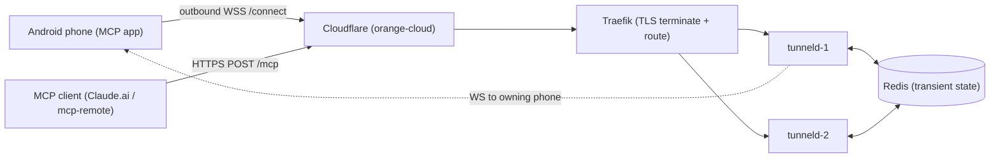

# tunneld — self-hosted HTTP tunnel

`tunneld` gives the Android MCP app a stable public hostname for free. The phone opens an outbound
WebSocket; the public web side is plain HTTP(S) behind a TLS-terminating reverse proxy; multiple
replicas bridge requests over Redis. Identity is a CA-signed certificate the phone earns by
enrollment; each `/connect` is authenticated at the **application layer** (challenge-response
proof-of-possession — NOT TLS mutual auth), so the tunnel works through Cloudflare's proxy.

See [`docs/PROJECT.md`](docs/PROJECT.md) for the operational reference,
[`docs/ARCHITECTURE.md`](docs/ARCHITECTURE.md) for the system map, and
[`docs/PROTOCOL.md`](docs/PROTOCOL.md) for the wire protocol.

## Architecture



The phone's `/connect` WebSocket lands on one replica (say `tunneld-1`). A public request may land on
either replica; the receiving replica resolves `name → node` via Redis and bridges the request over
`req:{node}` / `resp:{reqid}` to the replica holding the WebSocket, which forwards it to the phone.

## Deployment quickstart (orange-cloud reference)

1. **Generate the internal CA** (once):
   ```sh
   deploy/scripts/gen-ca.sh deploy/ca      # writes deploy/ca/{ca.pem,ca-key.pem}; compose mounts it at /ca
   ```
2. **Create the logs dir** (bind-mounted, operator-owned — the file log sink writes here):
   ```sh
   mkdir -p deploy/logs
   ```
3. **Configure**:
   ```sh
   cp deploy/.env.example deploy/.env
   cp deploy/tunneld.env.example deploy/tunneld.env
   # set DEPLOY_UID to `id -u` (tunneld runs as that uid so it can read the CA key + write logs)
   ```
4. **Cloudflare (orange-cloud)**: proxy `*.<tunnel-domain>`; use Advanced Certificate Manager (or a
   dedicated free zone) for the two-label edge cert; restrict the origin to Cloudflare — Traefik
   `IPAllowList` of Cloudflare's published ranges AND/OR Authenticated Origin Pulls — so
   `Cf-Connecting-Ip` is trustworthy. Keep `--ping-interval` and `--limit-request-timeout` under
   100 s (Cloudflare's WS-idle / 524 limits). Then `docker compose -f deploy/docker-compose.yml up -d`.
5. **ntfy** (first start): create a read user for the phone app (`ntfy user add`) and a write token
   for the bridge (`ntfy token add`), then set the token in `deploy/ntfy-alertmanager/config.scfg`.

**Grey-cloud alternative** (privacy-max): Traefik is the internet edge (DNS-only), no Cloudflare in
the path, `--client-ip-header=X-Real-Ip`, no `IPAllowList`.

**Prebuilt image (optional):** the Compose stack builds tunneld locally via `build:`. Multi-arch
images (linux/amd64 + linux/arm64) are also published to `ghcr.io/danielealbano/tunneld` on
`v*` tags — swap the tunneld services' `build:` for
`image: ghcr.io/danielealbano/tunneld:<tag>` to pull instead of build.

**Never publish tunneld's port.** The replicas have NO published ports — reachable only on the
compose network (Traefik + Prometheus). With orange-cloud the equivalent is "origin only reachable
from Cloudflare."

## Endpoint allowlist

The edge forwards ONLY the app's MCP + OAuth + share surface; everything else is `404`:

| Method + path | Behaviour |
|---|---|
| `POST /mcp`, `DELETE /mcp` | forwarded (NO edge auth — see below) |
| `GET /mcp` | `405` at the edge (`Allow: POST, DELETE`; SSE unsupported) |
| `OPTIONS` on any allowlisted path | forwarded (CORS preflight) |
| `POST /register`, `GET /authorize`, `GET /authorize/status`, `POST /token` | forwarded, unauthenticated |
| `GET /.well-known/oauth-protected-resource[/…]`, `…/oauth-authorization-server[/…]`, `…/openid-configuration` | forwarded, unauthenticated |
| `GET /s/{token}` (`^/s/[0-9a-f]{64}$`) | forwarded, unauthenticated |
| `/connect` (per-tunnel host) | reserved for the WebSocket manager (never forwarded) |

**The tunnel performs NO authentication on forwarded requests — the app is the sole authenticator.**
A token-less `POST /mcp` is forwarded so the app's own `401` carries the RFC 9728
`WWW-Authenticate: Bearer resource_metadata="…"` discovery header that OAuth connectors
(Claude.ai / `mcp-remote`) require; an edge `401` would swallow it and break the connect flow.

> **Consequence:** a phone in OPEN mode (no bearer/OAuth) is reachable **unauthenticated by anyone
> holding the tunnel hostname**. A tunnelled deployment MUST keep bearer or OAuth enabled on the app.

Any request carrying a client-cert / mTLS-indicating header on the public side is rejected `400`
(the app does not support client mTLS).

## Caps (defaults; all `--limit-*` / `TUNNELD_LIMIT_*`)

| Cap | Default | Over-limit |
|---|---|---|
| Bandwidth (per tunnel, per direction) | `1mbit` | paced |
| Requests / source IP | `10`/s, `100`/min | `429` + `Retry-After` |
| In-flight / tunnel | `4` | `429` |
| Request body | `1mb` | `413` |
| Response | `10mb` | `502` |
| Request headers | `16kb` total / `8kb` single | `431` |
| Request timeout | `60s` | `504` |
| Enrollments / source IP | `20`/h AND `2`/min | `429` + `Retry-After` |

These caps deliberately exclude bulk transfers (large `/s/` shares, large MCP bodies) — the tunnel is
a free service for MCP control traffic. There are NO per-path exceptions; operators may raise the
uniform `--limit-*` values.

## Ban / geo engine

One or more `--ban-file` (hot-reloaded on mtime), entries UNIONed. Line format:

```
# comment
ip 203.0.113.5
cidr 198.51.100.0/24
country XX
tunnel-name abcdef2345
tunnel-fingerprint sha256:<hex>
```

`country XX` entries are expanded at reload from a DB-IP Country Lite CSV (`--dbip-country-lite-csv`)
into the same longest-prefix-match table (one lookup per request); a missing CSV skips only the
country entries. **Country codes in this repo are placeholders (`XX`, `YY`) only** — configure real
codes in your private ban files. The ban check is the FIRST check on every ingress edge (public,
`/enroll`, `/connect`), keyed on the trusted `--client-ip-header` IP.

## Observability

The internal listener (never proxied) serves `GET /metrics` (Prometheus; no per-tunnel labels),
`GET /healthz` (200 if Redis reachable else 503), and `GET /admin/tunnels` (top-N per-tunnel
counters). Grafana/Prometheus/Alertmanager sit behind the proxy's basic-auth; ntfy uses its own auth.

## Attribution

Country data: **DB-IP Country Lite** — © db-ip.com, licensed under
[CC BY 4.0](https://creativecommons.org/licenses/by/4.0/).
