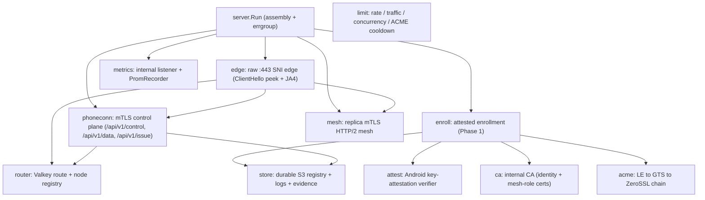
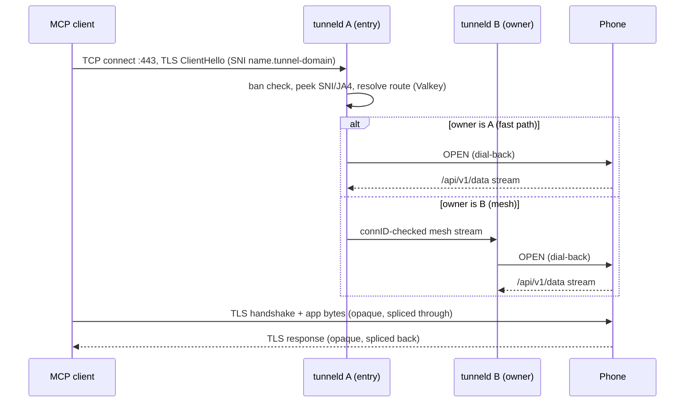

# tunneld — Architecture

This document maps the E2E-encrypted tunnel internals. The operational overview is
[`PROJECT.md`](PROJECT.md); the wire contract is [`PROTOCOL.md`](PROTOCOL.md); the decision record is
[Plan 3](plans/3_e2e_encrypted_tunneling_20260817175922.md).

## 1. Process anatomy

`tunneld serve` assembles everything in `server.Run` (constructor DI — no package globals) and runs it
under one `errgroup`. The public edge is a raw TCP `:443` listener; the phone control plane, the replica
mesh, and the internal metrics listener are separate servers. ALL construction — reserved-host cert
issuance included — completes BEFORE the `:443` and `:9443` listeners bind: a socket is never bound while
unserved (a cold-start issuance delays readiness, never leaves an accepting-but-dead port).

### Package map

| Package | Role |
|---|---|
| `internal/server` | assembly (`Run`), SNI-edge + listener wiring, schedulers, graceful shutdown |
| `internal/edge` | raw `:443` SNI edge: ClientHello peek + JA4, reserved-SNI local termination, bridge (fast path + mesh), connection policy (idle/min-rate/eviction) |
| `internal/phoneconn` | phone control plane (HTTP/2 + mTLS): `/api/v1/control` stream (OPEN dial-back, PING, RENEW_NUDGE), `/api/v1/data` dial-back, `/api/v1/issue` cert generation |
| `internal/enroll` | attested enrollment (Phase 1) + issuance (Phase 2 / renewal): nonce, seven-point gate, key binding, write-verify name claim, issuance cap |
| `internal/attest` | Android key-attestation verifier (KeyDescription parse, roots/status refreshers, signer allowlist) |
| `internal/acme` | LE→GTS→ZeroSSL issuance chain (lego DNS-01, spillover, per-CA cooldown/backoff retry-after, self-heal) |
| `internal/ca` | internal CA: identity certs (CN = tunnel name) + short-lived mesh-role certs (SAN = node id) |
| `internal/mesh` | replica↔replica mTLS HTTP/2 mesh: per-pair pools, connID-checked delivery |
| `internal/router` | Valkey routing registry (bind/heartbeat/unbind/lookup) + node registry |
| `internal/limit` | rate windows, enroll quota, global stream counter, per-second bandwidth + packet windows, ACME cooldown |
| `internal/store` | durable S3 name registry (write-verify claim), connection logs, rejected-enroll evidence, lifecycles |
| `internal/ban` | ban/geo LPM engine, DB-IP expansion, file watcher |
| `internal/config` | kong flag surface + `TUNNELD_*` env twins + `Validate()` |
| `internal/wire` | v1 control-frame codec + the ChunkSize pacing constant |
| `internal/metrics` / `internal/admin` / `internal/caplog` / `internal/observ` | metrics + `/api/v1/admin/tunnels/list` & `/stats` composer + deduped cap logger + the Recorder interface |
| `internal/logging` | `log/slog` fan-out + composite `--log` sinks |
| `internal/tunneltest` | shared test fakes + the testcontainers harness |

## 2. Public connection lifecycle

The entry node accounts bytes (day/week traffic), paces bandwidth against the per-second byte + packet
windows, and enforces the connection policy; the owner node (on the mesh path) only relays. The phone terminates TLS with its
WebPKI cert (a hermetic Pebble CA stands in for the test tiers) — tunneld never sees plaintext.

## 3. Enrollment, issuance, renewal

Enrollment is two-phase (see [`PROTOCOL.md`](PROTOCOL.md) §2): Phase 1 (`/api/v1/enroll`, server-TLS) verifies
attestation + key binding, write-verify-claims a name in S3, and signs a bootstrap identity cert; Phase
2 (`/api/v1/issue`, mTLS) re-verifies attestation, rotates the identity cert, and obtains the public cert for
`<name>.<tunnel-domain>` via the ACME chain. Renewal is the SAME `/api/v1/issue` endpoint, triggered by a
`RENEW_NUDGE{nonce}` on the control stream; the server-run chain applies LE-first migration + spillover.
The name registry record carries the cert metadata; the reserved-host (`--enroll-host`/`--control-host`)
certs are obtained by the server itself (`ObtainSelf`) at startup and renewed on schedule.

## 4. Unified per-window limit model

Every read charges ONE unified `Charge` against ALL four per-window counters in a single plain pipelined
round-trip (`INCRBY`/`INCR` + `EXPIRE … NX` — **NO Lua**, **NO TxPipeline**): the per-second byte window
`bw:{name}:{dir}:{unix_second}`, the per-second packet (read) window `pkt:{name}:{dir}:{unix_second}`, and
the per-direction day/week traffic windows `traf:{name}:{dir}:day:{unix_day}` /
`traf:{name}:{dir}:week:{unix_week}` (`unix_day = unix_second/86400` UTC-midnight days,
`unix_week = unix_day/7` epoch-aligned 7-day blocks — clock-aligned, so a window's reset is computed from
the clock with no `PTTL` read). The returned action is: **Proceed** (under all caps → forward now);
**Wait** (over a cap whose window resets within `maxPacingWait` = 5 s → wait that long, then forward — the
wait IS the pacing); or **Kill** (over a cap whose window resets beyond 5 s → end the stream). Bandwidth is
the always-`Wait` case (a per-second window resets in ≤ 1 s); day/week are almost always `Kill` (reset
hours/days away) except in the last ≤ 5 s of a window. `Kill` takes precedence over `Wait` (an exhausted far
window can't be waited out). `EXPIRE NX` self-heals a skipped TTL on the next same-window write, so strict
atomicity is unwarranted for these transient windows; a Valkey ERROR yields `Proceed` (fail-open — pacing
never hard-depends on the control plane). Each key's TTL is its window plus a small fixed 1 h margin
(per-second = 3 s, day = 25 h, week = 7 d + 1 h). An exhausted day/week window also refuses NEW streams at
admission (`TrafficExhausted`, read-only). `wire.ChunkSize` = 16384 is the paced-copy read slice, so the
per-second overshoot is bounded by `byteCap + N_concurrent × 16 KiB` / `pktCap + N_concurrent`.

## 5. Valkey state (all transient — every key TTL'd in the same round-trip: SET EX / a SETNX lock / a pipelined EXPIRE NX; NO Lua/WATCH/MULTI-EXEC)

Routing (`tunnel:{name}` → owner/fp/connID + merged byte counters, create/delete serialized by the per-name `lock:{name}`, owner-conditional teardown on `connID`), node registry
(`node:{id}` → JSON `{advertise, hostname, version, started_at, last_heartbeat}`, exposed via `/api/v1/admin/nodes`), rate-limit windows, the per-direction day/week traffic windows
(`traf:{name}:{dir}:day/week:{n}`, written via the same pipelined `EXPIRE NX` as the `bw:`/`pkt:` windows),
the global concurrency counter (`conc:{name}`, a lock-guarded `{connID, count}` hash: a fresh connection's
first acquire STRUCTURALLY resets it and a straggler release from a superseded connection is a no-op; TTL =
3 × `--limit-conn-idle`, refreshed by every traffic chunk via the `Charge` pipeline's `PEXPIRE` that no-ops
on a missing key), the merged per-tunnel byte counters (in `tunnel:{name}`, existence-guarded flush), single-use enrollment nonces, and per-CA ACME
cooldown/backoff. No permanent Valkey state; a stale connection never clobbers a re-bound route.
Connection/stream ids are 8 lowercase
hex chars (4 `crypto/rand` bytes); a bind whose id collides with the current route owner re-rolls the id
and retries (bounded), so the owner-conditional guarantee is deterministic, not probabilistic.

## 6. Durable S3 state

`internal/store` uses plain `GetObject`/`PutObject`/`DeleteObject` only (no conditional writes): the name
registry (`names/<name>`), connection logs (`tunnel-logs/<name>/…`), and rejected-enroll evidence
(`rejected-enroll/…`). Name uniqueness is the **write-verify claim**: GET (absent) → PUT a claim nonce
under a hard timeout (SDK retries disabled) → settle wait (strictly > the PUT timeout) → GET-verify the
nonce. Object-lifecycle expiration (logs 90d, rejected-enroll 30d) is applied programmatically at
startup by `EnsureLifecycles`.

## 7. Ban engine

`internal/ban` parses the union of `--ban-file`s into an atomic-swap longest-prefix-match table over
`netip`; `country XX` entries expand from the DB-IP CSV at reload. `ban.Watch` hot-reloads on mtime and,
on a reload, evicts BOTH the newly-banned tunnel's live phone control connection (`EvictBanned`) AND its
in-flight public splices (`EvictBannedStreams`, `close_reason=ban-evict`) — bans are the only revocation,
so a reload must stop live traffic, not just new admissions. A `--ban-file` or the DB-IP CSV that was
present at the last successful load but VANISHES at runtime is refused: the previous snapshot is kept
(Error-logged, retried), never silently unbanning (a first-deploy absence stays a benign skip). The ban
check is the FIRST handler-level check on every ingress edge.

Ban inputs are loaded **exactly once** at startup (synchronously, before any listener binds); the watcher
then polls and reloads with **build-verify-commit** — it builds the snapshot, re-reads the input
fingerprint, and swaps the new snapshot in ONLY when the read is stable, so a non-atomic writer caught
mid-truncate never becomes the live snapshot. The attestation **signer-digest allowlist** follows the same
vanished-file discipline: a deleted allowlist file keeps the previous digest set (Error-logged), never
silently allowing every signer.

## 8. Observability wiring

`observ.Recorder` is the consumer-site interface (implemented by `metrics.PromRecorder`, faked in tests).
The internal listener serves `/metrics` (custom registry, aggregate families only), `/healthz`,
`/api/v1/admin/tunnels/list?cursor=&count=` (a paginated tunnel-name list — ONE SCAN step, no ranking) +
`/api/v1/admin/tunnels/stats` (POST names → per-tunnel node/bytes/conc/bw/day/week, live tunnels only),
`/api/v1/admin/nodes` (the node registry: id → `{advertise, hostname, version, started_at, last_heartbeat}`), and
`POST /api/v1/admin/renew?tunnel=<name>` (force a RENEW_NUDGE, routed to the owner node over the mesh
`/api/v1/mesh/control` RPC — see PROTOCOL.md §5).

### Registered rejection reasons (`tunneld_rejections_total{reason}`)

The label set is EXACTLY `observ.RejectReasons` (pre-registered; `PromRecorder.Reject` refuses any
other string, so labels cannot be invented at call sites). The writers:

| Reason(s) | Writer |
|---|---|
| `ban` | edge accept, enroll handler, phone control handler (each ban gate) |
| `no-route`, `handshake-timeout`, `conn-rate`, `max-clients` | edge accept/dispatch |
| `quota-day`, `quota-week` | bridge admission (one per NEW stream refused on an exhausted window) |
| `stream-cap` | bridge (global per-tunnel stream counter refusal) |
| `attest-*`, `csr-mismatch`, `enroll-limit`, `issuance-cap`, `acme-failed` | enroll/issuance service |

Distinct signals, no double-counting: `QuotaExhausted(tunnel, window)` fires when an IN-FLIGHT stream
hits the window (its LOG is caplog-deduped), and forced closures of existing connections (`min-rate`,
`evicted`, `idle-timeout`, `quota-exhausted`, `cert-expired`, `ban-evict`, …) are recorded via
`PublicConnClose(reason)` / `PhoneConnClose(reason)` — never via `Reject`.
`tunneld_enrollments_total{result}` carries the enrollment outcome;
`tunneld_attest_verify_total{result}` the attestation verdicts; and
`tunneld_acme_renew_total{ca,result}` the tunnel-cert renewal outcomes (`ca="all"` on a failure, since
every CA in the chain declined).

Cap-hit logs are deduped via `internal/caplog` (first hit per `(tunnel, reason)` immediately, then ≤1
summary/min) for every reason EXCEPT `no-route`: a `no-route` rejection's tunnel value is
attacker-controlled (raw SNI / unrouted name), so it is metric + Debug-line only — it never keys the
dedup map nor emits a WARN, making log-flooding via that path impossible.

Connection-log writes to S3 are ASYNC (`store.AsyncConnLog`): enqueue is O(1) and never blocks an
admission, splice, or teardown path. A fixed pool of 8 workers drains a bounded 5000-event queue with
per-item exponential retry; a full queue drops the newest event and increments
`tunneld_connlog_dropped_total`. The queue is drained (bounded) at shutdown so `server-shutdown` end
events land.

## 9. Shutdown

```mermaid
flowchart LR
  cancel["ctx cancel"] --> close["close raw :443 listener (stop new public conns)"]
  close --> phones["close live phone conns (server-shutdown): teardown unbinds routes + enqueues end events"]
  phones --> drain["Shutdown enroll / control / mesh / internal servers"]
  drain --> join["join public handlers (Edge.Wait): splice + end-event enqueue + slot release returned"]
  join --> group["errgroup unwinds: schedulers + watchers on the drain ctx"]
  group --> queue["drain conn-log queue: server-shutdown end events land"]
  queue --> flush["final admin flush + cap-log flush"]
  flush --> dereg["Node explicitly deregistered (TTL = crash backstop)"]
```

Live public splices are cancelled by the drain context and record `close_reason=server-shutdown`
(`evicted` is reserved for saturation eviction, `ban-evict` for a ban reload). The ordering is load-bearing:
the public handlers are joined (`Edge.Wait`) so every end event is ENQUEUED, then the async conn-log queue
is drained, and only then the admin/cap-log final flush runs — so no end event or counter delta is lost.

## 10. Configuration

Config is a kong flag surface with `TUNNELD_*` env twins (note `--s3-*` → `TUNNELD_S_3_*`), validated
fail-fast in `Validate()`. Byte sizes are BINARY (`1mb` = 1048576); bitrates are DECIMAL bits
(`1mbit` = 125000 B/s). Full flag list: `tunneld serve --help`.
