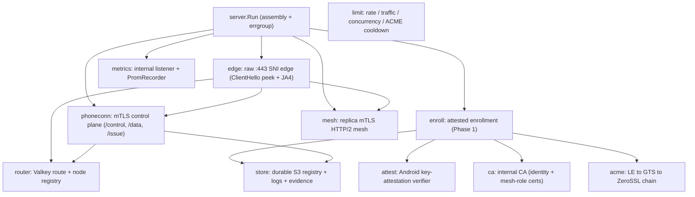
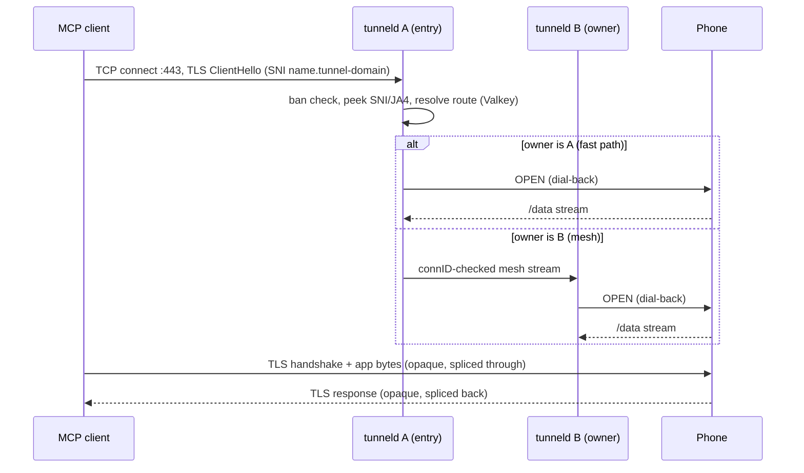
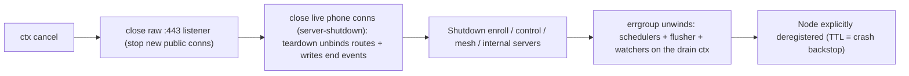

# tunneld — Architecture

This document maps the E2E-encrypted tunnel internals. The operational overview is
[`PROJECT.md`](PROJECT.md); the wire contract is [`PROTOCOL.md`](PROTOCOL.md); the decision record is
[Plan 3](plans/3_e2e_encrypted_tunneling_20260817175922.md).

## 1. Process anatomy

`tunneld serve` assembles everything in `server.Run` (constructor DI — no package globals) and runs it
under one `errgroup`. The public edge is a raw TCP `:443` listener; the phone control plane, the replica
mesh, and the internal metrics listener are separate servers.

### Package map

| Package | Role |
|---|---|
| `internal/server` | assembly (`Run`), SNI-edge + listener wiring, schedulers, graceful shutdown |
| `internal/edge` | raw `:443` SNI edge: ClientHello peek + JA4, reserved-SNI local termination, bridge (fast path + mesh), connection policy (idle/min-rate/eviction) |
| `internal/phoneconn` | phone control plane (HTTP/2 + mTLS): `/control` stream (OPEN dial-back, PING, RENEW_NUDGE), `/data` dial-back, `/issue` cert generation |
| `internal/enroll` | attested enrollment (Phase 1) + issuance (Phase 2 / renewal): nonce, seven-point gate, key binding, write-verify name claim, issuance cap |
| `internal/attest` | Android key-attestation verifier (KeyDescription parse, roots/status refreshers, signer allowlist) |
| `internal/acme` | LE→GTS→ZeroSSL issuance chain (lego DNS-01, spillover, per-CA cooldown/backoff retry-after, self-heal) |
| `internal/ca` | internal CA: identity certs (CN = tunnel name) + short-lived mesh-role certs (SAN = node id) |
| `internal/mesh` | replica↔replica mTLS HTTP/2 mesh: per-pair pools, connID-checked delivery |
| `internal/router` | Valkey routing registry (bind/heartbeat/unbind/lookup) + node registry |
| `internal/limit` | rate windows, enroll quota, global stream counter, batch-credit bandwidth bucket, ACME cooldown |
| `internal/store` | durable S3 name registry (write-verify claim), connection logs, rejected-enroll evidence, lifecycles |
| `internal/ban` | ban/geo LPM engine, DB-IP expansion, file watcher |
| `internal/config` | kong flag surface + `TUNNELD_*` env twins + `Validate()` |
| `internal/wire` | v2 control-frame codec + the ChunkSize pacing constant |
| `internal/metrics` / `internal/admin` / `internal/caplog` / `internal/observ` | metrics + `/admin/tunnels` + deduped cap logger + the Recorder interface |
| `internal/logging` | `log/slog` fan-out + composite `--log` sinks |
| `internal/tunneltest` | shared test fakes + the testcontainers harness |

## 2. Public connection lifecycle

The entry node accounts bytes (day/week traffic), paces bandwidth from the shared batch-credit bucket,
and enforces the connection policy; the owner node (on the mesh path) only relays. The phone terminates TLS with its
WebPKI cert (a hermetic Pebble CA stands in for the test tiers) — tunneld never sees plaintext.

## 3. Enrollment, issuance, renewal

Enrollment is two-phase (see [`PROTOCOL.md`](PROTOCOL.md) §2): Phase 1 (`/enroll`, server-TLS) verifies
attestation + key binding, write-verify-claims a name in S3, and signs a bootstrap identity cert; Phase
2 (`/issue`, mTLS) re-verifies attestation, rotates the identity cert, and obtains the public cert for
`<name>.<tunnel-domain>` via the ACME chain. Renewal is the SAME `/issue` endpoint, triggered by a
`RENEW_NUDGE{nonce}` on the control stream; the server-run chain applies LE-first migration + spillover.
The name registry record carries the cert metadata; the reserved-host (`--enroll-host`/`--control-host`)
certs are obtained by the server itself (`ObtainSelf`) at startup and renewed on schedule.

## 4. Bandwidth model

Per-tunnel, per-direction pacing draws from ONE **global Valkey token bucket** (`bw:{name}:{dir}`,
refilled in-script) in **~1 MB batches** into a per-stream local credit — the data plane hits the
control plane about once per megabyte moved, never per 32 KiB slice (a synchronous per-slice Valkey
call was rejected). An empty bucket blocks the copy in short refill waits (that wait IS the pacing); a
Valkey ERROR fails open so pacing never hard-depends on the control plane. Byte ACCOUNTING (day/week
traffic) is recorded per chunk via a TTL'd Lua INCR; an exhausted window refuses NEW streams at
admission and closes in-flight streams. `wire.ChunkSize` = 32768 is the paced-copy slice size.

## 5. Valkey state (all transient — TTL atomic with the write, single Lua)

Routing (`route:{name}` → owner/fp/connID/epoch, owner-conditional teardown on `connID`), node registry
(`node:{id}` → advertise), rate-limit windows, the global concurrency counter, per-tunnel counters
(`tcnt:{name}`), single-use enrollment nonces, and per-CA ACME cooldown/backoff. No permanent
Valkey state; a stale connection never clobbers a re-bound route.

## 6. Durable S3 state

`internal/store` uses plain `GetObject`/`PutObject`/`DeleteObject` only (no conditional writes): the name
registry (`names/<name>`), connection logs (`tunnel-logs/<name>/…`), and rejected-enroll evidence
(`rejected-enroll/…`). Name uniqueness is the **write-verify claim**: GET (absent) → PUT a claim nonce
under a hard timeout (SDK retries disabled) → settle wait (strictly > the PUT timeout) → GET-verify the
nonce. Object-lifecycle expiration (logs 90d, rejected-enroll 30d) is applied programmatically at
startup by `EnsureLifecycles`.

## 7. Ban engine

`internal/ban` parses the union of `--ban-file`s into an atomic-swap longest-prefix-match table over
`netip`; `country XX` entries expand from the DB-IP CSV at reload. `ban.Watch` hot-reloads on mtime and
fires an `EvictBanned` hook so a newly-banned tunnel's live phone connection is dropped. The ban check
is the FIRST handler-level check on every ingress edge.

## 8. Observability wiring

`observ.Recorder` is the consumer-site interface (implemented by `metrics.PromRecorder`, faked in tests).
The internal listener serves `/metrics` (custom registry, aggregate families only), `/healthz`, and
`/admin/tunnels` (top-N from TTL'd Valkey counters, flushed asynchronously by a background flusher).

### Registered rejection reasons (`tunneld_rejections_total{reason}`)

The label set is EXACTLY `observ.RejectReasons` (pre-registered; `PromRecorder.Reject` refuses any
other string, so labels cannot be invented at call sites). The writers:

| Reason(s) | Writer |
|---|---|
| `ban` | edge accept, enroll handler, phone control handler (each ban gate) |
| `no-route`, `handshake-timeout`, `conn-rate`, `max-clients` | edge accept/dispatch |
| `quota-day`, `quota-week` | bridge admission (one per NEW stream refused on an exhausted window) |
| `stream-cap` | bridge (global per-tunnel stream counter refusal) |
| `attest-*`, `csr-mismatch`, `enroll-limit`, `issuance-cap`, `acme-failed` | enroll/issuance service |

Distinct signals, no double-counting: `QuotaExhausted(tunnel, window)` fires when an IN-FLIGHT stream
hits the window (its LOG is caplog-deduped), and forced closures of existing connections (`min-rate`,
`evicted`, `idle-timeout`, `quota-exhausted`, …) are recorded via `PublicConnClose(reason)` /
`PhoneConnClose(reason)` — never via `Reject`. `tunneld_enrollments_total{result}` carries the
enrollment outcome; `tunneld_attest_verify_total{result}` the attestation verdicts; and
`tunneld_acme_renew_total{ca,result}` the tunnel-cert renewal outcomes (`ca="all"` on a failure, since
every CA in the chain declined).

## 9. Shutdown

Live public splices are cancelled by the drain context and record `close_reason=server-shutdown`
(`evicted` is reserved for saturation eviction).

## 10. Configuration

Config is a kong flag surface with `TUNNELD_*` env twins (note `--s3-*` → `TUNNELD_S_3_*`), validated
fail-fast in `Validate()`. Byte sizes are BINARY (`1mb` = 1048576); bitrates are DECIMAL bits
(`1mbit` = 125000 B/s). Full flag list: `tunneld serve --help`.
