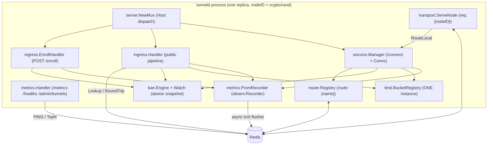
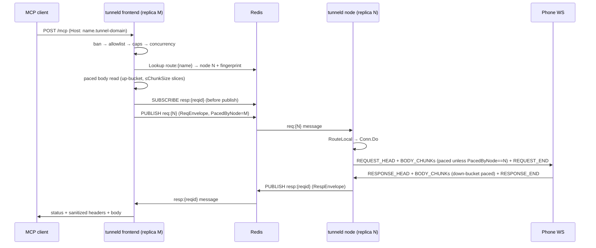
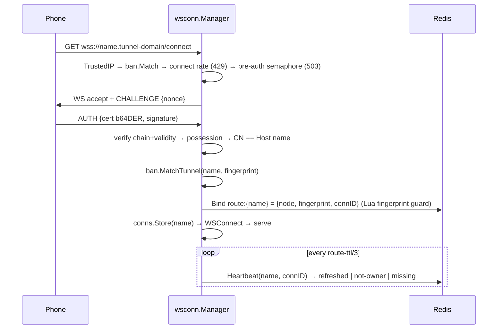
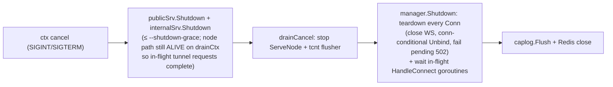

# tunneld — Architecture

System map of the tunneld process and its packages. Read [`PROJECT.md`](PROJECT.md) first for the
topology and product decisions; [`PROTOCOL.md`](PROTOCOL.md) is the canonical wire contract.

## 1. Process anatomy

One process (`tunneld serve`) runs two HTTP listeners plus the node-serving loop:

- **Public listener** (`--listen`, behind the proxy): Host-dispatch mux → enroll handler
  (`<enroll-host>`, `POST /enroll`), WebSocket manager (`/connect` on any per-tunnel host), or the
  public ingress pipeline (everything else).
- **Internal listener** (`--internal-listen`, never proxied): `/metrics`, `/healthz`,
  `/admin/tunnels`.
- **Node loop** (`transport.ServeNode`): subscribes to `req:{nodeID}` and bridges each delivered
  request to the locally-held phone WebSocket.

Wiring happens exclusively in `server.Run` (constructor DI, `errgroup`): Redis client, CA, ban
engine (initial load is SYNCHRONOUS, before any listener accepts — "ban-first" holds from the very
first request), routing registry, ONE `limit.BucketRegistry` (shared by the ingress paced reader
and the WS leg), the `observ.Recorder` implementation, and both HTTP servers.

### Package map

| Package | Responsibility |
|---|---|
| `cmd/tunneld` | kong CLI (`serve` / `version`), signal handling |
| `internal/config` | flag surface + `Validate()`; `ParseByteSize` (binary) / `ParseBitrate` (decimal) |
| `internal/logging` | slog fan-out; composite `--log` sinks (std severity-split, lumberjack files) |
| `internal/ban` | ban-file parser, `bart` LPM engine (atomic snapshot swap), DB-IP CSV expansion, mtime watcher |
| `internal/limit` | Redis fixed windows (`rl:*`), enroll quota, concurrency guard (`conc:*`), token buckets + registry |
| `internal/ca` | CA signer (`SignCSR`, P-256 only), name generation (reserved-label skip), cert/possession verification |
| `internal/clientip` | `TrustedIP` — the ONLY source of the abuse-control IP (right-most token) |
| `internal/router` | `route:{name}` bind/heartbeat/unbind/lookup; fingerprint guard; connID ownership |
| `internal/transport` | `RoundTrip` (subscribe-before-publish) + `ServeNode` per-message loop |
| `internal/wire` | frame codec (`ChunkSize` 32768), envelopes, header adapters, golden fixtures |
| `internal/wsconn` | `/connect` handshake, `Conn` (Do/read-pump), heartbeat/keepalive, `EvictBanned` |
| `internal/ingress` | public pipeline, allowlist, header sanitizer, paced body reader, enroll handler |
| `internal/server` | assembly (`Run`), Host-dispatch mux, graceful lifecycle |
| `internal/observ` | the `Recorder` interface (+ `Nop`) — the metrics boundary handlers depend on |
| `internal/metrics` | Prometheus registry, internal HTTP server, `PromRecorder` (+ async `tcnt` flusher) |
| `internal/admin` | `tcnt:{name}` counters (single-Lua HINCRBY+PEXPIRE) + `/admin/tunnels` TopN |
| `internal/caplog` | deduped cap-hit logger (first hit immediate, ≤1 summary/min, lazy flush) |
| `internal/tunneltest` | shared test fakes: capturing `Recorder`, raw-WS `FakePhone` |
| `client` | Go phone-side client: `Enroll`, `Connect` (challenge-response), backend bridge, backoff reconnect |

## 2. Public request lifecycle (cross-replica)

The ingress pipeline enforces, in order: trusted client IP (fail-closed `400`) → ban check
(`403`) → mTLS-header rejection (`400`) → route lookup (`404`) → tunnel-ban gate (`403`) →
allowlist (`404`/`405`) → header/body size caps (`431`/`413`) → per-IP rps/rpm (`429`) →
per-tunnel concurrency (`429`) → end-to-end deadline over the **paced** body read (`408` on
expiry) and the Redis round trip (`504` timeout, `502` publish failure / tunnel gone). There is
deliberately NO Authorization check at any step.

Key properties:

- **Subscribe-before-publish**: the frontend confirms the `resp:{reqid}` subscription is active
  before publishing, so a fast response can never be lost; the subscription is closed on every
  exit path.
- **One end-to-end deadline** (`--limit-request-timeout`) covers the paced body read AND the round
  trip — a client dribbling its body cannot hold a concurrency slot indefinitely.
- **Error discrimination**: `ErrTimeout` → `504`; publish failure → `502`; envelope
  `ErrCode="tunnel_gone"` → `502 tunnel_offline`; node-recorded synthetics
  (`response_too_large`, `phone_error`) pass through as-is without re-attribution.
- `ServeNode` runs each message's handler in its own goroutine under a per-message
  `WithTimeout` ctx; the response is published under the base ctx so a timed-out handler's
  synthetic reply is still delivered.

## 3. `/connect` lifecycle

- All pre-upgrade checks run BEFORE the WebSocket is allocated, so unauthenticated floods never
  hold sockets; the pre-auth semaphore (`--limit-connect-pending`) bounds concurrent handshakes.
- **Fingerprint guard**: `route:{name}` records the cert fingerprint; a bind for a name held by a
  DIFFERENT fingerprint is refused (distinct close + loud log). Same-fingerprint rebinds (phone
  reconnecting via any replica) are permitted.
- **connID ownership**: `Heartbeat`/`Unbind` mutate `route:{name}` only while its stored per-connection
  `connID` still matches — a stale connection's delayed teardown can never clobber the new
  connection's route, even on the same node.
- **Heartbeat three-state**: `refreshed` (still owner) · `not-owner` (superseded — close the local
  conn, do NOT unbind) · `missing` (TTL lapsed, e.g. Redis blip — SELF-HEAL by re-binding, since a
  live WS must never stay permanently unrouteable).
- **Liveness**: native WS pings every `--ping-interval` (Cloudflare-safe); a dead peer tears the
  conn down. There is no idle disconnect.
- **Live revocation**: the ban watcher's reload hook (`EvictBanned`) drops any live conn whose
  `(name, fingerprint)` became banned — required precisely because connections never idle out.
- **Multiplexing**: up to `--limit-concurrent` `Do` goroutines share one WS. `pending` is a
  `sync.Map` keyed by `reqid`; every data-frame write holds the single `writeMu` (released between
  frames so pings and other requests interleave); the blocking bandwidth `WaitN` is NEVER held
  under `writeMu`. The single read-pump owns reassembly, clamps untrusted phone-sent status codes,
  and enforces `--limit-response`.

## 4. Bandwidth model

Per-tunnel, per-direction token buckets (`rate = burst = 1 s` of `--limit-bandwidth`), **per
process**, from ONE `BucketRegistry` shared by the ingress and the WS manager (idle pairs are
evicted; callers acquire in ≤ `ChunkSize` slices):

- **Uploads**: the ingress reads the request body through a paced reader (TCP backpressure slows
  the client). It stamps `PacedByNode = <its nodeID>`; when the WS-owning node is the SAME
  process, `Conn.Do` skips the duplicate token drain (bytes were already drawn from this very
  bucket) but still records byte metrics for every chunk. A foreign `PacedByNode` IS paced at the
  WS leg — the owning node is the authoritative choke point.
- **Downloads**: the read-pump drains the down-bucket per `RESPONSE_BODY_CHUNK`. Client-side
  egress (writing the assembled response to the public client) is deliberately unpaced — it was
  already produced at the paced phone-leg rate.
- Cross-replica exactness was explicitly rejected: worst case aggregate ingress is replicas ×
  rate, while true tunnel throughput stays 1 × rate at the WS leg.

## 5. Redis state (all transient — TTL atomic with the write, single Lua)

| Key / channel | Content | TTL |
|---|---|---|
| `route:{name}` | `{node, fingerprint, connID}` | `--route-ttl` (30s), heartbeat-refreshed at TTL/3 |
| `rl:{scope}:{ip}:{windowStart}` | fixed-window counter (`rps`, `rpm`, `connect`, enroll scopes) | 2 × window |
| `conc:{name}` | in-flight request count (Lua: INCR → over-max ⇒ DECR+deny, else PEXPIRE) | 2 × `--limit-request-timeout` |
| `tcnt:{name}` | hash `bytes_in` / `bytes_out` / `requests` (async flusher, Lua HINCRBY+PEXPIRE) | 1 h |
| `req:{node}` / `resp:{reqid}` | pub/sub channels (envelopes: 4-byte BE header-len + JSON + raw body) | n/a |

No permanent Redis state exists, ever; Redis runs with persistence disabled in the compose stack.

## 6. Ban engine

`ban.Engine` holds an `atomic.Pointer` to an immutable snapshot: one `bart` LPM table (ip/cidr +
country-expanded prefixes, payload = source file/line/reason) plus name/fingerprint sets. Reload
(mtime poll, `--ban-poll`) parses all files, expands `country` entries from the DB-IP CSV
(range → prefixes via `netipx`), builds a FRESH snapshot, and swaps it in — the hot path is
lock-free, a load error keeps the previous snapshot, and absent files are skip-and-warn (first
deploy: the fetcher's output does not exist yet). A successful reload fires `EvictBanned`.

## 7. Observability wiring

Handlers depend on the `observ.Recorder` interface; `metrics.PromRecorder` implements it:

- `Reject(reason, tunnel, ip)` → `tunneld_rejections_total{reason}` + the deduped cap-hit log.
  Reason strings are the LITERAL registered label set — every label has a known writer.
- `Request`/`Bytes` → aggregate Prometheus families AND an in-process accumulator that a
  background flusher drains to `tcnt:{name}` (~5 s) — Redis is never on the data plane.
- WS lifecycle → connects/disconnects{reason} + the derived `tunneld_tunnels_connected` gauge.

Metric families carry NO per-tunnel labels; `/admin/tunnels` is the per-tunnel view.

## 8. Shutdown

The node-serving path runs on a separate `drainCtx` (derived from `Background`, not the parent
ctx) precisely so the listener drain can complete in-flight round trips before the WebSockets are
torn down. Clean shutdown leaves no `route:{name}` behind. Hijacked WS handlers are not tracked by
`http.Server.Shutdown`, so the manager tracks them itself (`connWG` + a closed-flag check that
covers the bind-during-shutdown race).

## 9. Configuration

The full flag table (every flag has a `TUNNELD_*` env twin) lives in `internal/config/config.go`;
`Validate()` fail-fasts on every cross-field invariant — mandatory `--client-ip-header`, the
bandwidth floor (`≥ 32768 B/s = wire.ChunkSize`, decimal-bit parsing), Cloudflare-compatible
durations (`--ping-interval ≤ 90s`, `--limit-request-timeout < 100s`), integer limits ≥ 1, and
parseability of every size/bitrate/log spec.
