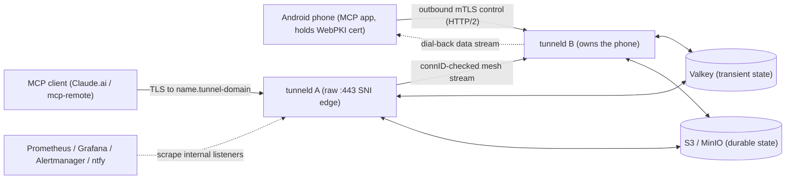

# tunneld — Project Reference

`tunneld` is a self-hosted, abuse-resistant **end-to-end-encrypted tunnel server** that gives the
Android MCP app (`android-remote-control-mcp`) a stable public hostname. The phone needs no inbound
port, no static IP, and no paid tunnel service. External clients (Claude.ai, `mcp-remote`) establish
TLS **directly with the phone**, which holds a publicly-trusted (WebPKI) certificate for its assigned
hostname `<name>.<tunnel-domain>`. tunneld is the internet edge on raw TCP `:443`: it peeks each
ClientHello (SNI/ALPN/version/JA4), routes on SNI, and splices the **opaque encrypted byte stream** to
the phone — it can NEVER read tunnel traffic.

This document is the operational entry point. The system internals live in
[`ARCHITECTURE.md`](ARCHITECTURE.md); the wire contract lives in [`PROTOCOL.md`](PROTOCOL.md); the
deployment quickstart lives in the [README](../README.md); the full decision record is
[Plan 3](plans/3_e2e_encrypted_tunneling_20260817175922.md).

## 1. Topology

One binary (`tunneld serve`) is the internet edge AND the tunnel bridge — there is **no reverse proxy**
(no Cloudflare, no Traefik). Run **one replica per host**; replicas bridge to each other over an
internal mTLS HTTP/2 **mesh** when a public connection lands on a node that is not the phone's owner.
**Valkey** holds transient control state (routing/rate-limit/concurrency — everything TTL'd); a plain
**S3** bucket (any provider; MinIO locally) holds the durable state (name registry, connection logs,
rejected-enrollment evidence).

**Never publish tunneld's mesh (`:9443`) or internal (`:9090`) ports** — only the raw edge `:443` is
public; the mesh + metrics are reachable on the internal network only. The tunnel relays opaque TLS, so
there is no proxy trust boundary and no `X-Forwarded-For` handling: the client's IP is the peer address
of the raw TCP connection.

## 2. Identity and authentication

- **Two-phase attested enrollment.** Phase 1 (server-TLS `POST /enroll` on `--enroll-host`): the phone
  submits an Android hardware key-attestation chain + an identity CSR; tunneld verifies the seven-point
  attestation predicate + key binding, assigns a random tunnel name (base32), and signs a bootstrap
  **identity (mTLS) cert** with its internal CA (CN = the assigned name). Phase 2 (mTLS `POST /issue` on
  `--control-host`): the phone — now knowing its name — submits a TLS CSR for `<name>.<tunnel-domain>`;
  tunneld re-verifies attestation, and issues the **public WebPKI cert** via server-run ACME. See
  [`PROTOCOL.md`](PROTOCOL.md) §2.
- **Server-run ACME chain**: Let's Encrypt → Google Trust Services → ZeroSSL, with automatic spillover,
  DNS-01, and short-lived certs renewed on a uniform ~4.7-day cadence. The phone holds the TLS private key;
  only CSRs leave it.
- **mTLS with role separation, NO public-side mutual auth.** The phone authenticates to tunneld with its
  identity cert over the outbound HTTP/2 control connection; replica↔replica mesh uses distinct
  **mesh-role** certs (SAN = node id). The public edge does NO client-cert auth (it relays opaque TLS).
- **Revocation is the ban engine ONLY** (no CRL): a `tunnel-name` / `tunnel-fingerprint` ban refuses new
  connections at the control plane, blocks the resolved route at the public edge, and on ban reload evicts
  BOTH the live phone control connection and every in-flight public splice (`close_reason=ban-evict`) —
  live traffic is stopped, not only new admissions.
- **The tunnel authenticates NOTHING it relays** — it cannot (the bytes are opaque TLS). The phone's own
  app is the sole authenticator; a tunnelled deployment MUST keep the app's bearer/OAuth enabled.

## 3. Public surface

The public edge is raw TCP `:443`. It peeks the ClientHello and dispatches by SNI:

| SNI | Behaviour |
|---|---|
| `<name>.<tunnel-domain>` | resolve the route → splice opaque TLS to the phone (local fast path or mesh) |
| `--enroll-host` | terminate locally: server-TLS enrollment endpoint (Phase 1) |
| `--control-host` | terminate locally: mTLS phone control plane (`/control`, `/data`, `/issue`) |
| anything else / no route | connection closed (`no-route`) |

There is no HTTP method/path allowlist on relayed traffic — the phone terminates TLS and enforces its
own routes. Client-supplied `X-Forwarded-*` are irrelevant (opaque relay).

## 4. Abuse containment

### Caps (defaults; `--limit-*` / `TUNNELD_LIMIT_*` unless noted)

| Cap | Flag | Default |
|---|---|---|
| Bandwidth (per tunnel, per direction) | `--limit-bandwidth` | `1mbit` (≥ 32768 B/s) |
| Traffic / tunnel / 24h window (both directions) | `--limit-traffic-day` | `1gb` |
| Traffic / tunnel / 7d window | `--limit-traffic-week` | `4gb` |
| Concurrent data streams / tunnel | `--limit-concurrent` | `4` |
| New public TCP connections / source IP | `--limit-conn-rate` | `10`/s |
| Enrollments / source IP | `--limit-enroll-hour` + `--limit-enroll-minute` | `20`/h AND `2`/min |
| Pre-bind control handshakes / node | `--limit-stream-pending` | `64` |
| All inbound connections / node | `--max-clients` | `10000` |
| Successful public-cert issuances / tunnel / 7d | `--issue-per-week` | `3` |
| Connection idle / min-rate / eviction | `--limit-conn-*` | see config |

Caps are uniform by design — no per-path exceptions, no bulk-transfer carve-outs. Operators raise the
`--limit-*` values; they never patch the code.

### Ban / geo engine

One or more `--ban-file` (hot-reloaded on mtime, entries UNIONed): `ip`, `cidr`, `country XX`,
`tunnel-name`, `tunnel-fingerprint`. `country` entries expand at reload from a DB-IP Country Lite CSV
into a longest-prefix-match table (one lookup per connection). The ban check is the FIRST handler-level
check on every ingress edge (public, `/enroll`, `/control`), keyed on the trusted client IP. Country
codes in repo artifacts are placeholders (`XX`/`YY`). The `fetcher` compose service keeps a Spamhaus
DROP-derived ban file and the DB-IP CSV fresh (atomic `mv` handoff).

## 5. State + retention

- **Valkey (transient, TTL'd):** routing entries, node registry, rate-limit windows, concurrency
  counters, per-tunnel counters, single-use enrollment nonces, ACME cooldown/backoff. Every key carries a
  TTL set atomically with its write. No permanent Valkey state.
- **S3 / MinIO (durable):** the name registry (`names/<name>`), connection logs (`tunnel-logs/…`), and
  rejected-enrollment evidence (`rejected-enroll/…`) — plain `GetObject`/`PutObject`/`DeleteObject` only
  (no conditional writes), so any plain-S3 provider works; name uniqueness comes from a write-verify
  claim protocol, not storage semantics. **PRE-GO-LIVE**, validate a provider with a read-after-write
  probe (PUT → GET → overwrite-PUT → GET returns the newest body).
- **Retention** (object-lifecycle rules applied programmatically at startup): name registry
  **indefinite**, connection logs **90 days**, rejected-enrollment evidence **30 days**, tunnel content
  **never** (it is opaque and never stored).

## 6. Observability

The internal listener (`--internal-listen`, never published) serves `GET /metrics` (Prometheus,
aggregate families only — NO per-tunnel labels), `GET /healthz` (`200` if Valkey is reachable), and
`GET /admin/tunnels` (top-N per-tunnel counters from TTL'd Valkey counters written asynchronously off
the data plane). Cap-hit events are logged deduplicated (first hit per `(tunnel, reason)` immediately,
then ≤1 summary/min) — EXCEPT `no-route`, whose tunnel value is attacker-controlled (raw SNI): it is
metric + Debug-line only, never keying the dedup map, so it cannot flood the logs. The compose stack
ships Prometheus, Grafana, Alertmanager, and ntfy on
`127.0.0.1`-only ports (reach them via SSH forward); alerts route to the phone via the ntfy bridge.
Secrets, key material, and tunnel payloads are NEVER logged.

## 7. Operations

- **Deployment quickstart** (CA generation, `.env`, S3, ACME/DNS): [README](../README.md).
- **Releases**: `v*` tags → goreleaser → linux amd64/arm64 archives + multi-arch image
  `ghcr.io/danielealbano/tunneld`.
- **Standard commands**: the Makefile (`build`, `lint`, `vet`, `govulncheck`, `test-unit`,
  `test-integration`, `test-e2e`, `test-scripts`, `compose-config`, `mermaid-check`). The integration
  and e2e tiers require Docker (testcontainers: Valkey, MinIO, Pebble).
- **Attribution**: country data is DB-IP Country Lite — © db-ip.com, CC BY 4.0 (the README carries the
  attribution; it MUST be preserved).

## 8. Non-goals

No database / persistent server-side identity store (the phone holds its cert). No authentication of
relayed traffic (it is opaque TLS; the app authenticates). No per-path cap exceptions or bulk transfers.
No CRL (bans are the only revocation). No per-slice-exact bandwidth accounting (batch-credit draws).
No server-side content storage or caching. No TLS mutual auth on the public side. The Android (Kotlin)
client lives with the app, not here.
