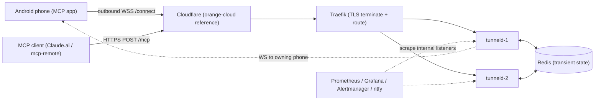

# tunneld — Project Reference

`tunneld` is a self-hosted, abuse-resistant HTTP tunnel server that gives the Android MCP app
(`android-remote-control-mcp`) a stable public hostname for free. The phone needs no inbound port,
no static IP, and no paid tunnel service: it opens an **outbound WebSocket** to its own hostname
(`wss://<name>.<tunnel-domain>/connect`), and MCP clients (Claude.ai, `mcp-remote`) reach the app
over ordinary HTTPS at `https://<name>.<tunnel-domain>/mcp`.

This document is the operational entry point. The system internals live in
[`ARCHITECTURE.md`](ARCHITECTURE.md); the wire contract lives in [`PROTOCOL.md`](PROTOCOL.md); the
deployment quickstart lives in the [README](../README.md); the full decision record is
[Plan 1](plans/1_self_hosted_tunnel_server_20260814130404.md).

## 1. Topology

One binary (`tunneld serve`), run as **N identical stateless replicas** behind a TLS-terminating
reverse proxy. The phone's WebSocket lands on one replica; a public request may land on any
replica; Redis pub/sub bridges the two. Redis holds **transient state only** (routing entries,
rate-limit counters — everything with a TTL); the phone's enrolled certificate is the only
persistent identity. There is no database.

### Deployment modes

| | Orange-cloud (reference) | Grey-cloud (privacy-max) |
|---|---|---|
| Internet edge | Cloudflare proxy (`*.<tunnel-domain>` proxied) | Traefik directly (DNS-only) |
| `--client-ip-header` | `Cf-Connecting-Ip` | `X-Real-Ip` |
| Origin protection | Traefik `IPAllowList` of Cloudflare ranges and/or Authenticated Origin Pulls — **origin reachable ONLY from Cloudflare** | Traefik is the edge; no allowlist |
| Edge certificate | Cloudflare ACM (or a dedicated free zone) for the two-label wildcard | Traefik's own ACME (DNS-01) |
| Privacy | Cloudflare sees tunnel plaintext | Traffic is origin-only |

In both modes the invariant is the same: **never publish tunneld's port** — the replicas are
reachable only on the compose network (Traefik + Prometheus), and the configured client-IP header
is trustworthy only because nothing but the trusted proxy can reach the origin.

### Cloudflare Free constraints (enforced by config validation)

- WS idle timeout 100 s → `--ping-interval` ≤ 90 s (default 30 s).
- Origin 524 timeout 100 s → `--limit-request-timeout` < 100 s (default 60 s).

## 2. Identity and authentication

- **Enrollment**: the phone generates an ECDSA P-256 keypair and POSTs a CSR to
  `https://<enroll-host>/enroll`. tunneld signs a leaf certificate with its internal CA, putting a
  randomly generated tunnel name (10 lowercase base32 chars) in the CN. Nothing is persisted
  server-side. Non-P-256 keys are rejected (`400 unsupported_key_type`).
- **`/connect`**: an ordinary WSS upgrade (Cloudflare-proxyable) followed by an application-layer
  challenge-response — the server sends a fresh nonce, the phone returns its certificate plus an
  ECDSA signature proving possession of the private key. **There is no TLS mutual auth anywhere.**
  Details and security invariants: [`PROTOCOL.md`](PROTOCOL.md) §2 and §6.
- **Revocation**: a `tunnel-name`/`tunnel-fingerprint` ban-file entry is the only mechanism (no
  CRL). It refuses new connects, blocks public ingress for the resolved route, and evicts live
  connections on ban-file reload.
- **The tunnel performs NO authentication on forwarded requests** — the app is the sole
  authenticator. A token-less `POST /mcp` is forwarded so the app's own `401` carries the RFC 9728
  `WWW-Authenticate` discovery header that OAuth connectors require. Consequence: a phone in OPEN
  mode (no bearer/OAuth) is reachable unauthenticated by anyone holding the hostname — a tunnelled
  deployment MUST keep bearer or OAuth enabled on the app.

## 3. Public surface (allowlist)

The edge forwards ONLY the app's MCP + OAuth + share surface; everything else is `404`:

| Method + path | Behaviour |
|---|---|
| `POST /mcp`, `DELETE /mcp` | forwarded (NO edge auth) |
| `GET /mcp` | `405` at the edge (`Allow: POST, DELETE`; SSE unsupported) |
| `OPTIONS` on any allowlisted path | forwarded (CORS preflight) |
| `POST /register`, `GET /authorize`, `GET /authorize/status`, `POST /token` | forwarded, unauthenticated |
| `GET /.well-known/oauth-protected-resource[/…]`, `…/oauth-authorization-server[/…]`, `…/openid-configuration` | forwarded, unauthenticated |
| `GET /s/{token}` (`^/s/[0-9a-f]{64}$`) | forwarded, unauthenticated |
| `/connect` (per-tunnel host) | reserved for the WebSocket manager (never forwarded) |

The allowlist's source of truth is the app's route code; requests carrying client-cert /
mTLS-indicating headers are rejected `400`.

## 4. Abuse containment

### Caps (defaults; all `--limit-*` / `TUNNELD_LIMIT_*`)

| Cap | Default | Over-limit |
|---|---|---|
| Bandwidth (per tunnel, per direction) | `1mbit` | paced |
| Requests / source IP | `10`/s, `100`/min | `429` + `Retry-After` |
| In-flight / tunnel | `4` | `429` |
| Request body | `1mb` | `413` |
| Response | `10mb` | `502` |
| Request headers | `16kb` total / `8kb` single | `431` |
| Request timeout (end-to-end) | `60s` | `504` (`408` if the body read is what expires) |
| Enrollments / source IP | `20`/h AND `2`/min | `429` + `Retry-After` |
| `/connect` attempts / source IP | reuses `--limit-rpm`, 1-min window | `429` |
| Pre-auth `/connect` handshakes / node | `64` | `503` |

Caps are uniform by design — no per-path exceptions, no bulk-transfer carve-outs. The tunnel is a
free service for MCP control traffic; operators may raise the `--limit-*` values.

### Ban / geo engine

One or more `--ban-file` (hot-reloaded on mtime, entries UNIONed): `ip`, `cidr`, `country XX`,
`tunnel-name`, `tunnel-fingerprint`. `country` entries are expanded at reload from a DB-IP Country
Lite CSV into the same longest-prefix-match table (one lookup per request). The ban check is the
FIRST check on every ingress edge, keyed on the trusted `--client-ip-header` IP. Country codes in
repo artifacts are placeholders (`XX`, `YY`) only. The `fetcher` compose service keeps a Spamhaus
DROP-derived ban file and the DB-IP CSV fresh (atomic `mv` handoff).

## 5. Observability

The internal listener (`--internal-listen`, never proxied) serves:

- `GET /metrics` — Prometheus, aggregate families only (NO per-tunnel labels).
- `GET /healthz` — `200` if Redis is reachable, else `503`.
- `GET /admin/tunnels` — top-N per-tunnel counters (bytes in/out, requests) from TTL'd Redis
  counters written asynchronously off the data plane.

Cap-hit events are logged deduplicated (first hit per `(tunnel, reason)` immediately, then at most
one summary per minute) so attackers cannot flood the logs. The compose stack ships Prometheus,
Grafana (provisioned dashboard), Alertmanager, and ntfy (self-authed) behind the proxy's
basic-auth; alerts route to the phone via the ntfy bridge.

## 6. Operations

- **Deployment quickstart** (CA generation, `.env`, Cloudflare setup): [README](../README.md).
- **Releases**: `v*` tags → goreleaser → linux amd64/arm64 archives + multi-arch image
  `ghcr.io/danielealbano/tunneld`.
- **Standard commands**: see the Makefile (`build`, `lint`, `vet`, `govulncheck`, `test-unit`,
  `test-integration`, `test-e2e`, `test-scripts`, `compose-config`, `mermaid-check`).
- **Attribution**: country data is DB-IP Country Lite — © db-ip.com, CC BY 4.0 (the README carries
  the attribution line; it must be preserved).

## 7. Non-goals

No database. No server-side authentication of forwarded requests. No per-path cap exceptions or
bulk transfers. No CRL. No cross-replica exact bandwidth accounting. No server-side caching. No
SSE on `/mcp`. No idle disconnect. The Android (Kotlin) client lives with the app, not here.
