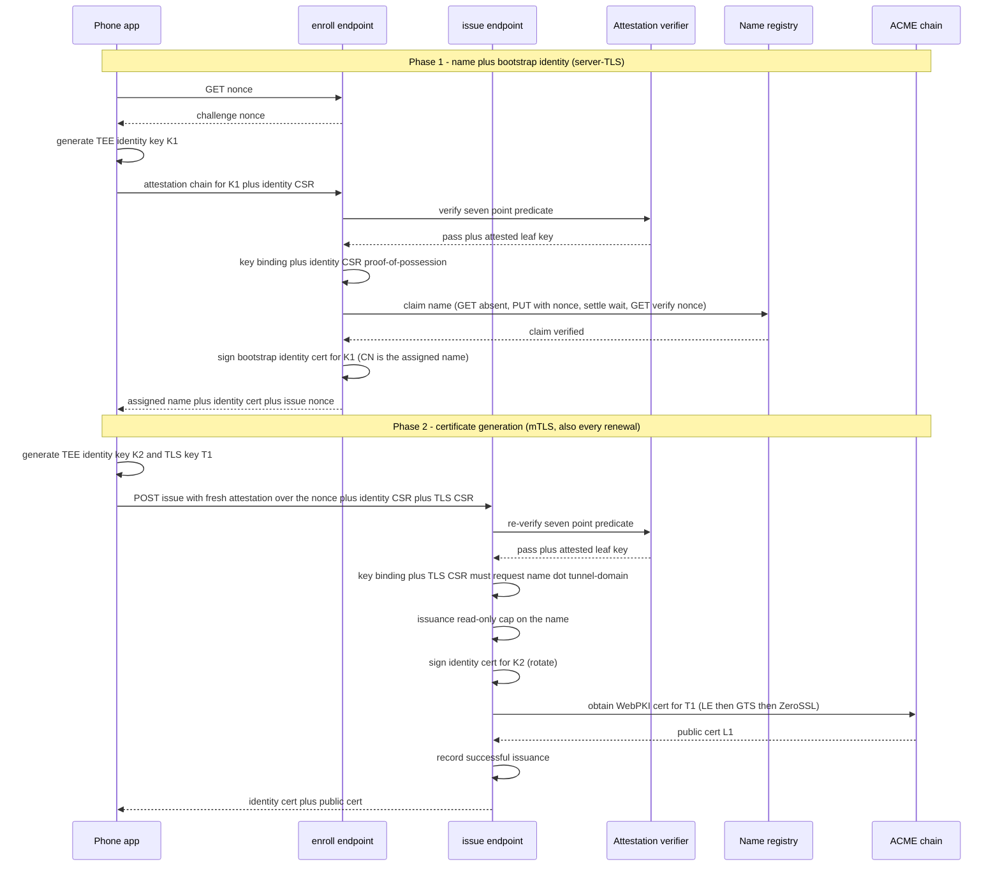

# tunneld Wire Protocol (v2 — End-to-End Encrypted)

This is the CANONICAL wire contract for the E2E-encrypted tunnel. The Go client in `client/` and the
Android (Kotlin) client both conform to THIS document, not to the Go source. `internal/wire` holds the
frame codec.

tunneld relays **opaque TLS bytes** and can NEVER read tunnel traffic: external clients establish TLS
directly with the phone, which holds a publicly-trusted (WebPKI) certificate for its assigned hostname.
tunneld is the internet edge (raw TCP `:443`), peeks the ClientHello (SNI/ALPN/version/JA4), routes on
SNI, and splices the encrypted byte stream to the phone over an internal HTTP/2 mesh.

## 1. Identity & authentication

- **No TLS mutual auth on the public side.** The phone authenticates to tunneld with an internal-CA
  **identity client certificate** over its outbound HTTP/2 **control connection** (mTLS). The assigned
  tunnel name is the certificate's **CN**; the server DERIVES the name from the CN (the phone dials the
  single shared `--control-host`, so there is no per-tunnel Host on the control connection).
- **Two TEE keys per tunnel**: the identity key (mTLS) and the TLS key (the public WebPKI cert). Both
  are generated in the phone's hardware keystore; only CSRs leave the phone.
- **Enrollment is gated by Android hardware key attestation** (seven-point predicate, §2) PLUS a
  **key-binding** check: the enrolled identity key MUST equal the attested TEE key, and the CSR
  signatures are verified (proof-of-possession — the identity CSR at Phase 1, the TLS CSR at Phase 2).
  This closes the "attest a real key, enroll a software key" bypass.
- **The tunnel name is server-assigned and server-dictated.** The public WebPKI cert is issued for
  `<name>.<tunnel-domain>`, where `<name>` is the random name the server assigned at Phase-1 enrollment
  and wrote into the identity cert CN; at issuance the server reads the name from the mTLS client-cert CN
  and REQUIRES the TLS CSR to request exactly `<name>.<tunnel-domain>`.
- **Revocation is the ban engine ONLY** (no CRL): tunnel-name / identity-fingerprint bans are enforced
  at the phone control connection, at the public SNI edge on the resolved route, and by live eviction
  on ban reload.

## 2. Enrollment (two-phase)

Enrollment is TWO phases. **Phase 1** (server-TLS `POST /enroll` on `--enroll-host`, no client cert —
the phone has no identity yet) verifies attestation, assigns + write-verify-claims the name, and signs a
**bootstrap identity cert** (CN = the assigned name). **Phase 2** (mTLS `POST /issue` on `--control-host`)
generates the certificates: because the server assigned the name in Phase 1, the phone learns it BEFORE
building the TLS CSR, so the public cert is issued for the server-dictated `<name>.<tunnel-domain>` while
the TLS private key never leaves the phone. Phase 2 regenerates the identity cert and the public cert
**together** and is also the single path for every renewal. The name registry uses a **write-verify
claim** over plain S3 (no conditional writes), so it runs on any S3 provider.

At Phase 2 and at every renewal the server reads the name from the **mTLS client-cert CN**, so the name
is fixed at Phase 1 and stays stable across renewals (which rotate the identity key). Phase 1 records the
claim; Phase 2 is retryable and its name is never rolled back.

**Seven-point attestation predicate** (ALL mandatory): chain roots at a Google attestation root ∧
`attestationChallenge == nonce` ∧ signing digest ∈ the hot-reloadable allowlist ∧ `securityLevel ≥
TrustedEnvironment` (Software rejected; StrongBox not required) ∧ `verifiedBootState == Verified` ∧
`deviceLocked == true` ∧ not revoked (status list refreshed with last-known-good; refused if `> 24h`
stale).

**Write-verify claim invariant**: the settle wait MUST strictly exceed the claim-PUT timeout, and
registry writes disable SDK auto-retries (a retried claim PUT would be a self-inflicted zombie write).

**Phase-1 HTTP surface** (server-TLS on `--enroll-host`, JSON, all binary blobs hex/PEM as noted):

- `GET /enroll/nonce` → `{"nonce": "<hex>"}` — a single-use challenge nonce (per-IP rate-limited).
- `POST /enroll` with `{"nonce": "<hex>", "attestation_chain": "<PEM bundle>", "identity_csr": "<PEM>"}`
  → `{"name": "<assigned>", "identity_cert": "<PEM>", "issue_nonce": "<hex>"}`. `issue_nonce` is the
  single-use nonce the phone echoes in its follow-up `POST /issue`. Errors are
  `{"reason", "retryable", "retry_after_seconds"?}` with an HTTP status (401 unauthorized, 503 retryable,
  400 otherwise).

## 3. Phone control connection (HTTP/2 + mTLS)

The phone opens ONE outbound HTTP/2 connection to `--control-host` (mTLS, identity client cert). It
carries:

- a long-lived **control stream** — a `POST /control` request whose **request body** is the phone→server
  frame stream (only `PONG`) and whose **response body** is the server→phone frame stream (`OPEN`,
  `PING`, `RENEW_NUDGE`). Both bodies are the length-framed control messages below; the server flushes
  each frame. The stream stays open for the connection's lifetime.
- one **data stream per public connection**, opened by the phone via **dial-back** (below).

Control-frame layout: `[type:1][payloadLen:4 BE][payload JSON]`. The type values are FROZEN:

| Frame | Type | Direction | Payload |
|---|---|---|---|
| `OPEN` | `0x01` | server→phone | `{stream_id}` — dial back for one public connection |
| `PING` | `0x02` | server→phone | (none) — application liveness |
| `PONG` | `0x03` | phone→server | (none) — liveness answer |
| `RENEW_NUDGE` | `0x04` | server→phone | `{nonce, ari_window}` — "renew now"; the phone answers by calling `POST /issue` |

The control stream carries only small frames. All certificate material (attestation chains, CSRs, issued
certs) — and every issuance/renewal ERROR — travels over the mTLS `POST /issue` endpoint below, NEVER the
stream. The only phone→server frame is `PONG` (liveness); a stream tears down via HTTP/2 `END_STREAM`,
never a control frame.

### `POST /issue` (mTLS certificate-generation endpoint)

`/issue` is the single cert-generation endpoint for BOTH the initial public cert (Phase 2) and every
renewal, authenticated by the phone's mTLS identity cert (name = its CN). Request/response are JSON:

- Request: `{nonce, attestation_chain, identity_csr, tls_csr}` — `nonce` is the Phase-1 `issue_nonce`
  (initial) or the `RENEW_NUDGE` nonce (renewal); `tls_csr` MUST request `<name>.<tunnel-domain>`.
- Response: `{identity_cert, public_cert, ca}` — the regenerated identity + public certs.

**Renewal rotates the identity key**: on a `RENEW_NUDGE{nonce}` the phone calls `POST /issue` with a
FRESH identity key + fresh TLS key + fresh attestation over the nonce; the server re-runs the full
seven-point predicate + key binding, rotates the identity cert (CN = the mTLS CN), renews the public cert,
and returns both in the response. The connection stays up on the old certs until the response installs
the new ones.

## 4. Data stream (opaque splice)

On `OPEN{stream_id}` the phone dials back with a `POST /data` request carrying the **`X-Stream-Id`**
header set to that `stream_id` (this is how the server correlates the dial-back to the waiting public
connection). The **request body** is the phone→client byte direction; the **response body** is the
client→phone direction. Both are a **raw, bidirectional, opaque byte splice** carrying the client↔phone
TLS session — NO framing (HTTP/2 provides framing; `END_STREAM` is the teardown signal). `wire.ChunkSize`
(32768) is the bandwidth-pacing slice size the bridge reads, NOT a wire frame. (An unknown/expired
`X-Stream-Id` gets a `404`.)

## 5. Replica mesh

When the accepting edge node is not the node holding the phone, it bridges to the owner over an internal
HTTP/2 mTLS mesh (mesh-role certs, SAN = node id). A mesh stream is a `POST /mesh` whose identity
travels in the request headers `X-Tunnel`, `X-Conn-Id`, and `X-Stream-Id`; the request/response bodies
are the opaque splice. The owner verifies `X-Conn-Id` against its live phone connection before bridging
(the entry node takes one fresh route lookup + retry on a mismatch/stale route, then closes). The mesh
is replica↔replica only — it is NOT part of the phone-client contract.

## 6. Security invariants

- E2E: forward-secret TLS 1.3 between client and phone; tunneld holds no tunnel cert key, ever.
- No reverse proxy anywhere; tunneld is the raw `:443` edge; the trusted client IP is the TCP peer.
- Caps are UNIFORM (no per-path exceptions); rate limiting is global across replicas via Valkey.
- `ChunkSize == 32768` is the paced-copy slice size only; HTTP/2 framing and flow control use the
  library defaults (no custom read-limit configuration).
- No secrets, key material, or tunnel payloads are ever logged.
