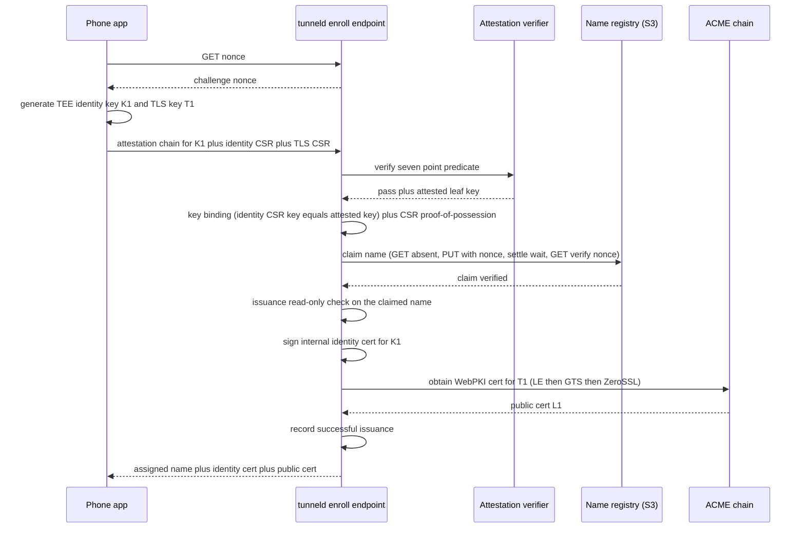

# tunneld Wire Protocol (v2 — End-to-End Encrypted)

This is the CANONICAL wire contract for the E2E-encrypted tunnel. The Go client in `client/` and the
Android (Kotlin) client both conform to THIS document, not to the Go source. `internal/wire` holds the
frame codec.

tunneld relays **opaque TLS bytes** and can NEVER read tunnel traffic: external clients establish TLS
directly with the phone, which holds a publicly-trusted (WebPKI) certificate for its assigned hostname.
tunneld is the internet edge (raw TCP `:443`), peeks the ClientHello (SNI/ALPN/version/JA4), routes on
SNI, and splices the encrypted byte stream to the phone over an internal HTTP/2 mesh.

## 1. Identity & authentication

- **No TLS mutual auth on the public side.** The phone authenticates to tunneld with an internal-CA
  **identity client certificate** over its outbound HTTP/2 **control connection** (mTLS). The assigned
  tunnel name is the certificate's **CN**; the server DERIVES the name from the CN (the phone dials the
  single shared `--control-host`, so there is no per-tunnel Host on the control connection).
- **Two TEE keys per tunnel**: the identity key (mTLS) and the TLS key (the public WebPKI cert). Both
  are generated in the phone's hardware keystore; only CSRs leave the phone.
- **Enrollment is gated by Android hardware key attestation** (seven-point predicate, §2) PLUS a
  **key-binding** check: the enrolled identity key MUST equal the attested TEE key, and both CSR
  signatures are verified (proof-of-possession). This closes the "attest a real key, enroll a software
  key" bypass.
- **Revocation is the ban engine ONLY** (no CRL): tunnel-name / identity-fingerprint bans are enforced
  at the phone control connection, at the public SNI edge on the resolved route, and by live eviction
  on ban reload.

## 2. Enrollment

The phone calls the server-TLS `--enroll-host` endpoint (no client cert — the phone has no identity
yet). The name registry uses a **write-verify claim** over plain S3 (no conditional writes), so it runs
on any S3 provider.

**Seven-point attestation predicate** (ALL mandatory): chain roots at a Google attestation root ∧
`attestationChallenge == nonce` ∧ signing digest ∈ the hot-reloadable allowlist ∧ `securityLevel ≥
TrustedEnvironment` (Software rejected; StrongBox not required) ∧ `verifiedBootState == Verified` ∧
`deviceLocked == true` ∧ not revoked (status list refreshed with last-known-good; refused if `> 24h`
stale).

**Write-verify claim invariant**: the settle wait MUST strictly exceed the claim-PUT timeout, and
registry writes disable SDK auto-retries (a retried claim PUT would be a self-inflicted zombie write).

## 3. Phone control connection (HTTP/2 + mTLS)

The phone opens ONE outbound HTTP/2 connection to `--control-host`. It carries:

- a long-lived **control stream** with length-framed control messages (below), and
- one **data stream per public connection**, opened by the phone via **dial-back** (the server announces
  an incoming connection on the control stream; the phone opens the data stream — HTTP/2 streams are
  always client-initiated).

Control-frame layout: `[type:1][payloadLen:4 BE][payload JSON]`.

| Frame | Direction | Payload |
|---|---|---|
| `OPEN` | server→phone | `{stream_id}` — dial back for one public connection |
| `CLOSE` | either | `{stream_id, reason}` |
| `PING` / `PONG` | either | (none) — application liveness |
| `RENEW_NUDGE` | server→phone | `{ari_window}` — renew early (ARI or migrate-to-LE) |
| `RENEW_REQUEST` | phone→server | (none) — initiate a renewal |
| `RENEW_CHALLENGE` | server→phone | `{nonce}` — fresh attestation nonce |
| `RENEW_SUBMIT` | phone→server | `{attestation_chain, identity_csr, tls_csr}` |
| `CERT_PUSH` | server→phone | `{identity_cert, public_cert}` |
| `ERROR` | server→phone | `{reason, retryable, retry_after_seconds}` |

**Renewal rotates the identity key**: `RENEW_REQUEST → RENEW_CHALLENGE → RENEW_SUBMIT → CERT_PUSH`
re-runs the full seven-point predicate + key binding on a FRESH identity key + fresh TLS key + fresh
attestation, as one event; the connection stays up on the old certs until `CERT_PUSH`.

## 4. Data stream (opaque splice)

Once the phone opens the data stream in response to `OPEN{stream_id}` (matched by `stream_id`), it is a
**raw, bidirectional, opaque byte splice** carrying the client↔phone TLS session. It has NO framing —
HTTP/2 provides the framing and `END_STREAM` is the teardown signal. `wire.ChunkSize` (32768) is the
bandwidth-pacing slice size the bridge reads, NOT a wire frame.

## 5. Replica mesh

When the accepting edge node is not the node holding the phone, it bridges to the owner over an internal
HTTP/2 mTLS mesh (mesh-role certs, SAN = node id). The mesh data stream is prefixed with ONE
`StreamOpen` header: `[len:4 BE][ {tunnel, conn_id, stream_id} JSON ]`. The owner verifies `conn_id`
against its live phone connection before bridging (one fresh route lookup + retry on mismatch, then
close). Everything after the header is the opaque splice.

## 6. Security invariants

- E2E: forward-secret TLS 1.3 between client and phone; tunneld holds no tunnel cert key, ever.
- No reverse proxy anywhere; tunneld is the raw `:443` edge; the trusted client IP is the TCP peer.
- Caps are UNIFORM (no per-path exceptions); rate limiting is global across replicas via Valkey.
- `ChunkSize == 32768`; both peers set the HTTP/2 read limits accordingly.
- No secrets, key material, or tunnel payloads are ever logged.
