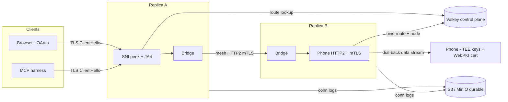
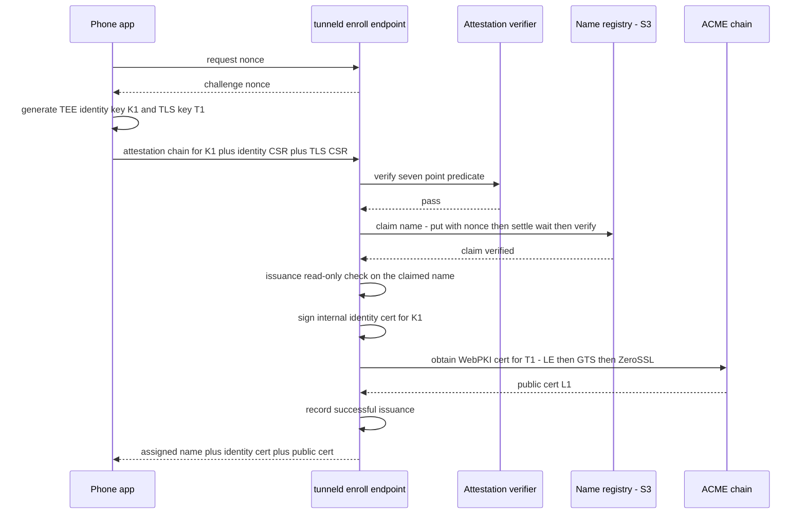

<!-- SACRED DOCUMENT — Edit ONLY per agent.md §2 plan-file rules: plan-review fixes, checkmarks, recorded implementation deviations, and code-review re-alignment. -->
<!-- You MUST NEVER delete this file or alter files outside this plan's scope. -->
<!-- Plans in docs/plans/ are PERMANENT artifacts. There are ZERO exceptions. -->

# Plan 3 — End-to-End Encrypted Tunneling

## Purpose

Replace the plaintext-at-the-edge HTTP tunnel (Plan 1) with an **end-to-end encrypted** tunnel where
`tunneld` relays opaque TLS bytes and can NEVER read tunnel traffic. The phone earns a **publicly
trusted (WebPKI) certificate** for its assigned hostname via server-run ACME against a phone-generated
CSR; external clients (browser for OAuth, MCP harness) establish TLS **directly with the phone**
through the relay. `tunneld` becomes the internet edge: a raw TCP :443 listener that peeks the TLS
ClientHello SNI, looks up the owning replica, and splices the encrypted byte stream to the phone over
an HTTP/2 mesh. There is NO reverse proxy (Cloudflare / Traefik / Caddy) anywhere.

Enrollment is gated by **Android hardware key attestation** pinned to the app's signing digest, so only
the genuine app on genuine certified hardware can be a tunnel endpoint — making generic hosting/abuse
structurally impossible rather than merely policy-forbidden. Abuse is further contained by per-tunnel
byte quotas, globally-accounted batch-credit bandwidth pacing, connection-policy timers with saturation
eviction, and the existing hot-reloadable ban engine.

**Scope of THIS plan: server side only** — the Go `tunneld` module, the Go test client, the wire
protocol v2 spec + fixtures, the durable-store layer, the ACME issuance chain, the attestation
verifier, the deployment stack, testcontainers integration/e2e tests, and CI. The Android (Kotlin) app
integration is explicitly **out of scope** — it lives with the app and conforms to `docs/PROTOCOL.md`.

**Plan structure note:** Acceptance Criteria and a Definition of Done are given per USER STORY
(aggregating that story's tasks), matching Plan 1's USER-APPROVED aggregation convention. SEPARATELY,
and as required by `development_pipeline.md` §3, EVERY user story, task, action, and acceptance-criterion
carries a checkbox (`[ ]`) to be checked (`[x]`) during implementation. Quality gates (lint, build, full
test suite, Mermaid validation) run ONCE at the end (US16), per `development_pipeline.md` §6 — NEVER per
task.

## Relationship to Plan 1

Plan 1 (`docs/plans/1_self_hosted_tunnel_server_20260814130404.md`) is delivered. This plan supersedes
its architecture. Code is built ALONGSIDE the existing stack and the legacy HTTP-mode subsystems are
removed in ONE deliberate story (US13) AFTER the new stack is in place — there is never a half-amputated
intermediate state. **Alongside means ADDITIVE until US13**: while the legacy packages still exist
(US1–US12), shared surfaces they consume are only EXTENDED, never destructively edited — the P1 config
flags, the P1 `observ.Recorder` methods, and the P1 possession-proof helpers all REMAIN (with their
legacy consumers compiling) until US13 removes consumers and surfaces together, so `go build ./...`
stays green at every story boundary. Preserved unchanged/adapted: the ban engine (`internal/ban`), the
caplog deduper (`internal/caplog`), the observ Recorder pattern (`internal/observ` +
`internal/tunneltest`), the config/logging/kong foundations, the metrics/admin packages, and the
Redis→Valkey control-plane routing model.

## Design Decisions (agreed with user)

Every decision below was agreed with the user in the design discussion preceding this plan. Where a
decision REVERSES a Plan 1 invariant, it is marked **[REVERSES P1]**.

### Goal & threat model
- **E2E encryption**: `tunneld` relays opaque TLS bytes; the operator cannot passively read traffic
  (TLS 1.3 forward secrecy — RFC 8446 §1.2: static RSA/DH removed, all key exchange is forward-secret,
  so the cert private key cannot decrypt captured sessions). An active MITM by the DNS-controlling
  operator remains theoretically possible but is Certificate-Transparency-detectable. "Read-only
  inspection" is cryptographically impossible; decrypting = terminating TLS = being a reverse proxy,
  which is refused.
- The private TLS key NEVER exists server-side. The phone generates it in the Android hardware keystore
  (non-exportable) and sends only a CSR. **[REVERSES P1: enrollment now returns a WebPKI cert, not an
  internal-CA cert, for the public TLS leg.]**
- Anti-abuse is economic/behavioral (attestation gate + byte quotas + caps), NEVER content inspection.

### Edge & topology
- **NO reverse proxy anywhere.** Cloudflare / Traefik / Caddy are dropped. `tunneld` is the internet
  edge on raw TCP :443. **[REVERSES P1: Cloudflare orange-cloud reference, TLS-terminating proxy,
  `--client-ip-header` trust model.]**
- The trusted client IP is the TCP socket peer address — no header parsing. `internal/clientip` is
  removed (US13). **[REVERSES P1: mandatory `--client-ip-header`.]**
- `tunneld` reads the plaintext TLS ClientHello (SNI + ALPN + version + JA4 fingerprint), routes on
  SNI, and splices encrypted bytes. It terminates TLS ONLY for its OWN control/enroll hostnames.
- An SNI with no live route → immediate TCP close (no error page is possible — `tunneld` never holds a
  tunnel's cert). Accepted UX change.
- **E2E-only deployment.** There is no dual-mode; the HTTP product is fully replaced.

### Transport
- **Raw HTTP/2, no gRPC, no WebSocket.** **[REVERSES P1: `coder/websocket` `/connect` transport.]**
  The phone opens ONE outbound HTTP/2 connection carrying a long-lived **control stream** plus one
  **data stream per public connection** (dial-back: server announces "incoming connection N" on the
  control stream, phone opens the data stream — HTTP/2 streams are always client-initiated).
- HTTP/2 per-stream + per-connection flow control (RFC 9113, credit/WINDOW_UPDATE) provides end-to-end
  backpressure through bounded bridge buffers. NO custom credit protocol is written.
- **Replica↔replica: direct HTTP/2 mesh with internal mTLS.** Redis/Valkey pub/sub is REMOVED from the
  data plane. **[REVERSES P1: `internal/transport` Redis pub/sub round trip.]**
  - Per DIRECTED node pair: a lazily-dialed pool of **4** HTTP/2 connections; new cross-replica streams
    are assigned round-robin and pinned to their connection for life; if a connection hits the peer's
    max-concurrent-streams, dial one more up to a configured max.
  - **Fast path**: when the owning node is the SAME node that accepted the frontend connection, bridge
    in-process (no mesh hop). Caps, pacing, byte accounting, logging, and eviction run IDENTICALLY on
    both the local and mesh bridge (one bridge interface, two implementations).
- Liveness: application-level PING frames on the control stream.
- Concurrency model: goroutine-per-connection (Go netpoller parks blocked readers without OS threads;
  ~2 KB initial stacks; scale horizontally via stateless replicas). A per-node ceiling `--max-clients`
  bounds memory.

### Identity & authentication
- **mTLS replaces the challenge-response** on phone connections. **[REVERSES P1: application-layer
  possession-proof over the WS.]** The phone presents its internal-CA identity cert as the TLS client
  certificate on its HTTP/2 connection; authentication IS the handshake; CN == assigned tunnel name is
  enforced. The challenge-response crypto is removed.
- **TWO TEE keys per tunnel** (disjoint signing oracles): the identity key (mTLS, internal identity CA)
  and the TLS key (public WebPKI cert). Enrolled together in one authenticated exchange.
- **CA role separation (same internal CA machinery, distinct cert roles):** the internal CA signs BOTH
  tunnel identity certs (phone mTLS, CN = tunnel name) and short-lived mesh node certs (SAN = node id,
  a mesh-role marker OU). The phone listener ACCEPTS only identity-role certs (no mesh-role marker) and
  DERIVES the tunnel name from the cert CN (the phone dials the shared `--control-host`, so there is no
  per-tunnel Host — the CN IS the assigned tunnel name and becomes the route key); the mesh listener
  ACCEPTS only mesh-role certs (SAN = a registered node id). Cross-use is therefore impossible even
  though one CA machinery signs both.
- **Rotation**: at every renewal (~every 4.7 days, driven by the 160h public cert), the app generates a
  FRESH identity key + fresh attestation + fresh internal identity cert + fresh public-cert CSR — one
  key event carries everything. Internal identity-cert validity = **6 months** (the dormancy window;
  offline > 6 months ⇒ full re-enrollment, new name). **[REVERSES P1: `--cert-validity 87600h`.]**
- Bans remain the ONLY timely revocation (no CRL of our own), enforced at THREE points that MUST stay
  wired: phone connect (after mTLS, on tunnel name + identity-cert fingerprint), the SNI edge (on the
  resolved route's name + fingerprint), and live eviction (a ban-reload hook closes matching live phone
  connections).

### Attestation (enrollment gate)
- Enrollment and every renewal require a valid Android hardware key attestation. **Seven-point
  predicate, ALL mandatory** — reject unless ALL hold:
  1. chain roots at a Google attestation root (from the published root set),
  2. attestation challenge equals the server-issued nonce,
  3. `attestationApplicationId` signing-cert digest ∈ the signer-digest allowlist,
  4. `attestationSecurityLevel` ≥ `TrustedEnvironment` (Software rejected; StrongBox NOT required),
  5. `rootOfTrust.verifiedBootState` == `Verified`,
  6. `rootOfTrust.deviceLocked` == true,
  7. the chain is not revoked (Google attestation status list).
- The Google root set and the revocation list are refreshed by background goroutines with
  **last-known-good** retention; enrollment is refused only if the revocation list is **> 24h stale**.
- The signer-digest allowlist is a hot-reloadable file (atomic-pointer swap, ban-engine pattern):
  production = release-key digest; staging += debug-key digest.
- Chains are validated at enrollment/renewal time while fresh (RKP intermediates are ~2 weeks); after
  that the internal identity cert is the credential and nothing re-validates the stored chain.
- Verifier validity-checks use an INJECTABLE clock (`x509.VerifyOptions.CurrentTime`) so frozen real
  fixtures test the full positive AND negative matrix indefinitely.
- **Attestation-optional test mode** (`--attestation-optional`, default false): a config-gated mode that
  makes the enroll/renew path accept a fixture chain, for integration/e2e where no hardware attestation
  exists. It is FAIL-CLOSED in production: `Validate()` refuses to start with it enabled unless the
  test-only sentinel env `TUNNELD_ALLOW_ATTESTATION_OPTIONAL=1` is ALSO set (which real deployments
  never set), so it can never be silently on.

### Certificates & CAs
- Public certs issued via **automatic spillover chain: Let's Encrypt → Google Trust Services →
  ZeroSSL** (all from day one; not break-glass).
  - LE primary: `shortlived` profile (160h); renewals are exempt from LE rate limits; renew at the
    `NotAfter − --acme-renew-margin` (T-48h) floor. (An earlier-ARI-window pull was planned but is NOT
    implementable server-side — see the Deviations entry "LE ARI margin floor".)
  - GTS secondary: EAB-bound to a Google Cloud project; 1–90 day validity (we request 7d); per-project
    quotas (adjustable). No documented per-registered-domain limit. GTS renewals are NOT exempt.
  - ZeroSSL tertiary: EAB; 90-day validity (misfit accepted — a banned name's cert is useless because
    DNS + SNI router refuse it). Sectigo-rooted.
  - **Uniform ~4.7-day rotation cadence regardless of issuer**: LE names renew at the T-48h floor
    (`NotAfter − margin` = NotBefore+112h for a 160h shortlived cert); GTS/ZeroSSL names renew on a
    FIXED schedule at `NotBefore + (160h − --acme-renew-margin)` (~112h after issuance) — a ZeroSSL
    90-day cert's unused validity is deliberately discarded so every tunnel rotates on the same cadence.
- Library: **lego v4** (`ObtainForCSR` for phone CSRs, `Profile` for `shortlived`). Validation is
  **DNS-01** against the tunnel domain's zone via a lego DNS provider (the scoped DNS API token is a
  crown-jewel secret).
- One operator ACME account per CA. Rate-limit protection is **REACTIVE per-CA cooldown + backoff**
  (agreed, replacing an earlier proactive order-counter design): on a CA "rate limited" answer, store a
  per-CA cooldown in Valkey (honoring the ACME `Retry-After`, floor `--acme-cooldown-default`) and skip
  that CA (spillover proceeds to the next) until it expires; on repeated consecutive failures of any
  other kind, apply exponential per-CA backoff (`--acme-backoff-initial` doubling to
  `--acme-backoff-max`, reset on success) — this protects the LE account from the no-override
  consecutive-failure pause without a proactive counter. There is NO order-counting budget (see the
  Deviations entry "LE weekly budget removed"): when a CA — LE included — answers rate-limited, its per-CA
  retry-after cooldown is set from the ACME `Retry-After` and the order spills to the next CA; when every
  CA is cooling, issuance returns a retryable "quota exhausted, retry later".
- **Migration to LE happens AT RENEWAL, opportunistically** (user decision — shift names onto LE as
  much as possible, because LE alone does not rate-limit renewals): issue AND renew share the SAME
  LE→GTS→ZeroSSL order, so every renewal (each carrying a fresh rotated phone CSR) tries **LE FIRST**; a
  cooling LE is skipped and the name renews on the next available CA. Once a name is on LE, its renewals
  are ARI-exempt forever. There is NO separate migration job — the per-CA retry-after is the only pacing.
  Public-Suffix-List listing of the tunnel domain is a future growth milestone (requires ~3000 users);
  it is NOT in this plan.
- Issuance cap **3 per tunnel per week** (SUCCESSFUL issuances only — the counter is consumed only after
  a cert is issued, never at the pre-issuance gate).
- ACME failures surface to the app as structured `{reason, retryable, retry_after}` over the control
  stream.
- CAA (operator DNS, documented, NOT enforced in code): `issue "letsencrypt.org;
  accounturi=<acct>; validationmethods=dns-01"` + `issue "pki.goog"` + `issue "sectigo.com"`. LE
  enforces `accounturi` and `validationmethods` (verified in Boulder `va/caa.go`).
- **tunneld's OWN reserved-host server certs**: `tunneld` serves publicly-trusted TLS for its own
  reserved hostnames (`--enroll-host`, `--control-host`) using **server-side keys it generates itself**
  and certs it obtains via the SAME ACME spillover chain (a fixed, tiny set of hostnames, auto-renewed on
  the T-48h/ARI schedule) — the phone/enroll client trusts them via the public WebPKI (no pinning). These
  are DISTINCT from the phone-issued tunnel certs (whose keys never leave the phone) and from the
  internal-CA identity/mesh certs. The `--control-host` listener ADDITIONALLY requires the phone's
  internal-CA identity client cert (mTLS); the `--enroll-host` listener is server-TLS only (the phone has
  no identity yet). These self-certs do NOT consume the per-tunnel 3/week issuance cap (that is keyed on
  tunnel names), but each new order is subject to the per-CA cooldowns like any
  other order.

### State
- **Valkey/Redis = control plane ONLY** (transient, TTL'd, Lua-atomic — Plan 1's SACRED invariant
  intact): node registry (mesh addresses), route records (`route:{name}` owner-conditional on connID,
  carrying the identity-cert fingerprint for edge ban resolution AND the tunnel-session start timestamp
  — the conn-id epoch every edge reads via the route lookup), batch-credit bandwidth accounting,
  rate windows, daily/weekly byte quotas, per-tunnel issuance counters, the per-CA ACME
  cooldown/failure-backoff state. Every key's TTL is set in the SAME Lua
  script as its mutation.
- **S3/MinIO = the first durable server-side state** **[REVERSES P1: "NO permanent Redis state; the
  phone's cert is the only persistent identity."]** — a deliberate, minimal, portable amendment (flat
  object store; MinIO locally, any S3 in the cloud; documented in `project.md`):
  - **Name registry — WRITE-VERIFY claim, NO conditional writes** (user decision: the registry MUST
    NOT depend on atomic/conditional PUT support, so it works on ANY plain S3 provider — production
    targets a plain S3 such as OVH Object Storage; MinIO is a local/e2e stand-in only). Claiming a
    candidate name: `GET names/<name>` (exists → new random name) → `PUT` the full record with a fresh
    `claim_nonce` (16 crypto-random bytes, hex; hard `--registry-claim-timeout`, SDK auto-retries
    DISABLED for registry writes — a retry landing after timeout is a self-inflicted zombie write; on
    timeout/error the name is abandoned PERMANENTLY) → wait `--registry-claim-settle` (STRICTLY >
    the PUT timeout, so any zombie PUT has landed or died) → `GET` and compare `claim_nonce`: ours =
    claimed; another's = lost the race, new name, bounded loop. A zombie PUT can orphan one random
    name forever — harmless in a 32^10 namespace. `ReleaseName` (failed enrollment after a VERIFIED
    claim) = plain `DELETE`, guarded by application logic only. Renewal/update writes = single-owner
    last-write-wins plain `PUT`. Correctness relies on read-after-write consistency — validated
    per-provider by a documented pre-go-live probe (US15). Body: schema version, enrolled-at,
    last-renewed-at, identity-key fingerprint, claim nonce, top-level issuing CA, cert
    serial/not-before/not-after/ARI-id, device os-version + patch-level scalars. NEVER stores certs,
    keys, or attestation chains for ACCEPTED enrollments.
  - **Connection logs**: one JSON object per event under
    `tunnel-logs/<name>/<yyyy>/<mm>/<dd>/<ts-ns>-<conn8>-<start|end>.json`, plain (no gzip), written
    immediately per event. 90-day lifecycle purge on the `tunnel-logs/` prefix.
  - **Rejected-enrollment evidence**: REJECTED/suspicious enrollments persist their evidence (timestamp,
    source IP, rejection reason, the submitted attestation chain, claimed package/digest when parseable,
    nonce) under `rejected-enroll/<yyyy>/<mm>/<dd>/<ts-ns>-<rand4>.json` with a **30-day** lifecycle
    purge. Retention policy (documented in US15): registry indefinite, connection logs 90 days,
    rejected-enrollment evidence 30 days, tunnel content never (it is unreadable by design).

### Caps & abuse policy (free for everyone — no paid tier)
- Per-tunnel traffic: **1 GB/day + 4 GB/week**, both directions combined; exhaustion refuses new
  streams, brief grace for in-flight, one caplog line.
- Carried from P1: per-direction bandwidth `1mbit`, enroll `2`/min + `20`/h per IP. Morphed:
  `4` concurrent streams/tunnel — enforced GLOBALLY across replicas via the retained/adapted Valkey
  `conc:{name}` counter (user decision: a Valkey counter, not per-replica in-memory, so N replicas
  never multiply the cap), per-IP TCP connection RATE; the P1 `--limit-connect-pending` is
  RENAMED `--limit-stream-pending` (agreed — the `/connect` concept is gone; it now bounds pre-bind
  phone handshakes), same default 64. There is NO per-IP concurrency cap; aggregate node memory is
  bounded by `--max-clients`.
- Frontend connection policy (per-replica, in-memory): idle timeout **120s**, min-rate kill
  **2 KB / rolling 60s** (past a grace), **evict-least-active-on-saturation** (evictable = idle ≥ 10s OR
  rolling rate < 256 KB/min protection line; all-protected ⇒ reject the newcomer). No hard lifetime cap.
- Request-level timeout is UNENFORCEABLE at the tunnel (opaque bytes) — the app enforces it; the server
  protects only itself.
- JA4 fingerprint recorded on ALL connections from day one; phone-side JA4 is an anomaly tripwire, NOT
  a gate (mTLS is the auth). Future hot-reload allow/deny lists are out of scope.
- ECH is a non-issue (the tunnel domain publishes no ECH keys, so ClientHellos are always readable).

### Repository hygiene (unchanged from P1, reaffirmed)
- Placeholder values ONLY in-repo: domain `example.test`, country codes `XX`/`YY`, secrets `changeme`.
  The real tunnel domain and project name MUST NOT appear anywhere in the repo, plan, code, or docs.
- No AI attribution anywhere.

## Architecture Overview





---

## User Story 1: Configuration surface, foundations, and new dependencies

- [x] **User Story 1 complete**

Rework the kong configuration surface for the E2E architecture, add the new third-party dependencies,
and move the `observ.Recorder` interface rework to this foundation story so later stories depend on the
interface (not on the US10 Prometheus implementation). This is the foundation every later story imports.

### Acceptance Criteria
- [x] `internal/config` `ServeCmd` ADDS the new flag families below, each with a working `TUNNELD_*` env
  twin. The P1 proxy/HTTP-inspection flags (`--client-ip-header`, `--limit-body`, `--limit-response`,
  `--limit-headers`, `--limit-header-single`, `--limit-request-timeout`, `--limit-rps`, `--limit-rpm`,
  `--ping-interval`, `--connect-auth-timeout`, `--limit-connect-pending`) REMAIN untouched here — their
  legacy consumers still compile — and are removed in US13 (additive-until-teardown discipline).
- [x] `Validate()` enforces every new cross-field invariant (Task 1.2), including the fail-closed
  `--attestation-optional` guard; the P1 checks stay untouched until US13.
- [x] `go.mod`/`go.sum` add lego v4 and the AWS S3 SDK v2 and are `go mod tidy`-clean.
- [x] The `observ.Recorder` interface is EXTENDED with the E2E event set (+ `Nop` covering all methods)
  while KEEPING the P1 methods (their consumers `internal/ingress`/`internal/wsconn`/
  `internal/transport`/`internal/metrics` still compile; US13 strips the P1 methods everywhere at once);
  the shared `internal/tunneltest` capturing fake covers the combined interface, and the EXISTING
  `metrics.PromRecorder` gains the E2E methods as empty stubs in the same change (so its
  `var _ observ.Recorder` assertion and the P1 `server.Run` wiring compile at every boundary), so
  US5/US6/US8/US11 depend on the INTERFACE (US10 supplies the real Prometheus implementation + admin).
- [x] New byte-size flags reuse the BINARY `ParseByteSize`; bitrate reuses DECIMAL `ParseBitrate`.
- [x] US1 code + test tables authored/committed (gate execution in US16).

### Task 1.1: Dependency additions
- [x] **Task 1.1 complete**
- [x] **File**: `go.mod` / `go.sum` — modify: add, at latest stable pinned versions (verify each on
  pkg.go.dev at implementation time; never `@latest` in tooling): `github.com/go-acme/lego/v4` (ACME
  CSR/ARI/profiles/DNS-01 providers) and `github.com/aws/aws-sdk-go-v2` + `.../config` +
  `.../service/s3` (plain S3 object operations — NO conditional-write feature is used). `go.sum` MUST
  be committed.
**Context**: attestation verification needs NO new dependency (stdlib `crypto/x509` + `encoding/asn1`,
validated by the US4 spike approach). The lego DNS provider sub-package is selected by operator config
(wired behind our own interface in US6), not locked at compile time here.

### Task 1.2: Config struct rework
- [x] **Task 1.2 complete**
- [x] **File**: `internal/config/config.go` — modify `ServeCmd` ADDITIVELY. The P1 flags that are dead
  under E2E — `--client-ip-header`, `--limit-body`, `--limit-response`, `--limit-headers`,
  `--limit-header-single`, `--limit-request-timeout`, `--limit-rps`, `--limit-rpm`, `--ping-interval`
  (succeeded by the NEW `--control-ping-interval`), `--connect-auth-timeout`, `--limit-connect-pending`
  (succeeded by the NEW `--limit-stream-pending`) — are KEPT here (legacy consumers still read them)
  and deleted in US13. **Keep** (adapted):
  `--listen` (now the raw TCP :443 edge), `--internal-listen`, `--tunnel-domain`, `--enroll-host`,
  `--name-prefix`, `--name-length`, `--redis-url` (Valkey), `--ca-cert`/`--ca-key` (internal CA for
  identity + mesh certs), `--route-ttl`, `--dbip-country-lite-csv`, `--ban-file`, `--ban-poll`,
  `--limit-bandwidth`, `--limit-enroll-hour`, `--limit-enroll-minute`, `--limit-enroll-body`,
  `--shutdown-grace`, `--log`, PLUS two EXISTING flags whose semantics/defaults change in place (they
  are NOT new fields): `--limit-concurrent` (unchanged default 4; help now "concurrent data streams per
  tunnel") and `--cert-validity` (default changes `87600h` → `4380h`; help now "internal identity-cert
  lifetime (6 months)"). **Add** these flag families (all with `TUNNELD_*` twins):

| Field (flag) | Type | Default | Purpose |
|---|---|---|---|
| `--control-host` | string | `connect.example.test` | Hostname the phone dials for its HTTP/2 control connection (mTLS) |
| `--mesh-listen` | string | `:9443` | Replica↔replica HTTP/2 mesh listener (internal network only) |
| `--mesh-advertise` | string | *(required for serve)* | This node's mesh dial address announced in the node registry |
| `--mesh-pool-size` | int | `4` | HTTP/2 connections per directed node pair |
| `--mesh-pool-max` | int | `8` | Hard cap on pool growth when max-concurrent-streams is hit |
| `--mesh-cert-ttl` | duration | `24h` | Lifetime of a node's self-issued mesh-role cert |
| `--max-clients` | int | `10000` | Per-node ceiling on ALL concurrent inbound connections (memory bound), enforced at the edge accept loop |
| `--s3-endpoint` | string | *(required for serve)* | S3/MinIO endpoint URL |
| `--s3-region` | string | `us-east-1` | S3 region |
| `--s3-bucket` | string | *(required for serve)* | Bucket for the name registry + connection logs |
| `--s3-access-key` | string | *(required for serve)* | S3 access key (secret) |
| `--s3-secret-key` | string | *(required for serve)* | S3 secret key (secret) |
| `--s3-force-path-style` | bool | `true` | Path-style addressing (MinIO default) |
| `--registry-claim-timeout` | duration | `3s` | Hard timeout on the name-claim PUT (SDK retries disabled; timeout = name abandoned) |
| `--registry-claim-settle` | duration | `5s` | Settle wait before the claim-verify GET (MUST exceed the claim timeout) |
| `--attest-signer-digest-file` | string | *(required for serve)* | Hot-reload file of accepted app signing-cert SHA-256 digests |
| `--attest-root-url` | string | `https://android.googleapis.com/attestation/root` | Google attestation root-set endpoint |
| `--attest-status-url` | string | `https://android.googleapis.com/attestation/status` | Google attestation revocation-status endpoint |
| `--attest-refresh` | duration | `1h` | Root-set + status refresh cadence |
| `--attest-status-max-stale` | duration | `24h` | Refuse enrollment if the status list is staler than this |
| `--attestation-optional` | bool | `false` | Accept a fixture chain (tests only); fail-closed in prod (see Validate) |
| `--acme-dir-le` | string | `https://acme-v02.api.letsencrypt.org/directory` | LE ACME directory |
| `--acme-dir-gts` | string | `https://dv.acme-v02.api.pki.goog/directory` | GTS ACME directory |
| `--acme-dir-zerossl` | string | `https://acme.zerossl.com/v2/DV90` | ZeroSSL ACME directory |
| `--acme-email` | string | *(required for serve)* | ACME account contact |
| `--acme-le-profile` | string | `shortlived` | LE certificate profile |
| `--acme-gts-validity` | duration | `168h` | Requested GTS validity (7d) |
| `--acme-eab-gts-kid` / `--acme-eab-gts-hmac` | string | *(empty)* | GTS EAB credentials (secret) |
| `--acme-eab-zerossl-kid` / `--acme-eab-zerossl-hmac` | string | *(empty)* | ZeroSSL EAB credentials (secret) |
| `--acme-account-dir` | string | *(required for serve)* | Directory holding persisted per-CA ACME account keys |
| `--acme-dns-provider` | string | *(required for serve)* | lego DNS-01 provider id (e.g. `cloudflare`, `route53`) |
| `--acme-cooldown-default` | duration | `1h` | Per-CA cooldown when a CA answers rate-limited WITHOUT a Retry-After (Retry-After wins when larger) |
| `--acme-backoff-initial` | duration | `1m` | First per-CA backoff after a non-rate-limit failure (doubles per consecutive failure) |
| `--acme-backoff-max` | duration | `6h` | Ceiling for the exponential per-CA failure backoff |
| `--acme-renew-margin` | duration | `48h` | Renew floor before public-cert expiry (ARI may pull earlier) |
| `--issue-per-week` | int | `3` | Max SUCCESSFUL public-cert issuances per tunnel per 7d window (anchored at the first issuance) |
| `--limit-traffic-day` | string | `1gb` | Per-tunnel bytes per 24h window (anchored at the first byte), both directions combined (BINARY) |
| `--limit-traffic-week` | string | `4gb` | Per-tunnel bytes per 7d window (anchored at the first byte), both directions combined (BINARY) |
| `--limit-conn-rate` | int | `10` | New public TCP connections/sec per source IP |
| `--limit-stream-pending` | int | `64` | Max concurrent pre-bind phone control handshakes per node |
| `--limit-conn-idle` | duration | `120s` | Close a public connection idle (no bytes either direction) this long |
| `--limit-conn-min-rate` | string | `2kb` | Min bytes per rolling 60s (past grace) before kill (BINARY) |
| `--limit-conn-min-grace` | duration | `60s` | Grace before the min-rate rule applies |
| `--limit-conn-evict-idle` | duration | `10s` | A public connection idle ≥ this is evictable on saturation |
| `--limit-conn-protect-rate` | string | `256kb` | Rolling-60s byte floor that protects a connection from eviction (BINARY) |
| `--handshake-timeout` | duration | `10s` | Max time to read a complete ClientHello before closing (pre-TLS slowloris guard) |
| `--control-ping-interval` | duration | `30s` | Control-stream application PING cadence |

- [x] **Action**: `Validate()` adds: `--mesh-pool-size` in `[1, --mesh-pool-max]`; `--max-clients ≥ 1`;
  `--limit-concurrent ≥ 1`; `--limit-conn-rate ≥ 1`; `--limit-stream-pending ≥ 1`; `--issue-per-week ≥ 1`;
  `--acme-cooldown-default`/`--acme-backoff-initial`/`--acme-backoff-max`
  all > 0 and `--acme-backoff-initial ≤ --acme-backoff-max`; `ParseByteSize` of `--limit-traffic-day`/
  `--limit-traffic-week`/`--limit-conn-min-rate`/`--limit-conn-protect-rate` succeeds and each > 0;
  `--limit-traffic-week ≥ --limit-traffic-day`; `--registry-claim-timeout` and
  `--registry-claim-settle` both > 0 AND `--registry-claim-settle > --registry-claim-timeout` (the
  write-verify correctness invariant); `ParseBitrate(--limit-bandwidth) ≥ wire.ChunkSize`
  (unchanged floor, comment referencing `wire.ChunkSize`); `--limit-conn-idle`, `--limit-conn-evict-idle`,
  `--handshake-timeout`, `--attest-refresh`, `--attest-status-max-stale`, `--acme-renew-margin`,
  `--cert-validity`, `--mesh-cert-ttl`, `--route-ttl`, `--shutdown-grace`, `--control-ping-interval` all
  > 0; `--acme-renew-margin < 160h` (must fit inside the LE `shortlived` lifetime); S3 required fields
  non-empty; `--attest-signer-digest-file` non-empty and readable; `--ca-cert`/`--ca-key` non-empty and
  readable; `--mesh-advertise`, `--acme-email`, `--acme-account-dir`, `--acme-dns-provider` non-empty;
  `--redis-url` parseable; each `--acme-dir-*` and `--attest-*-url` parse as URLs; **the fail-closed
  attestation guard**: if `--attestation-optional` is true AND `os.Getenv("TUNNELD_ALLOW_ATTESTATION_OPTIONAL")
  != "1"` → error (prevents enabling it in a real deployment). The Cloudflare-specific `--ping-interval
  ≤ 90s` and `--limit-request-timeout < 100s` checks are left untouched here and are REMOVED in US13
  together with their flags.
- [x] **Action**: change the retained `--listen` default from the P1 proxy-era `:8080` to `:443` and
  update its help text to "Raw TCP public edge (SNI-routed); NOT behind a proxy." (`--internal-listen`
  keeps `:9090`.)

### Task 1.3: observ.Recorder interface extension + shared fake
- [x] **Task 1.3 complete**
- [x] **File**: `internal/observ/recorder.go` — EXTEND the interface with the E2E event set
  (dependency-free; primitives only). The P1 methods (`Request`, `WSConnect`, `WSDisconnect`,
  `Enrollment()`, `InflightAdd`, `Timeout`, `PublishError`) REMAIN so their legacy consumers
  (`internal/ingress`/`internal/wsconn`/`internal/transport`/`internal/metrics`) keep compiling; US13
  strips them together with those consumers. `Reject` and `Bytes` already exist with the exact needed
  signatures and are SHARED. The new event is named `EnrollmentResult(result string)` because the P1
  no-arg `Enrollment()` still occupies that name until US13. E2E additions:
```go
type Recorder interface {
	// ... P1 methods retained until US13 ...
	Reject(reason, tunnelName, clientIP string)  // shared with P1 (same signature)
	Bytes(tunnelName, direction string, n int64) // shared with P1; "in"/"out" from the peer's perspective
	PublicConnOpen(); PublicConnClose(reason string)
	PhoneConnOpen(); PhoneConnClose(reason string)
	StreamOpen(); StreamClose()
	EnrollmentResult(result string) // "ok" | reason
	AttestVerify(result string)     // "ok" | failure reason
	ACMEIssue(ca, result string); ACMERenew(ca, result string)
	QuotaExhausted(tunnelName, window string) // "day" | "week"
	ACMECooldown(ca string)         // a per-CA cooldown/backoff was set
	MeshPool(peer string, size int)
}
```
Provide `Nop` (no-op) covering the COMBINED interface with `var _ Recorder = Nop{}`. Define HERE
(exported slice `observ.RejectReasons`) the exact `tunneld_rejections_total{reason}` label set consumed
by every later writer (US5/US6/US8/US11) and registered by US10: `ban`, `no-route`,
`handshake-timeout`, `conn-rate`, `max-clients`, `quota-day`, `quota-week`, `stream-cap`,
`attest-untrusted`, `attest-challenge`, `attest-signer`, `attest-security-level`, `attest-boot`,
`attest-device-unlocked`, `attest-revoked`, `attest-stale`, `csr-mismatch`, `enroll-limit`,
`issuance-cap`, `acme-failed`.
- [x] **File**: `internal/tunneltest/recorder.go` — EXTEND the shared capturing fake to the combined
  interface. Shared test infrastructure — full implementation of the E2E additions (the existing P1
  capture methods and helpers stay as-is):
```go
// RecCall gains CA/Result/Window/Peer/Size fields alongside the P1 fields:
type RecCall struct {
	Kind, Reason, Tunnel, IP, Class, Direction string
	Code                                       int
	N                                          int64
	Dur                                        time.Duration
	CA, Result, Window, Peer                   string
	Size                                       int
}

func (r *Recorder) PublicConnOpen()               { r.add(RecCall{Kind: "publicconnopen"}) }
func (r *Recorder) PublicConnClose(reason string) { r.add(RecCall{Kind: "publicconnclose", Reason: reason}) }
func (r *Recorder) PhoneConnOpen()                { r.add(RecCall{Kind: "phoneconnopen"}) }
func (r *Recorder) PhoneConnClose(reason string)  { r.add(RecCall{Kind: "phoneconnclose", Reason: reason}) }
func (r *Recorder) StreamOpen()                   { r.add(RecCall{Kind: "streamopen"}) }
func (r *Recorder) StreamClose()                  { r.add(RecCall{Kind: "streamclose"}) }
func (r *Recorder) EnrollmentResult(result string) {
	r.add(RecCall{Kind: "enrollmentresult", Result: result})
}
func (r *Recorder) AttestVerify(result string) { r.add(RecCall{Kind: "attestverify", Result: result}) }
func (r *Recorder) ACMEIssue(ca, result string) {
	r.add(RecCall{Kind: "acmeissue", CA: ca, Result: result})
}
func (r *Recorder) ACMERenew(ca, result string) {
	r.add(RecCall{Kind: "acmerenew", CA: ca, Result: result})
}
func (r *Recorder) QuotaExhausted(tunnel, window string) {
	r.add(RecCall{Kind: "quotaexhausted", Tunnel: tunnel, Window: window})
}
func (r *Recorder) ACMECooldown(ca string) { r.add(RecCall{Kind: "acmecooldown", CA: ca}) }
func (r *Recorder) MeshPool(peer string, size int) {
	r.add(RecCall{Kind: "meshpool", Peer: peer, Size: size})
}
```
Reused by US5/US6/US8/US10/US11 tests (the existing `Count`/`BytesFor` helpers work unchanged).
- [x] **File**: `internal/metrics/recorder.go` — modify in the SAME change: extend the EXISTING
  `PromRecorder` with the new E2E methods as EMPTY STUBS so `var _ observ.Recorder = (*PromRecorder)(nil)`
  and the P1 `server.Run` wiring keep compiling from US1 onward (US10 replaces the stubs with the real
  family/flusher implementations).

### Task 1.4: Unit tests
- [x] **Task 1.4 complete**
- [x] **File**: `internal/config/config_test.go` (extend), `internal/observ/recorder_test.go` (compile
  assertion only).
- [x] **Action**: ADAPT the EXISTING tests that drive `serve` parsing/validation so they PASS (not
  merely compile) with the new required-for-serve flags: the config kong-parse/env-twin tests and
  `cmd/tunneld/main_test.go` must supply the new required values (`--s3-endpoint`/`--s3-bucket`/
  `--s3-access-key`/`--s3-secret-key`, `--mesh-advertise`, `--acme-email`, `--acme-account-dir`,
  `--acme-dns-provider`, and a READABLE temp `--attest-signer-digest-file`) alongside the existing P1
  flags — `Validate()` runs on every parse, so omitting them fails the suite.

| Test | Verifies |
|---|---|
| `Validate rejects mesh-pool-size out of range` | `0` and `> --mesh-pool-max` → error |
| `Validate requires S3 fields` | Empty endpoint/bucket/access/secret → error |
| `Validate requires attest signer digest file` | Empty or unreadable → error |
| `Validate traffic week >= day` | `--limit-traffic-week 512mb` with `--limit-traffic-day 1gb` → error |
| `Validate bandwidth floor` | `--limit-bandwidth 128kbit` → error; `1mbit` passes |
| `Validate renew margin fits shortlived` | `--acme-renew-margin 200h` → error |
| `Validate rejects zero integer limits` | `--max-clients 0`, `--limit-concurrent 0`, `--limit-conn-rate 0`, `--issue-per-week 0`, `--limit-stream-pending 0` → error |
| `Validate attestation-optional fail-closed` | `--attestation-optional` without `TUNNELD_ALLOW_ATTESTATION_OPTIONAL=1` → error; with it set → passes |
| `Validate registry settle > timeout` | `--registry-claim-settle 2s` with `--registry-claim-timeout 3s` → error; defaults pass |
| `env twin overrides` | `TUNNELD_MAX_CLIENTS`, `TUNNELD_S3_BUCKET`, `TUNNELD_LIMIT_TRAFFIC_DAY`, `TUNNELD_ACME_DNS_PROVIDER` override defaults |
| `Nop satisfies Recorder` | Compile-time `var _ observ.Recorder = observ.Nop{}` (combined interface) |

### Definition of Done
- [x] `ServeCmd` extended: new families added (P1 flags untouched until US13), every new flag has a
  working env twin.
- [x] `Validate()` enforces all new invariants incl. the fail-closed attestation-optional guard
  (P1 checks untouched until US13).
- [x] `go.mod`/`go.sum` add lego v4 + AWS S3 SDK v2, tidy-clean and committed.
- [x] `observ.Recorder` extended with the E2E event set + combined `Nop`; the shared `tunneltest` fake
  extended; `observ.RejectReasons` defined.
- [x] US1 config + observ test tables extended/committed (execution in US16).

---

## User Story 2: Durable store layer (S3/MinIO) — name registry + connection logs

- [x] **User Story 2 complete**

Create the durable-state package: a PLAIN-S3 client behind a small interface (no conditional-write
feature anywhere — the registry must work on any plain S3 provider; MinIO is the local/e2e stand-in),
the name-registry object operations, and the connection-event log writer. First durable server-side
state in the project. The write-verify CLAIM ORCHESTRATION lives in the enroll service (US5), not here.

### Acceptance Criteria
- [x] `internal/store` defines SMALL COMPOSABLE interfaces (`NameStore`, `ConnLogStore`,
  `EvidenceStore`, `LifecycleStore`, composed as `Store`) and an S3-backed implementation using ONLY
  plain `GetObject`/`PutObject`/`DeleteObject` — no `If-None-Match`, no `If-Match`, no ETags; each
  consumer depends only on the sub-interface it uses.
- [x] Registry writes have SDK auto-retries DISABLED (a claim PUT retried after a timeout is a zombie
  write; renewal LWW PUTs don't need retries either — callers handle errors).
- [x] `NameRecord` (incl. `claim_nonce`) and connection-log `Event` types serialize to the exact JSON
  schemas in Task 2.2/2.3.
- [x] Connection-log objects are written at the exact key layout
  `tunnel-logs/<name>/<yyyy>/<mm>/<dd>/<tsNanos>-<conn8>-<start|end>.json`.
- [x] Integration tests (US14) exercise real MinIO; unit tests use a fake `Store`.

### Task 2.1: Store interface + S3 implementation
- [x] **Task 2.1 complete**
- [x] **File**: `internal/store/store.go` — create the consumer-side interface:
```go
// Small composable interfaces (go.md: 1–3 methods, consumer-site) — each consumer
// depends only on what it uses; the S3 type implements them all.
type NameStore interface { // consumers: enroll (claim/rollback/LWW), US8 renewal
	GetName(ctx context.Context, name string) (NameRecord, error)   // ErrNotFound if absent
	PutName(ctx context.Context, name string, rec NameRecord) error // plain PUT (claim writes + single-owner LWW updates); NO retries
	DeleteName(ctx context.Context, name string) error              // plain DELETE (rollback of a failed enrollment after a VERIFIED claim)
}
type ConnLogStore interface { // consumers: phoneconn (US8), edge bridges (US11)
	PutConnLog(ctx context.Context, ev Event) error // fire-once, immediate
}
type EvidenceStore interface { // consumer: enroll (US5)
	PutRejectedEnrollment(ctx context.Context, ev RejectedEnrollment) error
}
type LifecycleStore interface { // consumer: server.Run (US11), once at startup
	EnsureLifecycles(ctx context.Context, connLogDays, rejectedDays int) error // idempotent: tunnel-logs/ past connLogDays, rejected-enroll/ past rejectedDays
}
type Store interface { // the full composition, implemented by the S3 type and the tunneltest fake
	NameStore; ConnLogStore; EvidenceStore; LifecycleStore
}
var ErrNotFound = errors.New("store: name not found")
```
- [x] **File**: `internal/store/s3.go` — create the S3-backed `Store`: plain `GetObject` (`GetName`
  maps `NoSuchKey` → `ErrNotFound`), plain `PutObject` (`PutName` — the S3 client for registry writes
  is configured with SDK auto-retries DISABLED, `retry.NewStandard` max attempts 1 / `aws.Retryer`
  off, so a timed-out claim PUT is never silently replayed; the caller's ctx carries the
  `--registry-claim-timeout` deadline), plain `DeleteObject` (`DeleteName`);
  `PutConnLog` writes the computed key (Task 2.3); `PutRejectedEnrollment` writes the
  Task 2.2 rejected-evidence key; `EnsureLifecycles` applies one idempotent
  `PutBucketLifecycleConfiguration` with TWO expiration rules — objects under `tunnel-logs/` after
  `connLogDays` (90) and under `rejected-enroll/` after `rejectedDays` (30) — called once at startup by
  `server.Run` (US11). Constructor `NewS3Store(ctx, cfg)` with functional options; force path-style
  honored for MinIO.
**Context**: NO conditional-write / atomic-PUT feature is used anywhere (user decision — the registry
must run on any plain S3 provider; production targets one, MinIO is the local/e2e stand-in). Uniqueness
comes from the US5 write-verify claim protocol, not from storage semantics. Objects are tiny; no
multipart.

### Task 2.2: Name registry record
- [x] **Task 2.2 complete**
- [x] **File**: `internal/store/name_record.go` — create `DeviceInfo` (os VERSION + os/vendor/boot patch
  levels, attestation+keymint versions, security level string — the seven agreed device scalars),
  `CertInfo` (ca, serial, not-before, not-after, ARI id — the shared cert-metadata type returned by the
  US6 issuer and consumed by the US5 enroll flow; `not_before` anchors the fixed GTS/ZeroSSL renewal
  cadence), and `NameRecord` whose JSON shape is the AGREED registry schema: `schema`=1, `enrolled_at`,
  `last_renewed_at`, `identity_key_fpr`, `claim_nonce` (16 crypto-random bytes hex — the write-verify
  claim discriminator, written at claim time and preserved on every LWW update), **top-level `ca`**,
  `cert{serial, not_before, not_after,
  ari_id}` (the CA lives top-level, NOT inside the `cert` sub-object), `device{...}`. A
  `SetCert(info CertInfo)` helper populates `ca` + `cert` from the issuer's `CertInfo`. JSON snake_case;
  times RFC3339 nanosecond UTC. NEVER cert PEM, private keys, or chains.
- [x] **File**: `internal/store/rejected.go` — create `RejectedEnrollment` (ts, src_ip, reason,
  attestation chain PEM as submitted, claimed package + signer digest when parseable, nonce hex) and its
  key helper `RejectedKey(ev) string` = `rejected-enroll/<yyyy>/<mm>/<dd>/<ts-ns>-<rand4>.json`
  (30-day-lifecycle prefix; forensic evidence for abuse/lawful-request handling — the ONLY place a
  submitted chain is retained, and only for REJECTED enrollments).

### Task 2.3: Connection-log event
- [x] **Task 2.3 complete**
- [x] **File**: `internal/store/event.go` — create the `Event` type (schema=1; event start|end; conn (10
  hex chars = hex of 3 bytes seconds-since-tunnel-session-start ‖ 2 random bytes); type public|phone;
  tunnel; node_hostname; node_start; ts_start; ts_end; duration_ms; src_ip;
  src_port; sni (public only); alpn; tls_version; tls_fp (JA4); bytes_in/bytes_out (end only, peer's
  perspective); close_reason enum; and phone-only identity_cert_serial + identity_key_fpr) plus
  `LogKey(ev) string` = `tunnel-logs/<name>/<yyyy>/<mm>/<dd>/<tsNanos>-<conn8>-<event>.json` (conn8 =
  first 8 chars of conn; tsNanos = zero-padded `20060102T150405.000000000Z` so listings sort
  chronologically); and `NewConnID(sessionStart, now time.Time) (string, error)` =
  hex-encode(3 big-endian bytes of `int(now.Sub(sessionStart).Seconds()) & 0xFFFFFF` ‖ 2 `crypto/rand`
  bytes) → 10 hex chars. The `sessionStart` EPOCH is ONE value per tunnel session — the phone control
  connection's establishment time: US8 uses it directly when minting the phone connID (and stores it in
  the route record via `router.BindRoute`); US11 edges read it back as `startedAt` from
  `router.LookupRoute` (already on the routing path — no extra call) when minting public conn ids, so
  every conn id of a tunnel session counts seconds from the SAME epoch.
  `close_reason` ∈ {client-close, phone-close, ban-evict, quota-exhausted, idle-timeout, min-rate,
  evicted, error}.

### Task 2.4: Shared store fake + unit tests
- [x] **Task 2.4 complete**
- [x] **File**: `internal/tunneltest/store.go` — a thread-safe in-memory `store.Store` fake. Shared test
  infrastructure — full implementation:
```go
// Store is a thread-safe in-memory store.Store fake for assertions. The exported
// hook fields let the write-verify race tests (US5) inject interleavings: a claim
// PUT that "times out" client-side but lands later (zombie), a competing claimant
// writing between another's PUT and verify, etc.
type Store struct {
	mu       sync.Mutex
	names    map[string]store.NameRecord
	ConnLogs []store.Event
	Rejected []store.RejectedEnrollment

	// FailNextPut, when non-nil, is returned by the next PutName call WITHOUT
	// writing (simulates a clean PUT failure). ZombieNextPut simulates a
	// timed-out-but-landed PUT: the record IS written, the error IS returned.
	FailNextPut   error
	ZombieNextPut error
	// BeforeVerifyGet, when set, runs before each GetName — the race tests use it
	// to land a competing/zombie write between a claimant's PUT and its verify.
	BeforeVerifyGet func(name string)
}

func NewStore() *Store { return &Store{names: map[string]store.NameRecord{}} }

var _ store.Store = (*Store)(nil)

func (s *Store) GetName(_ context.Context, name string) (store.NameRecord, error) {
	if s.BeforeVerifyGet != nil {
		s.BeforeVerifyGet(name)
	}
	s.mu.Lock()
	defer s.mu.Unlock()
	rec, ok := s.names[name]
	if !ok {
		return store.NameRecord{}, store.ErrNotFound
	}
	return rec, nil
}

func (s *Store) PutName(_ context.Context, name string, rec store.NameRecord) error {
	s.mu.Lock()
	defer s.mu.Unlock()
	if err := s.FailNextPut; err != nil {
		s.FailNextPut = nil
		return err
	}
	if err := s.ZombieNextPut; err != nil {
		s.ZombieNextPut = nil
		s.names[name] = rec // landed server-side despite the client-side error
		return err
	}
	s.names[name] = rec
	return nil
}

func (s *Store) DeleteName(_ context.Context, name string) error {
	s.mu.Lock()
	defer s.mu.Unlock()
	delete(s.names, name)
	return nil
}

func (s *Store) PutConnLog(_ context.Context, ev store.Event) error {
	s.mu.Lock()
	defer s.mu.Unlock()
	s.ConnLogs = append(s.ConnLogs, ev)
	return nil
}

func (s *Store) PutRejectedEnrollment(_ context.Context, ev store.RejectedEnrollment) error {
	s.mu.Lock()
	defer s.mu.Unlock()
	s.Rejected = append(s.Rejected, ev)
	return nil
}

func (s *Store) EnsureLifecycles(_ context.Context, _, _ int) error { return nil }
```
Reused by US5/US6/US8/US11 tests (tests needing failure injection wrap it or use a small local
override type embedding it).
- [x] **File**: `internal/store/store_test.go`, `name_record_test.go`, `event_test.go`

| Test | Verifies |
|---|---|
| `NameRecord json round-trip` | All fields preserved (incl. `claim_nonce`, `device.os_version`, `cert.not_before`); `ca` is TOP-LEVEL (not inside `cert`); no cert-PEM/key/chain fields present |
| `RejectedEnrollment json + key` | Evidence fields round-trip; `RejectedKey` matches the `rejected-enroll/` layout |
| `Event json omitempty` | Start omits end-only fields; phone event omits SNI; public omits identity fields |
| `LogKey layout + sort` | Key matches the exact shape and sorts chronologically |
| `fake Get/Put/Delete round-trip` | Put stores; Get returns; absent → `ErrNotFound`; Delete removes |
| `s3 client single-attempt` | `NewS3Store` against a counting `httptest` endpoint that errors → exactly ONE request per `PutName` (SDK auto-retries verifiably disabled — the write-verify protocol's core invariant) |
| `fake FailNextPut / ZombieNextPut` | Fail: error, nothing written; Zombie: error AND the record landed |
| `fake PutRejectedEnrollment` | Evidence captured by the fake for assertion |

### Definition of Done
- [x] `internal/store` interface + S3 implementation (plain get/put/delete, retries disabled on
  registry writes, rejected-evidence writes, two-rule lifecycle provisioning) authored — NO
  conditional-write usage anywhere.
- [x] `NameRecord` (top-level `ca`, `claim_nonce`, shared `CertInfo` with `not_before`) +
  connection-log `Event` + `RejectedEnrollment` with exact schemas and key layouts.
- [x] Shared in-memory store fake in `internal/tunneltest`.
- [x] US2 unit tables authored/committed (execution in US16); real-MinIO coverage deferred to US14.

---

## User Story 3: Valkey control plane — node registry, routing, batch-credit quotas, ACME cooldowns

- [x] **User Story 3 complete**

Extend the control plane: a node registry (node id → mesh address), the route registry (retained,
owner-conditional on connID, now carrying the identity-cert fingerprint), and the batch-credit Lua
scripts for bandwidth, day/week byte quotas, per-tunnel issuance counters, and the per-CA ACME
cooldown/backoff (retry-after) state. Every key TTL'd atomically in-script.

### Acceptance Criteria
- [x] `internal/router` gains a node registry (`RegisterNode`/`RefreshNode`/`LookupNode`/`Nodes`,
  `node:{id}` → advertise address, TTL'd, heartbeat-refreshed).
- [x] The route registry gains ADDITIVE `BindRoute`/`LookupRoute` — the route record carries the owning
  node id, connID, the identity-cert fingerprint, AND the tunnel-session start (`startedAt`, the
  conn-id epoch) (the P1 `Bind`/`Lookup` stay untouched for their legacy consumers until US13);
  teardown/refresh stay owner-conditional on connID.
- [x] `internal/limit` gains `ClaimBandwidth`, `ClaimTraffic` (day+week combined), the new global
  per-tunnel stream counter `AcquireStream`/`ReleaseStream` (reusing the `conc:{name}` key, ADDED
  alongside the retained P1 `Acquire` — which keeps its `internal/ingress` consumer compiling until
  US13 removes both together), `IssuanceAllowed`
  (read-only check) + `IssuanceRecord` (success-only increment), and the per-CA reactive cooldown/backoff
  (retry-after) primitives (`SetCACooldown`/`CACooldown`/`BumpCAFailures`/`ResetCAFailures`); each
  sets its TTL in the SAME Lua script as its mutation (or `SET EX` for the cooldown).
- [x] All scripts are `EVALSHA`-cached; no dynamically generated script bodies.
- [x] Unit tests run against miniredis.

### Task 3.1: Node registry
- [x] **Task 3.1 complete**
- [x] **File**: `internal/router/nodes.go` — create `RegisterNode(ctx, nodeID, advertise, ttl)`
  (`SET node:{id} advertise EX ttl` in one call), `RefreshNode`, `LookupNode(ctx, nodeID) (advertise,
  ok, err)`, and `Nodes()` (SCAN — ops/admin only, not the data path). A background heartbeat (US11)
  refreshes at `route-ttl/3`.

### Task 3.2: Route registry — additive BindRoute/LookupRoute with the tunnel-session epoch
- [x] **Task 3.2 complete**
- [x] **File**: `internal/router/registry.go` — ADD two methods consumed by the new stack:
  `BindRoute(ctx, name, nodeID, fingerprint, connID string, startedAt time.Time) error` (the P1 `Bind`
  hash plus a `startedAt` field — the tunnel-session start, i.e. the phone control connection's
  establishment time, stored as unix nanos) and `LookupRoute(ctx, name) (nodeID, fingerprint, connID
  string, startedAt time.Time, ok bool, err error)` (an `HMGET` including `"connID"` + `"startedAt"`).
  `startedAt` is the conn-id epoch: ANY edge node minting a public conn id for this tunnel reads it
  from the route it already looks up — no extra call. Also ADD the matching self-heal variant
  `BindRouteIfAbsentOrOwner(ctx, name, nodeID, fingerprint, connID string, startedAt time.Time)
  (SelfHealResult, error)` (same Lua as the P1 `BindIfAbsentOrOwner` plus the `startedAt` field, so a
  self-healed route keeps its epoch). The P1 four-value `Lookup`, five-arg `Bind`, and
  `BindIfAbsentOrOwner` are left UNTOUCHED — their legacy consumers (`internal/ingress`,
  `internal/wsconn`) still compile — and are removed in US13 with them (additive-until-teardown). `Heartbeat`/`Unbind` stay owner-conditional
  on `connID`, shared by both stacks, UNCHANGED from P1. The SNI edge needs `connID` (phone owner id)
  for the mesh `StreamOpen` owner check and `fingerprint` for the resolved-route ban check.

### Task 3.3: Batch-credit, quota, issuance, and ACME-cooldown scripts
- [x] **Task 3.3 complete**
- [x] **File**: `internal/limit/credit.go` — `ClaimBandwidth(ctx, name, dir, want) (granted, err)`: claim
  up to `want` bytes from the per-tunnel, per-direction refilling budget (window+TTL in-script); the
  pacer draws ~1 MB at a time into a local bucket (Redis hit ~once/MB).
- [x] **File**: `internal/limit/concurrency.go` — ADD (additive — the P1 `Acquire`/`acquireScript`
  stay untouched so their consumer `internal/ingress/handler.go` keeps compiling until US13): the GLOBAL
  per-tunnel concurrent-STREAM counter reusing the same `conc:{name}` key —
  `AcquireStream(ctx, name, cap) (ok bool, err error)` (Lua: INCR-if-below-cap with the TTL refreshed
  in the same script) and `ReleaseStream(ctx, name) error` (DECR floored at 0). The TTL bounds leakage
  from a crashed node (streams die with their bridges; a stale count self-heals at TTL expiry).
- [x] **File**: `internal/limit/traffic.go` — `ClaimTraffic(ctx, name, n) (dayOK, weekOK, err)`: add `n`
  bytes to the combined day+week counters (both TTL'd in-script), report per-window exhaustion.
- [x] **File**: `internal/limit/issuance.go` — `IssuanceAllowed(ctx, name, cap) (bool, err)`: READ-ONLY
  check that the rolling-7d per-tunnel issuance counter is below `cap` (NO mutation); and
  `IssuanceRecord(ctx, name) error`: atomically increment that counter with a 7d TTL in-script, called
  ONLY after a public cert is successfully issued (so the cap counts SUCCESSFUL issuances only).
- [x] **File**: `internal/limit/acme_cooldown.go` — the REACTIVE per-CA state (NO order-counting budget):
  `SetCACooldown(ctx, ca string, d time.Duration) error` (`SET acme-cooldown:{ca} 1 EX d` — TTL IS the
  cooldown / retry-after), `CACooldown(ctx, ca string) (remaining time.Duration, err)` (PTTL read; 0 =
  not cooling), `BumpCAFailures(ctx, ca string, window time.Duration) (consecutive int, err)` (INCR + TTL
  in-script — the caller derives the exponential backoff from `consecutive`; the `window` is ALWAYS
  `--acme-backoff-max`, so a streak older than the largest backoff expires), `ResetCAFailures(ctx, ca
  string) error` (DEL on success) — all TTL-in-script.
**Context**: all scripts are short `EVALSHA`-cached Lua (INCR/HINCRBY/SET + a conditional + `PEXPIRE`),
following the existing `internal/limit` fixed-window pattern. `ClaimTraffic` accounts for BOTH the local
and mesh bridge. The issuance counter is consumed only on SUCCESS (via `IssuanceRecord`), never at the
gate.

### Task 3.4: Unit tests
- [x] **Task 3.4 complete**
- [x] **File**: `internal/router/nodes_test.go`, `internal/router/registry_test.go` (extend),
  `internal/limit/credit_test.go`, `traffic_test.go`, `issuance_test.go`, `acme_cooldown_test.go`
**Setup**: miniredis; fake clock where the fixed-window helpers accept one.

| Test | Verifies |
|---|---|
| `RegisterNode / LookupNode / TTL` | Address stored, looked up, expires after TTL |
| `RefreshNode extends TTL` | A refresh before expiry keeps the node registered past the original TTL |
| `Nodes enumerates` | `Nodes()` returns all currently-registered node ids/addresses |
| `BindRoute/LookupRoute round-trip` | `BindRoute` stores node+fpr+connID+startedAt; `LookupRoute` returns all four; the P1 `Bind`/`Lookup` are untouched (owner-conditional Heartbeat/Unbind unchanged from P1) |
| `Heartbeat/Unbind owner-conditional` | Different connID does NOT refresh/unbind; same connID does (anti-clobber) |
| `ClaimBandwidth partial grant` | Grants ≤ want; drains to zero; refills over time; TTL set |
| `ClaimTraffic day+week` | Day exhaustion flips `dayOK=false` while week still ok; both TTL'd |
| `IssuanceAllowed read-only` | Reports below/at cap WITHOUT mutating the counter |
| `IssuanceRecord success-only` | Increments the 7d-TTL'd counter; after `cap` records, `IssuanceAllowed` denies |
| `SetCACooldown / CACooldown` | Cooldown readable while TTL'd; expires to 0 |
| `BumpCAFailures / ResetCAFailures` | Consecutive counter increments in-window; reset deletes it |
| `AcquireStream global cap` | INCRs to `cap` then refuses; `ReleaseStream` frees a slot; TTL refreshed per acquire; DECR floors at 0 |

### Definition of Done
- [x] Node registry; additive `BindRoute`/`LookupRoute` (node+connID+fpr+startedAt) with the P1
  `Bind`/`Lookup` untouched until US13; teardown/refresh stay owner-conditional.
- [x] Batch-credit bandwidth, day+week traffic, per-week issuance (read-only check + success-only
  record), and per-CA cooldown/backoff (retry-after) primitives — all TTL'd,
  `EVALSHA`-cached (or `SET EX` for the cooldown).
- [x] US3 unit tables (miniredis) authored/committed (execution in US16).

---

## User Story 4: Attestation verifier

- [x] **User Story 4 complete**

Implement the seven-point Android hardware key-attestation verifier: KeyDescription parsing, chain walk
to the Google root set, challenge/digest/security-level/boot-state checks, revocation, background
root-set + status refreshers (last-known-good), and a hot-reload signer-digest allowlist. Full frozen
positive + negative fixture matrix using REAL chains from the connected Realme T70 dev device.

### Acceptance Criteria
- [x] `internal/attest` parses the KeyDescription extension (OID `1.3.6.1.4.1.11129.2.1.17`) and
  extracts version + security level, `attestationChallenge`, `attestationApplicationId` (package infos +
  signature digests), `rootOfTrust` (verifiedBootState, deviceLocked), and device patch-level scalars.
- [x] `Verify(chain, nonce, now)` enforces ALL seven predicate points; each failure returns a DISTINCT
  typed reason usable as a rejection label + user-facing mapping.
- [x] Chain validity uses an INJECTABLE `now` (frozen in tests).
- [x] The Google root set + status list are fetched by refreshers with last-known-good retention;
  `Verify` refuses if the status list is older than `--attest-status-max-stale`.
- [x] The signer-digest allowlist hot-reloads via atomic-pointer swap (ban-engine pattern).
- [x] Test fixtures are REAL chains from the Realme T70 (`internal/attest/testdata/`) plus synthetic
  negative chains from an in-test fake root.

### Task 4.1: KeyDescription ASN.1 parsing
- [x] **Task 4.1 complete**
- [x] **File**: `internal/attest/keydescription.go` — create the ASN.1 structs + parser locating the
  attestation extension on the leaf and decoding `KeyDescription` (attestationVersion/securityLevel,
  keymintVersion/securityLevel, attestationChallenge, uniqueId, softwareEnforced, teeEnforced). Within
  the authorization lists decode `attestationApplicationId` (tag 709 → packageInfos SET OF
  {packageName, version}, signatureDigests SET OF OCTET_STRING), `rootOfTrust` (tag 704 → verifiedBootKey,
  deviceLocked, verifiedBootState, verifiedBootHash), and patch-level tags (osVersion 705, patchLevel
  706, vendorPatchLevel 718, bootPatchLevel 719). Enums: SecurityLevel Software(0)/TrustedEnvironment(1)/
  StrongBox(2); VerifiedBootState Verified(0)/SelfSigned(1)/Unverified(2)/Failed(3).
**Context**: exactly the structure validated by the design spike against the Realme T70 chain
(`attestationApplicationId` in softwareEnforced; `rootOfTrust` in teeEnforced).

### Task 4.2: Root set + status refreshers
- [x] **Task 4.2 complete**
- [x] **File**: `internal/attest/roots.go` — a refresher goroutine (ctx-bound, `--attest-refresh`) that
  fetches the root-set JSON (array of PEMs) into a `*x509.CertPool` behind an atomic pointer;
  last-known-good on failure; staleness metric/log.
- [x] **File**: `internal/attest/status.go` — a refresher fetching the revocation status list into an
  atomic map (serial → status) with a `fetchedAt`; `Verify` reads `fetchedAt` for the staleness gate.

### Task 4.3: Signer-digest allowlist (hot reload)
- [x] **Task 4.3 complete**
- [x] **File**: `internal/attest/signers.go` — parse a file of hex SHA-256 digests (one/line, `#`
  comments), atomic-pointer snapshot, mtime watcher at the ban poll cadence; `Allowed(digest)` is a
  lock-free read.

### Task 4.4: The verifier
- [x] **Task 4.4 complete**
- [x] **File**: `internal/attest/verify.go` — create `Verifier` + `Verify(chain, nonce, now)
  (Result, error)` (no `ctx` — it reads only the in-memory atomic root/status snapshots, no I/O)
  returning distinct sentinels (`ErrChainUntrusted`, `ErrChallengeMismatch`,
  `ErrSignerNotAllowed`, `ErrSecurityLevel`, `ErrBootState`, `ErrDeviceUnlocked`, `ErrRevoked`,
  `ErrStatusStale`). Enforce in order: (1) `x509` verify to the root pool with `CurrentTime: now`;
  (2) `attestationChallenge == nonce`; (3) a signature digest ∈ allowlist; (4) securityLevel ≥
  TrustedEnvironment; (5) verifiedBootState == Verified; (6) deviceLocked; (7) serial not revoked AND
  status not stale. On success return `Result{Package string, Device store.DeviceInfo, LeafPublicKey
  crypto.PublicKey}` — the attested leaf's public key (the TEE key the chain certifies) is surfaced so
  the enroll service can BIND the credential it signs to the attested key (US5).

### Task 4.5: Fixtures + unit tests
- [x] **Task 4.5 complete**
- [x] **File**: `internal/attest/testdata/realme_t70_chain.pem` + `realme_t70.json` (challenge + frozen
  `validAt`) — the REAL captured chain.
- [x] **File**: `internal/attest/fixtures_test.go` — an in-test fake attestation CA minting structurally
  valid chains with arbitrary field values (negative cases that must not depend on Google's short-lived
  intermediates).
- [x] **File**: `internal/attest/verify_test.go`, `keydescription_test.go`, `signers_test.go`

| Test | Verifies |
|---|---|
| `parse real chain` | Fields from the Realme T70 leaf match the spike values (package, digest, TEE, Verified, deviceLocked, patch levels) |
| `verify real chain at frozen time` | Full predicate PASSES with the fixture challenge + `validAt` |
| `reject wrong root` | Perfect chain from the FAKE CA → `ErrChainUntrusted` |
| `reject expired chain` | Real chain verified at `validAt + 30d` (agreed deterministic substitute for "at current time" — always past the RKP validity) → `ErrChainUntrusted` |
| `reject challenge mismatch` | Correct chain, wrong nonce → `ErrChallengeMismatch` |
| `reject digest not allowed` | Digest absent from allowlist → `ErrSignerNotAllowed` |
| `reject software level` | Fake chain Software level → `ErrSecurityLevel` |
| `reject unverified boot` | verifiedBootState != Verified → `ErrBootState` |
| `reject unlocked device` | deviceLocked=false → `ErrDeviceUnlocked` |
| `reject revoked serial` | Serial in the status map → `ErrRevoked` |
| `reject stale status` | `fetchedAt` older than max-stale → `ErrStatusStale` |
| `reject broken signature` | An intermediate's signature bytes corrupted → chain verify error |
| `reject tampered extension` | KeyDescription extension bytes modified on the leaf → parse/verify error |
| `reject truncated/leaf-only chain` | Dropped intermediate, single-cert chain → error |
| `reject duplicated chain` | A duplicated leaf/intermediate in the presented chain → error |
| `signer allowlist hot reload` | Rewriting the file swaps the snapshot; a new digest is accepted |
| `root refresher swap + last-known-good` | httptest root endpoint: a successful fetch atomically swaps the pool; a subsequent failing fetch RETAINS the previous snapshot |
| `status refresher swap + last-known-good` | Same for the status list; `fetchedAt` advances only on success |

### Definition of Done
- [x] KeyDescription parser validated against the real Realme T70 chain.
- [x] Seven-point `Verify` with injectable clock, distinct typed failures, last-known-good refreshers,
  hot-reload signer allowlist.
- [x] Real fixture chain + fake in-test CA for negatives.
- [x] Full positive + negative unit matrix authored/committed (execution in US16).

---

## User Story 5: Internal CA rework, attested enrollment, and the enroll HTTP endpoint

- [x] **User Story 5 complete**

Rework `internal/ca` for two-key enrollment, 6-month identity certs, and mesh-role certs; build the
enrollment service (nonce → attestation → name → issuance check → identity cert → public cert → record,
with rollback), and the server-TLS enroll HTTP handler.

### Acceptance Criteria
- [x] `internal/ca` issues 6-month identity certs from a phone identity CSR (CN=name) and short-lived
  mesh-role certs (SAN=node id, mesh-role OU); the P1 challenge-response possession-proof code is
  UNTOUCHED here (mTLS replaces it; the code is removed in US13 with its consumer `internal/wsconn`).
- [x] Name generation reuses `GenerateName` (base32, hardcoded reserved set) BUT the enroll service also
  passes `firstLabel(--enroll-host)` and `firstLabel(--control-host)` as extra reserved labels (restoring
  and extending P1's guard, whose `internal/ingress` call site is deleted in US13); the assigned name is
  claimed durably via the WRITE-VERIFY protocol (GET-absent → PUT with a fresh `claim_nonce` under the
  `--registry-claim-timeout` deadline, timeout/error = name abandoned permanently → wait
  `--registry-claim-settle` on an INJECTABLE clock → GET-verify the nonce; another's nonce = lost the
  race, new name; bounded loop) — no storage-side atomicity is assumed.
- [x] `internal/enroll` exposes `Nonce()` and `Enroll()`; it declares a CONSUMER-SIDE `PublicIssuer`
  interface (implemented by US6) so it does NOT depend on `internal/acme`.
- [x] Enrollment ordering avoids orphaned durable state AND counts SUCCESSFUL issuances only:
  attestation → name (generate + write-verify claim on INITIAL / existing on RENEWAL) → issuance
  read-only check → identity cert → public cert → record issuance on success; on public-cert failure
  the just-claimed name is released (`store.DeleteName` — plain delete, safe because we only delete
  after a VERIFIED claim and nobody else can claim while our record exists) and NO issuance is
  recorded.
- [x] Per-IP enroll limits (retained), the issuance-per-week cap, and the ACME per-CA cooldowns are enforced.
- [x] REJECTED enrollments (attestation failures and suspicious submissions) persist their evidence via
  `store.PutRejectedEnrollment` (best-effort — a store error is logged, never masks the rejection),
  under the 30-day `rejected-enroll/` prefix.
- [x] Nonces are single-use, short-TTL, stored in Valkey.
- [x] The enroll HTTP handler (server-TLS on `--enroll-host`) decodes CSRs + attestation chain, calls the
  service, and encodes the structured result/error.

### Task 5.1: CA signer rework
- [x] **Task 5.1 complete**
- [x] **File**: `internal/ca/ca.go` — modify: add `SignIdentity(csr *x509.CertificateRequest, name
  string) (certPEM []byte, err error)` — the server-assigned `name` is passed EXPLICITLY and sets
  `Subject.CommonName = name`, IGNORING all CSR subject fields (SACRED invariant: the server assigns the
  name; it is generated AFTER attestation and is not in the phone CSR — mirrors P1
  `SignCSR(csrDER, commonName)`); validity `--cert-validity` 6 months, TLS client-auth EKU. Add
  `SignMesh(nodeID) (certPEM, keyPEM, error)`
  (SAN=nodeID, a mesh-role OU marker, TLS client+server auth, validity `--mesh-cert-ttl`). The P1
  possession-proof helpers (`VerifyPossession`, challenge construction) are KEPT here — their consumer
  `internal/wsconn` still compiles — and are removed in US13 together with it (additive-until-teardown).
  Keep `GenerateName` + reserved-set + fingerprint helpers unchanged.
**Context**: both cert kinds chain to the same `--ca-cert` machinery but carry distinct roles enforced by
the listeners (US8 phone: name derived from cert CN, reject mesh-role marker; US9 mesh: SAN=registered node id).

### Task 5.2: Enrollment nonce
- [x] **Task 5.2 complete**
- [x] **File**: `internal/enroll/nonce.go` — `Nonce(ctx)` issuing a `crypto/rand` nonce stored at
  `enroll-nonce:{nonce}` in Valkey (short TTL, single-use — deleted on consume). The nonce is the
  attestation challenge the app embeds at key generation.

### Task 5.3: Enroll service (consumer-side issuer interface + rollback)
- [x] **Task 5.3 complete**
- [x] **File**: `internal/enroll/enroll.go` — create the consumer-side issuer interface + the service:
```go
type PublicIssuer interface { // implemented by internal/acme (US6); keeps enroll independent of acme
	// Obtain = INITIAL enrollment: full LE→GTS→ZeroSSL spillover, LE first.
	Obtain(ctx context.Context, csr *x509.CertificateRequest, name string) (pemChain []byte, info store.CertInfo, err error)
	// Renew = RENEWAL of an existing name. Same LE→GTS→ZeroSSL order as Obtain, so every renewal tries
	// LE FIRST (opportunistic migration — user decision); a cooling CA is skipped. cur is unused.
	Renew(ctx context.Context, csr *x509.CertificateRequest, name string, cur store.CertInfo) (pemChain []byte, info store.CertInfo, err error)
}
type Request struct {
	Renewal     bool                       // false = initial enrollment; true = renewal (existing name, over the phone's mTLS control connection)
	Name        string                     // required iff Renewal — the existing, already-authenticated tunnel name
	Nonce       []byte
	AttestChain []*x509.Certificate
	IdentityCSR, TLSCSR *x509.CertificateRequest
}
type Result struct { Name string; IdentityCert, PublicCert []byte; CA string }
type Error struct { Reason string; Retryable bool; RetryAfter time.Duration }
func (e *Error) Error() string // implements error (go.md: inspectable custom error types)
func (s *Service) Enroll(ctx context.Context, ip string, req Request) (Result, *Error)
```
Flow (ORDER matters — the issuance gate is keyed on a KNOWN name, and the counter is consumed only on
SUCCESS): per-IP enroll-hour/minute limit (INITIAL only — SKIPPED when `req.Renewal`, since renewal is
already authenticated over the phone's mTLS control connection) → consume+validate nonce →
`attest.Verify(chain, nonce, now)` (skipped only when `--attestation-optional` accepts the fixture); on
verify FAILURE, persist the evidence via `store.PutRejectedEnrollment` (ts, ip, typed reason, the
submitted chain, claimed package/digest, nonce — best-effort: a store error is logged and the rejection
still returned) → **KEY BINDING (the attestation must gate the actual credential)**: verify
`IdentityCSR.CheckSignature()` and `TLSCSR.CheckSignature()` (proof-of-possession of both CSR keys),
and verify the IdentityCSR public key EQUALS `attest.Result.LeafPublicKey` — the TEE key the chain
certifies; ANY mismatch → non-retryable `unauthorized` with rejection reason `csr-mismatch` (evidence
persisted like an attestation failure). Applies to INITIAL and RENEWAL alike (renewal re-binds the NEW
identity key to the NEW chain) →
determine the name (INITIAL, i.e. `!req.Renewal`:
`ca.GenerateName(--name-prefix, --name-length, firstLabel(--enroll-host), firstLabel(--control-host))` —
passing the operator-configurable reserved hostnames' first labels as EXTRA reserved labels so a
generated name can never collide with a reserved SNI on the shared :443 namespace (restoring P1's guard,
whose `internal/ingress` call site is deleted in US13, and extending it to `--control-host`; the enroll package
provides a small `firstLabel(host) string` helper) — then the WRITE-VERIFY CLAIM, bounded loop per
candidate: `store.GetName` (exists → new name) → `store.PutName` with a fresh `claim_nonce` under a ctx
deadline of `--registry-claim-timeout` (timeout/error → that name is abandoned PERMANENTLY — never
retried, a landed-late zombie PUT may orphan it, accepted) → wait `--registry-claim-settle` on the
service's INJECTABLE clock → `store.GetName` and compare `claim_nonce` (ours = claimed; another's =
lost the race → new name; absent = our PUT was lost → new name);
RENEWAL, i.e. `req.Renewal`: use `req.Name` — the existing mTLS-authenticated name — no claim) →
`limit.IssuanceAllowed(name, --issue-per-week)` READ-ONLY check (deny → on INITIAL `store.DeleteName`,
return retryable) → `ca.SignIdentity(IdentityCSR, name)` (the server-assigned name — generate-claim on
INITIAL, `req.Name` on RENEWAL — sets the CN; CSR subject ignored) → the public cert: INITIAL calls
`s.issuer.Obtain(TLSCSR, name)`; RENEWAL first reads the current record (`store.GetName(req.Name)`) and
calls `s.issuer.Renew(TLSCSR, name, rec-cert-info)` so the chain can apply the LE-first migration
rules (US6). On issuer
failure — and on ANY OTHER post-claim failure of an INITIAL enrollment (`ca.SignIdentity` error,
context cancellation during/after issuance): `store.DeleteName(name)` (plain-delete rollback — safe
only because the claim was VERIFIED; no orphaned durable state). (Key binding / CSR proof-of-possession
is checked PRE-CLAIM — before any name is generated — so it returns `csr-mismatch` with no name to roll
back.) The issuance counter is NOT consumed
(nothing was recorded); return the classified `Error`. On SUCCESS: `limit.IssuanceRecord(name)` (count
this successful issuance) → `store.PutName` (single-owner last-write-wins) records CA + cert info +
device scalars, PRESERVING `claim_nonce`; if THIS final metadata write fails, log the error and STILL
return success — the verified claim record already exists durably, the certs are issued, and the next
renewal's LWW `PutName` refreshes the metadata → return. Map
failures to structured `Error` (attestation → non-retryable `unauthorized`; ACME rate/transient →
retryable + `RetryAfter`; issuance cap → retryable at window reset).
**Context**: renewal (US8) calls `Enroll` in renewal mode (existing name; NO new claim, NO delete —
plain LWW `PutName` on the existing record; authenticated over the phone's mTLS control connection, not
IP-limited). Because the counter is recorded only on success, a failed renewal never consumes an
issuance slot. The `Service` takes an injectable clock (constructor DI) so the settle wait is instant in
tests.

### Task 5.4: Enroll HTTP handler
- [x] **Task 5.4 complete**
- [x] **File**: `internal/enroll/http.go` — create the server-TLS HTTP handler for `--enroll-host`: `GET`
  nonce route → the SAME per-IP enroll-minute/hour limit as enrollment (an unauthenticated surface must
  not mint unbounded Valkey nonce keys), then `Nonce()`; `POST` enroll route → decode `{nonce,
  attestation chain (PEM), identity CSR
  (DER), TLS CSR (DER)}` (bounded by `--limit-enroll-body`), call `Enroll`, encode `Result` or the
  structured `Error` (with an HTTP status reflecting retryable/permanent). A ban check on the peer IP is
  FIRST. This handler is wired to the local TLS terminator by US11 (reserved-SNI routing); its
  `tls.Config` presents the publicly-trusted `--enroll-host` server cert supplied by `server.Run` (US11,
  via `GetCertificate`) — server-TLS only, no client cert (the phone has no identity yet).

### Task 5.5: Unit tests
- [x] **Task 5.5 complete**
- [x] **File**: `internal/ca/ca_test.go` (extend), `internal/enroll/enroll_test.go`, `nonce_test.go`,
  `http_test.go`
**Setup**: fake `attest.Verifier`, fake `store.Store`, fake `PublicIssuer` (canned cert or typed error),
miniredis for nonces + limits.

| Test | Verifies |
|---|---|
| `SignIdentity CN + validity` | CN = the passed server-assigned name (a DIFFERENT CSR subject is ignored), ~6-month validity, client-auth EKU |
| `SignMesh role marker` | SAN=nodeID, mesh-role OU, `--mesh-cert-ttl` validity |
| `nonce single use` | Second consume → error; TTL expiry → error |
| `enroll happy path` | limit→nonce→verify→claim(write-verify)→issuance-check→sign→issue→record→`PutName` (nonce preserved); result carries both certs + CA |
| `enroll success records issuance` | On success `IssuanceRecord` increments the 7d counter |
| `enroll issuance cap (renewal)` | Existing name at cap → `IssuanceAllowed=false` → retryable Error; no issue |
| `renewal calls Renew with cur` | Renewal mode reads the record via `GetName` and calls `issuer.Renew(csr, name, cur)` (never `Obtain`) |
| `enroll attestation reject` | Verifier failure → non-retryable `unauthorized`; no claim; `PutRejectedEnrollment` captured with the typed reason + chain |
| `CSR signatures verified` | An IdentityCSR or TLSCSR with a broken signature → `csr-mismatch` rejection; no claim |
| `identity key must be the attested key` | IdentityCSR public key ≠ the attestation leaf's key → `csr-mismatch` rejection + evidence; equal → passes |
| `rejected-evidence best-effort` | Store error on `PutRejectedEnrollment` is logged; the rejection Error is still returned unchanged |
| `claim collision → new name` | First candidate exists on GET → a second name is drawn and claimed; bounded loop then error |
| `claim race lost at verify` | Verify GET (via `BeforeVerifyGet`) sees a competitor's nonce → new name drawn; the competitor's claim stands |
| `claim zombie PUT` | `ZombieNextPut`: PUT errors but lands → name abandoned; a later claimant of the same name loses verify and redraws; no name is double-issued |
| `claim timeout counts as loss` | `FailNextPut` (deadline error) → name abandoned permanently; loop draws a new name |
| `claim settle wait > timeout` | The verify GET happens only after the injectable clock advances past `--registry-claim-settle` |
| `name reserves operator hosts` | A generated name never equals `firstLabel(--enroll-host)` or `firstLabel(--control-host)` |
| `enroll acme failure rolls back` | Issuer returns rate-limit → `DeleteName` called, issuance NOT recorded; retryable Error with RetryAfter |
| `sign failure rolls back` | `SignIdentity` error after a verified claim → `DeleteName` called; classified Error |
| `final record write is non-fatal` | Success-path `PutName` fails → error logged, enrollment still succeeds (certs returned) |
| `enroll per-IP limit` | Over enroll-minute/hour → rejected before attestation |
| `http decode + structured error` | Handler decodes CSRs+chain, returns structured error with the right status; ban-first |
| `nonce route rate-limited` | Over the per-IP enroll limit → the GET nonce route refuses; no Valkey nonce key created |
| `attestation-optional accepts fixture` | With the mode on, a fixture chain enrolls without a real verify |

### Definition of Done
- [x] CA issues 6-month identity certs + mesh-role certs from CSR/nodeID (P1 possession-proof untouched
  until US13).
- [x] `GenerateName` is called with `firstLabel(--enroll-host)` + `firstLabel(--control-host)` as extra
  reserved labels; the enroll handler accepts its server cert via an injected
  `tls.Config.GetCertificate` (the actual `ObtainSelf` certs are obtained and supplied in US11).
- [x] `internal/enroll` with a consumer-side `PublicIssuer` interface, the write-verify claim loop
  (injectable clock; timeout = permanent abandon; settle > timeout), an issuance gate keyed on the
  known name with success-only counting (`IssuanceRecord` after `Obtain`), and plain-delete rollback on
  failure (safe only after a verified claim).
- [x] Server-TLS enroll HTTP handler (ban-first, structured errors).
- [x] Rejected-enrollment evidence persisted best-effort via `store.PutRejectedEnrollment`.
- [x] Nonces single-use/TTL'd; per-IP + issuance limits enforced; attestation-optional honored.
- [x] US5 unit tables authored/committed (execution in US16).

---

## User Story 6: ACME issuance chain (LE → GTS → ZeroSSL) with margin-floor renewal + opportunistic LE migration

- [x] **User Story 6 complete**

Implement public-cert issuance behind the `enroll.PublicIssuer` interface: lego-backed clients for the
three CAs with automatic spillover, DNS-01, the split renewal timing (LE ARI / fixed cadence for
GTS+ZeroSSL), and reactive per-CA cooldown+backoff (a rate-limited CA gets a per-CA retry-after) driving
the spillover and the opportunistic at-renewal migration onto LE. NO order-counting budget.

### Acceptance Criteria
- [x] `internal/acme` provides a `chainIssuer` implementing `enroll.PublicIssuer` (BOTH `Obtain` —
  initial spillover — and `Renew` — the SAME LE-first order, so every renewal opportunistically
  migrates the name to LE) plus `ShouldRenew(ctx context.Context, cur store.CertInfo) (bool, time.Time,
  error)` — ctx-first (dispatched via the internal `caIssuer.shouldRenew(ctx, cur)` it wraps; the US11
  renewal watcher propagates its drain ctx), recording which CA succeeded.
- [x] Issuance uses `ObtainForCSR` (phone CSR), the LE `shortlived` profile, and DNS-01 via the
  configured lego provider behind our own `DNSProvider` interface.
- [x] Renewal timing preserves the UNIFORM ~4.7-day rotation cadence: LE names renew at the
  `NotAfter − --acme-renew-margin` floor (the planned earlier-ARI-window pull is not implementable
  server-side — see the Deviations entry "LE ARI margin floor"); GTS/ZeroSSL names renew on the FIXED
  schedule `NotBefore + (160h − --acme-renew-margin)`, so a 90-day ZeroSSL cert still rotates every
  ~4.7 days.
- [x] Rate-limit protection is REACTIVE: a CA in cooldown (`limit.CACooldown` > 0) is SKIPPED by the
  spillover; an `ErrRateLimited` answer sets `limit.SetCACooldown(max(RetryAfter,
  --acme-cooldown-default))`; any other failure bumps `limit.BumpCAFailures` and sets a cooldown of
  `min(--acme-backoff-initial × 2^(n−1), --acme-backoff-max)`; success calls `limit.ResetCAFailures`.
  There is NO order-counting budget: LE is gated ONLY by its own retry-after cooldown, exactly like GTS
  and ZeroSSL.
- [x] `Renew` shifts names onto LE opportunistically (user decision — LE alone does not rate-limit
  renewals): it uses the SAME LE→GTS→ZeroSSL order as `Obtain`, so every renewal tries LE FIRST; a
  cooling LE is skipped and the name renews on the next available CA. Every renewal carries the phone's
  fresh CSR (rotation), so the LE issuance happens right there — no separate migration job exists.
- [x] `chainIssuer` also exposes `ObtainSelf(host)` (server-side key+CSR) for tunneld's own reserved-host
  server certs (`--enroll-host`/`--control-host`), via the same spillover.
- [x] Classified errors (rate-limited / transient / permanent) propagate to enrollment.

### Task 6.1: chainIssuer + DNS provider seam
- [x] **Task 6.1 complete**
- [x] **File**: `internal/acme/issuer.go` — create the internal per-CA `caIssuer` interface + the neutral
  `DNSProvider` wrapper over lego's provider, and typed errors:
```go
type caIssuer interface {
	obtain(ctx context.Context, csr *x509.CertificateRequest, name string) (pem []byte, info store.CertInfo, err error)
	shouldRenew(ctx context.Context, cur store.CertInfo) (bool, time.Time, error)
	id() string // "letsencrypt" | "gts" | "zerossl"
}
type DNSProvider interface { Present(ctx context.Context, fqdn, value string) error; CleanUp(ctx context.Context, fqdn, value string) error }
var ErrRateLimited = errors.New("acme: rate limited") // typed error also carries Retry-After
var ErrTransient   = errors.New("acme: transient")
var ErrPermanent   = errors.New("acme: permanent")
```

### Task 6.2: lego-backed per-CA client
- [x] **Task 6.2 complete**
- [x] **File**: `internal/acme/lego_client.go` — one `legoClient` per CA (directory + persisted account
  from `--acme-account-dir` + optional EAB + DNS-01 provider). `obtain` calls
  `certificate.ObtainForCSR(ObtainForCSRRequest{CSR: csr, Profile: <profile>, Bundle: true})` (LE →
  `shortlived`; GTS → `--acme-gts-validity` window; ZeroSSL → 90d default). `shouldRenew` is SPLIT: the
  LE client returns true once `now ≥ cur.NotAfter − --acme-renew-margin` (the T-48h floor — see the
  Deviations entry "LE ARI margin floor"); the GTS and ZeroSSL clients return true once `now ≥
  cur.NotBefore + (160h − --acme-renew-margin)` (the fixed uniform cadence). Classify lego/ACME
  `*acme.ProblemDetails` into `ErrRateLimited` (with Retry-After) / `ErrTransient` / `ErrPermanent`.
**Context**: accounts are registered once and persisted under `--acme-account-dir` (EAB for GTS +
ZeroSSL). If lego needs a specific registration/storage shape not covered here, record it in `##
Deviations` and use the closest supported path.

### Task 6.3: Spillover + retry-after gating
- [x] **Task 6.3 complete**
- [x] **File**: `internal/acme/chain.go` — `chainIssuer` (implements `enroll.PublicIssuer`) holding
  `[LE, GTS, ZeroSSL]`. Common attempt mechanics (both entry points): SKIP any CA whose
  `limit.CACooldown` > 0 (an active retry-after); attempt the CA; on `ErrRateLimited` set
  `limit.SetCACooldown(ca, max(RetryAfter, --acme-cooldown-default))`, record `ACMECooldown(ca)`, and
  fall through; on `ErrTransient`/other failure `limit.BumpCAFailures(ctx, ca, --acme-backoff-max)` →
  `limit.SetCACooldown(ca, min(--acme-backoff-initial × 2^(n−1), --acme-backoff-max))` and fall
  through; on success `limit.ResetCAFailures(ca)`; on `ErrPermanent` (bad CSR) stop and return; if ALL
  CAs are cooling down/failed, return `ErrRateLimited` carrying the SHORTEST remaining cooldown as
  Retry-After ("quota exhausted, retry later" — surfaces to the app as a retryable structured error).
  Record the winning CA in `store.CertInfo.CA`. LE carries NO order-counting budget — it is gated ONLY
  by its own retry-after, exactly like GTS/ZeroSSL. Entry points: `Obtain` (initial) and
  `Renew(csr, name, _)` BOTH try the full `[LE, GTS, ZeroSSL]` chain in order (so a renewal tries LE
  first and opportunistically migrates; `cur` is unused).
  `ShouldRenew(ctx, cur)` dispatches to the CA that issued `cur` (passing ctx into `caIssuer.shouldRenew`).
  Also expose
  `ObtainSelf(ctx, host) (certPEM, keyPEM []byte, info store.CertInfo, err error)` which generates a
  SERVER-SIDE key + CSR for one of tunneld's OWN reserved hostnames and obtains a cert via the same
  spillover (used for `--enroll-host`/`--control-host`; subject to the per-CA cooldowns but NOT the
  per-tunnel issuance cap).

### Task 6.4: Unit tests
- [x] **Task 6.4 complete**
- [x] **File**: `internal/acme/chain_test.go`, `lego_client_test.go` (error classification only, no
  network)
**Setup**: fake per-CA `caIssuer` returning canned certs or typed errors; fake `store` + miniredis. Real
ACME issuance is covered by the integration tier (US14, Pebble).

| Test | Verifies |
|---|---|
| `spillover LE→GTS→ZeroSSL` | LE rate-limited, GTS transient, ZeroSSL succeeds → `info.CA == zerossl` |
| `spillover stops on permanent` | LE permanent (bad CSR) → no GTS/ZeroSSL attempt |
| `cooldown skips CA` | A CA with `CACooldown > 0` is skipped WITHOUT a CA call; next CA attempted |
| `rate-limited sets cooldown` | `ErrRateLimited` with Retry-After → `SetCACooldown(max(RetryAfter, default))`; `ACMECooldown(ca)` recorded |
| `failure backoff doubles` | Consecutive non-rate-limit failures → cooldowns `initial, 2×, 4×…` capped at `--acme-backoff-max`; success resets |
| `all CAs cooling → retryable` | Every CA in cooldown → `ErrRateLimited` with the shortest remaining cooldown as Retry-After |
| `all cooling message is quota-exhausted` | The all-cooling error text is "quota exhausted, retry later" |
| `rate-limited spills and sets retry-after` | LE rate-limited (Retry-After 30m) → LE retry-after set, order spills to GTS |
| `renew tries LE first` | `Renew` with `cur.CA == gts` → LE tried FIRST (migration), `info.CA == letsencrypt`, GTS not called |
| `renew spills when LE cooling` | `Renew` with `cur.CA == gts` + LE cooling → LE skipped, renews on GTS |
| `ShouldRenew LE margin floor` | LE cert: due at `NotAfter − margin` (= NotBefore+112h for a 160h cert); not due before |
| `ShouldRenew fixed cadence GTS/ZeroSSL` | GTS/ZeroSSL cert: renews at `NotBefore + 112h` regardless of remaining validity; NO ARI call made |
| `error classification` | Sample ACME problem docs map to ErrRateLimited/Transient/Permanent |
| `ObtainSelf self-cert` | Produces a server-side key + cert for a reserved host; does NOT consume the per-tunnel issuance counter; IS subject to per-CA cooldowns |

### Definition of Done
- [x] `chainIssuer` implements `enroll.PublicIssuer` (`Obtain` + LE-first-migrating `Renew`); spillover
  with reactive per-CA cooldown+backoff (per-CA retry-after, NO budget); DNS-01 behind our own provider seam.
- [x] `ObtainForCSR` + `shortlived` profile via lego; renewal split LE-ARI vs fixed
  `NotBefore + 112h` cadence for GTS/ZeroSSL; opportunistic LE-first migration at renewal
  (paced only by the per-CA retry-after).
- [x] Classified errors propagate to enrollment.
- [x] US6 unit tables authored/committed (execution in US16; real ACME in US14).

---

## User Story 7: Wire protocol v2 (HTTP/2 stream frames) + fixtures

- [x] **User Story 7 complete**

Define the v2 binary frame protocol carried on HTTP/2 streams: control-stream messages (including the
full renewal exchange), the mesh stream-open header, and the data-stream chunk convention, with golden
byte fixtures. Rewrite `docs/PROTOCOL.md` to the new contract. The P1 pub/sub envelopes are NOT removed
here (they are still referenced by `internal/transport` until US13) — this story only ADDS v2 types.

### Acceptance Criteria
- [x] `internal/wire` v2 defines the control-frame set (`OPEN`, `CLOSE`, `PING`, `PONG`, `RENEW_NUDGE`,
  `RENEW_REQUEST`, `RENEW_CHALLENGE`, `RENEW_SUBMIT`, `CERT_PUSH`, `ERROR`) — including the full renewal
  exchange (request → challenge nonce → attestation+CSR submit → cert push) — the mesh `StreamOpen{tunnel,
  connID, streamID}` header, and the OPAQUE data-stream splice (`ChunkSize` = 32768 retained as the
  bandwidth-pacing slice size only — see below).
- [x] The data stream is a RAW BIDIRECTIONAL BYTE SPLICE over the HTTP/2 stream (it carries opaque TLS
  records of an interactive session — NOT an HTTP body): after the `OPEN`/`StreamOpen` correlation,
  bytes flow incrementally in BOTH directions, HTTP/2 provides the framing, and HTTP/2 `END_STREAM` is
  the teardown signal. There is NO body/END-dispatch buffering (that would deadlock the TLS handshake)
  and NO custom length-prefix framing on the data stream; `ChunkSize` (32768) is ONLY the
  batch-credit / pacing slice size, not a wire frame. (Body/END semantics apply solely to the
  CONTROL-stream frames.)
- [x] Golden byte fixtures under `internal/wire/testdata/` cover every v2 frame type (incl. the renewal
  exchange); a round-trip test asserts byte-exactness; `ChunkSize == 32768` is asserted.
- [x] `docs/PROTOCOL.md` is rewritten to the v2 contract with validated Mermaid (US16).
- [x] The P1 pub/sub envelopes remain intact (removed only in US13).

### Task 7.1: Frame codec v2 (additive)
- [x] **Task 7.1 complete**
- [x] **File**: `internal/wire/frame_v2.go` — create the v2 frame types. Go identifiers MUST NOT
  collide with the retained v1 constants (`CHALLENGE`…`ERROR` occupy the bare names until US13): the v2
  control-frame enum is a DISTINCT type `ControlType` with `Ctrl`-prefixed constants (`CtrlOpen`,
  `CtrlClose`, `CtrlPing`, `CtrlPong`, `CtrlRenewNudge`, `CtrlRenewRequest`, `CtrlRenewChallenge`,
  `CtrlRenewSubmit`, `CtrlCertPush`, `CtrlError`) — these names are PERMANENT (no rename after the v1
  surface dies in US13), mirroring the `EnrollmentResult` treatment in `observ`. Wire-format frame names
  below refer to the protocol, encoded by those constants: control frames
  `OPEN{streamID}` (server→phone dial-back for ONE public connection; `streamID` is the
  per-public-connection id, DISTINCT from the phone connection's route `connID` — one phone serves many
  public connections), `CLOSE{streamID, reason}`, `PING`/`PONG`, `RENEW_NUDGE{ariWindow}` (server→phone,
  ARI-driven prompt), `RENEW_REQUEST{}` (phone→server, initiate a renewal), `RENEW_CHALLENGE{nonce}`
  (server→phone, the fresh attestation nonce), `RENEW_SUBMIT{attestationChainPEM, identityCSR, tlsCSR}`
  (phone→server), `CERT_PUSH{identityCertPEM, publicCertPEM}` (server→phone, the renewal/issuance result),
  `ERROR{reason, retryable, retryAfter}`; and the mesh `StreamOpen{tunnel, connID, streamID}` header
  (`connID` = the phone connection's route id for owner verification; `streamID` = the public
  connection) — these control/mesh frames ARE length-framed and carry the retained body/END encoding.
  The DATA stream itself carries NO wire frames: once the phone opens it in response to `OPEN{streamID}`
  (matched by `streamID`), it is a raw opaque byte splice in both directions terminated by HTTP/2
  `END_STREAM`; `ChunkSize` (retained from the existing `internal/wire` constant) is the pacing-slice
  size the bridge reads, NOT a framed unit. Do NOT modify or remove the P1 pub/sub envelopes in this
  story.

### Task 7.2: Golden fixtures
- [x] **Task 7.2 complete**
- [x] **File**: `internal/wire/testdata/v2_*.bin` — golden bytes for each v2 CONTROL frame (incl.
  `RENEW_REQUEST`/`RENEW_CHALLENGE`/`RENEW_SUBMIT`/`CERT_PUSH`) and the mesh StreamOpen header. (The data
  stream is an unframed raw splice — nothing to fixture there.) A guarded generator test (not run in CI)
  may emit them; the committed fixtures are the contract.

### Task 7.3: PROTOCOL.md rewrite
- [x] **Task 7.3 complete**
- [x] **File**: `docs/PROTOCOL.md` — rewrite: enrollment (nonce → attestation + two CSRs → name +
  identity cert + public cert, incl. the registry WRITE-VERIFY claim semantics: claim-nonce PUT with
  retries disabled → settle wait STRICTLY greater than the PUT timeout → nonce-verify GET; no
  storage-side atomicity assumed), the phone HTTP/2 control connection (mTLS, control stream, PING liveness,
  dial-back OPEN, the renewal exchange RENEW_REQUEST→CHALLENGE→SUBMIT→CERT_PUSH, RENEW_NUDGE, ERROR), the
  per-connection data stream as an OPAQUE raw byte splice (no data-stream framing; `END_STREAM`
  teardown; `ChunkSize` = pacing slice only), the mesh StreamOpen + connID verification, and the security
  invariants (E2E, mTLS, attestation gate, no-proxy edge, `ChunkSize`=32768). Include a validated
  `mermaid` sequence for enrollment + a data-path flow.

### Task 7.4: Unit tests
- [x] **Task 7.4 complete**
- [x] **File**: `internal/wire/frame_v2_test.go`

| Test | Verifies |
|---|---|
| `control frame round-trip` | Each v2 control frame encodes/decodes byte-exact vs its golden fixture |
| `renewal exchange frames` | RENEW_REQUEST/RENEW_CHALLENGE/RENEW_SUBMIT/CERT_PUSH round-trip byte-exact |
| `mesh StreamOpen round-trip` | `{tunnel, connID, streamID}` header byte-exact vs fixture |
| `chunk size constant` | `ChunkSize == 32768` (pacing slice size) |
| `reject oversize/malformed` | Oversize or bad-tag frame → decode error |
| `p1 envelopes intact` | The P1 pub/sub envelope encode/decode still compiles and passes (not removed here) |

### Definition of Done
- [x] v2 control frames (incl. the renewal exchange) + mesh StreamOpen header framed; the data stream is
  an opaque raw byte splice (no data-stream frames; `END_STREAM` teardown; `ChunkSize` = pacing slice);
  P1 envelopes untouched.
- [x] Golden fixtures for every v2 CONTROL frame + StreamOpen; byte-exact round-trip tests.
- [x] `docs/PROTOCOL.md` rewritten with validated Mermaid.
- [x] US7 unit tables authored/committed (execution in US16).

---

## User Story 8: Phone control plane (HTTP/2 + mTLS listener, bind, dial-back, ban enforcement)

- [x] **User Story 8 complete**

Implement the phone-facing HTTP/2 listener with internal-CA mTLS (identity-role only), the long-lived
control stream, route bind/heartbeat/unbind (owner-conditional, carrying the fingerprint), start/end
connection-log events, dial-back, liveness, renewal-with-rotation, and tunnel-name/fingerprint ban
enforcement + live eviction.

### Acceptance Criteria
- [x] `internal/phoneconn` replaces `internal/wsconn`: an HTTP/2 server requiring client certs signed by
  the internal CA in the IDENTITY role (mesh-role marker OU REJECTED). The phone dials the ONE shared
  `--control-host`, so the tunnel name is DERIVED FROM the identity cert's CN (there is no per-tunnel
  Host on the shared control connection): the server reads the CN, validates it is a well-formed tunnel
  name (base32 charset + `--name-length`, not a reserved label), and uses it as the `route:{name}`
  binding key and the resolvable public SNI label `<name>.<tunnel-domain>`. Peer-IP ban check FIRST; a
  tunnel-name+fingerprint ban check after mTLS.
- [x] On a valid control connection the node binds `route:{name}` = (this node, connID, fingerprint,
  session start),
  writes a phone `start` connection-log event (carrying the edge-peeked ALPN/TLS-version/JA4 + peer
  address — JA4 on phone connections is the agreed anomaly tripwire), and heartbeats at `route-ttl/3`;
  on disconnect it writes a phone `end` event and unbinds (owner-conditional).
- [x] The control stream carries dial-back `OPEN`, `PING`/`PONG`, `RENEW_NUDGE`, and the renewal exchange
  (`RENEW_REQUEST` → `RENEW_CHALLENGE` → `RENEW_SUBMIT` → `CERT_PUSH`/`ERROR`); renewal reuses the US5
  enroll service in renewal mode (rotation of identity + TLS keys, full seven-point predicate re-verified).
- [x] A ban-reload hook (`EvictBanned`) closes live phone connections whose name/fingerprint became
  banned.
- [x] `--limit-stream-pending` bounds concurrent pre-bind handshakes; every goroutine is ctx-bound.

### Task 8.1: mTLS HTTP/2 listener (identity role)
- [x] **Task 8.1 complete**
- [x] **File**: `internal/phoneconn/listener.go` — an HTTP/2 server on `--control-host` with
  `tls.Config{GetCertificate: <the publicly-trusted --control-host server cert supplied by server.Run
  US11>, ClientAuth: RequireAndVerifyClientCert, ClientCAs: internalCA}` — the phone validates tunneld's
  public server cert AND presents its own internal-CA identity client cert (mTLS). Handler: peer-IP ban
  check FIRST; verify the client cert chains to the internal CA and is IDENTITY-role (does NOT carry the
  mesh-role OU marker); DERIVE `name` from the cert CN and validate it is a well-formed tunnel name
  (base32, `--name-length`, non-reserved) — a malformed/reserved CN is rejected; then a
  tunnel-name+fingerprint ban check; then establish the control stream. Reject non-conforming with a TCP
  close.
**Context**: fronted by the raw SNI edge (US11), which routes `--control-host` SNI to this local TLS
terminator; the phone connection terminates at `tunneld` (our service, not E2E).
- [x] **File**: `internal/phoneconn/meta.go` — create the shared `ConnMeta` type the US11 edge hands to
  every local terminator and bridge:
```go
type ConnMeta struct {
	SNI, ALPN, TLSVersion, JA4 string
	SrcIP                      string
	SrcPort                    int
}
```
Defined HERE (not in `internal/edge`) so both `phoneconn` (phone connection-log events) and `edge`
(bridges/logging, US11) use it without an import cycle — `edge` already imports `phoneconn` for
dial-back, never the reverse.

### Task 8.2: Connection manager + bind + start/end events + eviction
- [x] **Task 8.2 complete**
- [x] **File**: `internal/phoneconn/manager.go` — on control-stream establishment: record the
  establishment time as the tunnel-session start, generate the
  per-connection `connID` (via `store.NewConnID` seeded by it, per Task 2.3), compute the
  identity-cert fingerprint, `router.BindRoute(ctx, name, nodeID, fpr, connID, sessionStart)` (the TTL
  is bound at `NewRegistry`; `sessionStart` becomes the route's `startedAt` — the conn-id epoch the
  edges read), write the phone `start` connection-log
  event (needed for crash evidence; populated from the edge-supplied `ConnMeta` — the US11 accept loop
  hands the peeked SNI/ALPN/TLS-version/JA4 + peer address to this local terminator so phone events
  carry `alpn`/`tls_version`/`tls_fp`/`src_ip`/`src_port`), start a
  heartbeat goroutine handling the retained registry's THREE-STATE `Heartbeat` result (P1 semantics
  preserved): `HeartbeatRefreshed` → continue; `not-owner` → a newer connection re-bound the name: close
  THIS superseded connection WITHOUT unbinding (never clobber the new owner); `missing` → the route
  lapsed (Valkey TTL/restart): self-heal via `router.BindRouteIfAbsentOrOwner(ctx, name, nodeID, fpr,
  connID, sessionStart)` (preserving the conn-id epoch) so a live phone never becomes unrouteable — and
  a read-pump for control frames. Maintain an
  in-memory `name → *conn` map (for the fast path + dial-back). On disconnect: write the phone `end`
  connection-log event, owner-conditional `Unbind`, cancel goroutines.
- [x] **File**: `internal/phoneconn/evict.go` — `EvictBanned(matcher)` iterating the in-memory map and
  closing connections whose (name, fingerprint) match a ban; wired to the ban-reload hook in `server.Run`
  (US11). Records `ban-evict` as the close reason.
- [x] **File**: `internal/phoneconn/dialback.go` — `OpenStream(streamID)`: send `OPEN{streamID}` on the
  control stream, await the phone's data stream correlated by `streamID`, return a bidirectional handle to
  the bridge (US11); timeout + cleanup if the phone fails to dial back.

### Task 8.3: Liveness + renewal + cert push
- [x] **Task 8.3 complete**
- [x] **File**: `internal/phoneconn/liveness.go` — application `PING` at `--control-ping-interval`; missed
  `PONG` past a bound tears down the connection (recorded reason).
- [x] **File**: `internal/phoneconn/renew.go` — handle the renewal exchange (US7 frames): on
  `RENEW_REQUEST` reply with `RENEW_CHALLENGE{nonce}`; on `RENEW_SUBMIT{attestationChain, identityCSR,
  tlsCSR}` call `enroll.Enroll(ctx, "", Request{Renewal: true, Name: <the mTLS-authenticated tunnel
  name>, Nonce, AttestChain, IdentityCSR, TLSCSR})` (RE-VERIFY the full seven-point predicate on the NEW
  identity key, rotate identity + TLS certs, update the name record), then `CERT_PUSH` the new certs;
  classify+return errors as `ERROR` frames (the connection stays up on the OLD certs). Also emit
  `RENEW_NUDGE` when the server-side ARI watcher (US11) says a name should renew early.

### Task 8.4: Unit tests
- [x] **Task 8.4 complete**
- [x] **File**: `internal/phoneconn/manager_test.go`, `evict_test.go`, `dialback_test.go`,
  `liveness_test.go`, `renew_test.go`
**Setup**: an in-process HTTP/2 client with an internal-CA identity client cert as a fake phone; fake
`router`/`store`/enroll/ban; fake clock.

| Test | Verifies |
|---|---|
| `mTLS identity-role + CN derivation` | No cert → rejected; mesh-role marker → rejected; malformed/reserved CN → rejected; valid identity cert → name derived from CN, connection up |
| `ban checks` | Banned peer IP → rejected before mTLS; banned tunnel name/fpr → rejected after mTLS |
| `bind + start/end events` | `BindRoute` records (node, connID, fpr, startedAt); a `start` event on bind carrying the edge `ConnMeta` (JA4/ALPN/version/peer); an `end` event on disconnect |
| `heartbeat owner-conditional` | A second conn with a new connID re-binds without the first's stale unbind clobbering |
| `heartbeat not-owner closes superseded` | `Heartbeat` → not-owner ⇒ the old connection is closed WITHOUT unbinding the new owner's route |
| `heartbeat missing self-heals` | `Heartbeat` → missing ⇒ `BindRouteIfAbsentOrOwner` re-binds (epoch preserved) and the connection stays routable |
| `evict banned live conn` | `EvictBanned` closes a matching live connection with `ban-evict` |
| `dial-back correlates streamID` | `OPEN{streamID}` → matching data stream → handle; wrong/absent → timeout+cleanup |
| `liveness teardown` | Missed PONGs → closed with the liveness reason |
| `renewal exchange rotates + pushes` | RENEW_REQUEST→CHALLENGE→SUBMIT → fresh seven-point verify + key binding (new IdentityCSR key == new attested leaf) → new identity+TLS certs → CERT_PUSH; record updated |
| `renewal rejects unbound key` | Renewal SUBMIT whose IdentityCSR key ≠ the fresh attested leaf → ERROR frame; connection stays on OLD certs |
| `renewal error frame` | Attestation fail on renewal → ERROR; connection stays on OLD certs |
| `stream-pending cap` | Pre-bind handshakes beyond the cap rejected |

### Definition of Done
- [x] `internal/phoneconn` mTLS HTTP/2 listener (ban-first, identity-role, name derived from cert CN, mesh-role rejected),
  replacing `internal/wsconn`.
- [x] Bind/heartbeat/unbind owner-conditional with fingerprint; phone start+end connection-log events;
  in-memory name→conn map; `EvictBanned`.
- [x] Control stream: dial-back OPEN, PING/PONG, RENEW_NUDGE, the renewal exchange (RENEW_REQUEST/
  CHALLENGE/SUBMIT → CERT_PUSH/ERROR); renewal in rotation mode with full seven-point re-verify.
- [x] Tunnel-name+fingerprint ban enforced at connect; all goroutines ctx-bound; `--limit-stream-pending`
  enforced.
- [x] US8 unit tables authored/committed (execution in US16).

---

## User Story 9: Replica mesh (lazy pools, round-robin, connID-checked delivery)

- [x] **User Story 9 complete**

Implement the replica↔replica HTTP/2 mesh with internal mTLS (mesh-role only): an mTLS mesh listener,
lazily-dialed per-directed-pair pools (4, round-robin, background fill, grow to max), and connID-checked
stream delivery with one route-refresh retry.

### Acceptance Criteria
- [x] `internal/mesh` runs an internal-mTLS HTTP/2 listener on `--mesh-listen` accepting only MESH-role
  peer certs (SAN = a registered node id) and dials peers using this node's mesh-role cert.
- [x] Per directed peer: a pool lazily dials `--mesh-pool-size` connections (member #1 + first stream
  synchronous, remainder background); new streams round-robin and pin; pool grows to `--mesh-pool-max`
  on max-concurrent-streams; broken members redial; idle pools reaped.
- [x] A `StreamOpen{tunnel, connID, streamID}` header is verified by the owning node — the `connID` is
  matched against its live phone connection (owner check) before bridging, and the `streamID` correlates
  the phone dial-back; mismatch → reject; the entry node does ONE fresh route lookup + retry before
  closing the frontend connection.
- [x] Mesh addresses come from the node registry (US3).
- [x] The node's mesh-role cert is hot-swappable (an atomic pointer) and rotated before `--mesh-cert-ttl`
  by the US11 scheduler; the listener + client read the current cert.

### Task 9.1: Mesh listener + client (mesh role)
- [x] **Task 9.1 complete**
- [x] **File**: `internal/mesh/listener.go` — an HTTP/2 server presenting this node's (hot-swappable,
  rotated) mesh-role cert as its server cert, with `RequireAndVerifyClientCert` against the internal CA,
  that ADDITIONALLY requires the peer cert to be MESH-role (SAN = a node id present in the node registry;
  reject identity-role certs). Handler: read `StreamOpen{tunnel, connID, streamID}`,
  look up the local phone conn (US8), verify the `connID` matches the live phone binding (route owner),
  and — if valid — dial-back the phone with `streamID` and bridge; else return a typed reject.
- [x] **File**: `internal/mesh/client.go` — a mesh client holding per-peer pools; `OpenStream(peer,
  tunnel, connID, streamID)` returns a bidirectional stream to the peer's handler, using this node's
  current mesh-role cert (a hot-swappable pointer supplied by `server.Run` (US11), rotated before
  `--mesh-cert-ttl`).

### Task 9.2: Connection pool
- [x] **Task 9.2 complete**
- [x] **File**: `internal/mesh/pool.go` — a per-directed-peer pool: lazy dial (first connection
  synchronous, rest via a background goroutine), round-robin stream assignment over established members,
  grow-on-max-streams up to `--mesh-pool-max`, HTTP/2 PING health, redial on failure, ctx-bound reaper
  for idle pools. Thread-safe; bounded.

### Task 9.3: Unit tests
- [x] **Task 9.3 complete**
- [x] **File**: `internal/mesh/pool_test.go`, `listener_test.go`
**Setup**: two in-process mesh endpoints over loopback with internal-CA mesh-role certs; fake phoneconn
manager; fake router.

| Test | Verifies |
|---|---|
| `lazy dial + background fill` | First stream returns before all 4 connections exist; pool reaches size in the background |
| `round-robin assignment` | Sequential streams land on successive members and pin |
| `grow to max on max-streams` | Simulated max-concurrent-streams → one extra dial, bounded by pool-max |
| `mesh-role required` | An identity-role cert (or no node-id SAN) is refused at the mesh listener |
| `connID verified on delivery` | Matching route `connID` bridges (using `streamID` for dial-back); mismatch → reject |
| `one retry on stale route` | Owner rejects (re-bound); entry node re-looks-up once + retries; second failure closes the frontend conn |
| `idle pool reaped` | A pool idle past the reaper window is torn down |
| `mesh cert hot-swap` | Swapping the cert pointer is picked up by new handshakes without a restart |

### Definition of Done
- [x] `internal/mesh` mesh-role mTLS listener + client; lazy per-pair pools (4, round-robin, background
  fill, grow-to-max, redial, reap).
- [x] The mesh-role cert is hot-swappable and rotated by the US11 scheduler before `--mesh-cert-ttl`.
- [x] connID-checked delivery with one route-refresh retry.
- [x] Peer addresses via the node registry.
- [x] US9 unit tables authored/committed (execution in US16).

---

## User Story 10: Observability (PromRecorder implementation, registry, admin)

- [x] **User Story 10 complete**

Supply the Prometheus implementation of the `observ.Recorder` interface (reworked in US1), the metric
registry with the E2E families (no per-tunnel labels) + goroutine/memory gauges, and the adapted
`/admin/tunnels` view. This story precedes the server-assembly story (US11) so `server.Run` can
construct the concrete `PromRecorder` without a forward dependency (matching Plan 1's metrics-before-
assembly ordering).

### Acceptance Criteria
- [x] `internal/metrics` registers the E2E metric families on the internal listener only, with NO
  per-tunnel labels: rejections (the exact US1 `observ.RejectReasons` set), public/phone connections up,
  streams active, bytes by direction, quota-exhaustion, attestation verify outcomes, ACME issue/renew by
  CA + result, per-CA cooldown activations, mesh pool sizes, goroutines, per-conn memory estimate.
- [x] `metrics.PromRecorder` implements the US1 `observ.Recorder` interface (updating families + the
  async per-tunnel `tcnt:{name}` Valkey counters via a background flusher — never synchronous on the data
  plane).
- [x] `/admin/tunnels` reflects the TTL'd per-tunnel counters (traffic day/week, streams, last issuance).
- [x] Cap-hit logging stays deduped via `internal/caplog`.

### Task 10.1: Registry + reason set + gauges
- [x] **Task 10.1 complete**
- [x] **File**: `internal/metrics/metrics.go` — modify (the EXISTING registry file): register the
  families for the US1 recorder events
  (custom registry, internal listener only, no per-tunnel labels) + the Go collector `go_goroutines` +
  a per-conn memory gauge. The `tunneld_rejections_total{reason}` label VALUES are the
  `observ.RejectReasons` set DEFINED in US1 Task 1.3 (registration validates against it; unknown reasons
  rejected). Each reason has a DEFINED set of writer edges: `ban` is emitted at the enroll (US5),
  phone-connect (US8), and SNI-edge (US11) checks; the edge writes
  `no-route`/`handshake-timeout`/`conn-rate`/`max-clients`; the BRIDGE (US11 Task 11.3) writes
  `quota-day`/`quota-week` — one `Reject` per NEW stream refused for that exhausted window — while
  `QuotaExhausted(tunnel, window)` fires ONCE per exhaustion transition (deduped via `caplog`) and
  in-flight connections closed after grace record `close_reason quota-exhausted` via `PublicConnClose`
  (three distinct signals, no double-counting); the bridge also writes `stream-cap` when the global
  per-tunnel stream counter refuses a new stream; enroll/renewal write
  `attest-*`/`csr-mismatch`/`enroll-limit`/`issuance-cap`/`acme-failed`. Forced closures of EXISTING connections
  (`min-rate`, `evicted`, and the other connection-log `close_reason`s) are recorded via
  `PublicConnClose(reason)`/`PhoneConnClose(reason)`, NOT via `Reject` (no double-counting). The
  `ACMECooldown(ca)` recorder event registers as a per-CA cooldown-activations counter (replaces any
  circuit-breaker family).

### Task 10.2: PromRecorder + admin
- [x] **Task 10.2 complete**
- [x] **File**: `internal/metrics/recorder.go` — modify (the EXISTING `PromRecorder`): replace the US1
  E2E stubs with the real implementations — update the new Prometheus families and the async per-tunnel
  `tcnt:{name}` Valkey counters via a background flusher (never synchronous on the data plane); the
  retained P1 methods become NO-OPS here (their last callers are legacy packages removed in US13, which
  also strips the methods).
- [x] **File**: `internal/admin/tunnels.go` — modify: adapt `/admin/tunnels` to read the new counters.

### Task 10.3: Unit tests
- [x] **Task 10.3 complete**
- [x] **File**: `internal/metrics/metrics_test.go` — REWRITE the four P1-behavior test functions that
  assert the now-no-op P1 methods update families/counters (`TestRunFlusherCadenceAndFinalFlush`,
  `TestMetricsEndpointExposesFamilies`, `TestNoPerTunnelMetricLabels`, `TestPromRecorderFlushesTcnt`)
  onto the new E2E recorder events (`Bytes`/`EnrollmentResult`/`ACMEIssue`/`PublicConnOpen`…) — they
  contradict the "P1 methods are no-ops" assertion and would break the suite otherwise (same explicit
  P1-test-rewrite treatment US11/US13 use). Then extend `internal/metrics/*_test.go` +
  `internal/admin/tunnels_test.go` with the rows below.

| Test | Verifies |
|---|---|
| `no per-tunnel labels` | Registered families expose no per-tunnel label dimension |
| `rejection reasons known-writers` | Every reason label maps to a known writer-edge set; unknown reasons rejected; `min-rate`/`evicted` are close reasons (via `PublicConnClose`), not rejections |
| `recorder updates counters async` | `Bytes`/`EnrollmentResult`/`ACMEIssue` update families + enqueue counter writes; flusher applies them; P1 methods are no-ops |
| `admin tunnels view` | `/admin/tunnels` renders the TTL'd counters; absent tunnel → empty |
| `goroutine + mem gauges present` | `go_goroutines` and the per-conn memory gauge are exported |

### Definition of Done
- [x] E2E metric families (no per-tunnel labels) + goroutine/mem gauges on the internal listener.
- [x] `PromRecorder` implements the US1 `observ.Recorder`; async counters; `/admin/tunnels` adapted;
  caplog dedup retained.
- [x] US10 unit tables authored/committed (execution in US16).

---

## User Story 11: Public edge (SNI peek + JA4), bridge, and server assembly

- [x] **User Story 11 complete**

Implement the raw TCP :443 edge (ClientHello peek → SNI/ALPN/JA4), reserved-hostname local TLS
termination (control/enroll), the bridge abstraction (local fast path vs mesh) with byte accounting +
connection logging + eviction, edge ban enforcement (name+fingerprint), and `server.Run` wiring
everything with lifecycle + background schedulers (node heartbeat, renewal watcher, ban-reload
eviction hook). The concrete `PromRecorder`/registry/admin come from US10 (earlier), so `server.Run`
constructs them without a forward dependency.

### Acceptance Criteria
- [x] `internal/edge` accepts raw TCP on `--listen`, reads the ClientHello within `--handshake-timeout`,
  extracts SNI + ALPN + TLS version + computes JA4, and applies accept-time checks (peer-IP ban FIRST,
  per-IP connection RATE, `--max-clients`).
- [x] Reserved SNIs (`--control-host`, `--enroll-host`) go to the local TLS terminators (phoneconn /
  enroll HTTP handlers); all other SNIs are tunnel names.
- [x] For a tunnel SNI: route lookup (`router.LookupRoute`) → tunnel-name+fingerprint ban check on the resolved route → if owner
  == this node, local bridge; else mesh bridge; unknown route → TCP close. The bridge splices bytes,
  paces via batch-credit, accounts day/week traffic, applies the connection policy (idle/min-rate/evict),
  and writes start/end connection-log events.
- [x] `server.Run` assembles all components with constructor DI, starts listeners + schedulers (node
  heartbeat, renewal watcher, ban-reload `EvictBanned` hook), and drains in the correct
  order.

### Task 11.1: ClientHello peek + JA4
- [x] **Task 11.1 complete**
- [x] **File**: `internal/edge/clienthello.go` — read the first TLS record without consuming it from the
  downstream splice (buffer + replay), parse SNI/ALPN/supported-versions/cipher+extension lists, compute
  the **JA4** fingerprint (SORTED cipher + extension lists — resistant to Chrome's extension-order
  randomization; JA3 is NOT used). Enforce `--handshake-timeout` on the read.

### Task 11.2: Accept loop + policy
- [x] **Task 11.2 complete**
- [x] **File**: `internal/edge/accept.go` — the TCP accept loop: peer-IP ban check FIRST, per-IP
  connection RATE (`--limit-conn-rate`), global `--max-clients` ceiling, then the ClientHello peek.
  Reserved SNI → local terminator, HANDING OVER the peeked `ConnMeta` (SNI/ALPN/TLS-version/JA4 + peer
  address) so the phoneconn (US8) and enroll handlers can log it (phone events carry JA4 — the anomaly
  tripwire); tunnel SNI → route lookup → name+fingerprint ban check → bridge path
  (or TCP close on no route / ban). (There is NO per-IP concurrency cap.)
- [x] **File**: `internal/edge/policy.go` — per-connection policy timers on the housekeeping tick: idle
  timeout (`--limit-conn-idle`), min-rate kill past `--limit-conn-min-grace` (`--limit-conn-min-rate` per
  rolling 60s), and eviction ranking (protected if rolling-60s rate ≥ `--limit-conn-protect-rate`;
  evictable if idle ≥ `--limit-conn-evict-idle` OR rolling rate < the protect line). Saturation is
  detected GLOBALLY: `limit.AcquireStream(name, --limit-concurrent)` refuses the newcomer's slot → the
  node evicts its least-active LOCAL evictable stream of that tunnel (freeing a slot) and retries the
  acquire ONCE; no local evictable candidate or the retry refused → `Reject("stream-cap")` and close.
  Policy timers/ranking state stays per-connection in-memory (last-activity, rolling byte window,
  start time); only the CAP counter is global.

### Task 11.3: Bridge (local + mesh) with accounting
- [x] **Task 11.3 complete**
- [x] **File**: `internal/edge/bridge.go` — a `Bridge` interface with two implementations:
```go
type Bridge interface { Run(ctx context.Context, client net.Conn, meta phoneconn.ConnMeta) error }
```
(`ConnMeta` is the US8 `internal/phoneconn` type — cycle-free, since `edge` imports `phoneconn`.)
The edge mints the public connection's `streamID` (= its connection-log `conn`) via `store.NewConnID`
seeded by the tunnel-session start — the `startedAt` returned by the `router.LookupRoute` call the edge
already made for routing (per Task 2.3).
Both bridges FIRST acquire a global stream slot via `limit.AcquireStream(name, --limit-concurrent)`
(refusal → the Task 11.2 evict-and-retry-once path → `Reject("stream-cap")`) and `ReleaseStream` on
close (deferred, exactly once).
`localBridge` splices `client` ↔ the local phone data stream (`phoneconn.OpenStream(streamID)` dial-back);
`meshBridge` splices `client` ↔ a mesh stream to the owning node (`mesh.OpenStream(peer, name, connID,
streamID)`, where `connID` is the phone owner id from the route lookup, verified by the owner). Both:
draw bandwidth via
`limit.ClaimBandwidth` (batch, per direction) into a local paced reader; account combined day/week bytes
via `limit.ClaimTraffic` — on an exhausted window REFUSE each new stream with
`Reject("quota-day"|"quota-week")` (per US10's writer map), fire `QuotaExhausted(tunnel, window)` once
per transition (caplog-deduped), and grace-close in-flight connections with `close_reason
quota-exhausted`; write the `start` event on open and the `end` event (bytes per direction,
close_reason) on close. Caps,
pacing, accounting, logging, and eviction are identical for both bridges (only the far side differs).

### Task 11.4: server.Run assembly + schedulers
- [x] **Task 11.4 complete**
- [x] **File**: `internal/server/server.go` — replace the P1 assembly. Construct (constructor DI, no
  globals): Valkey client + `router` + `limit`; `store` (S3); `attest.Verifier` + refreshers; `ca`
  (identity + mesh signing); `acme.chainIssuer`; `enroll.Service` + enroll HTTP handler; `phoneconn`
  manager + listener; `mesh` listener + client (minting this node's mesh cert via `ca.SignMesh`); `edge`
  accept loop + bridge; the internal HTTP server (metrics + `/healthz` + `/admin`, US10); `observ`
  PromRecorder (US10). Call `store.EnsureLifecycles(ctx, 90, 30)` once at startup (idempotent lifecycle
  rules: `tunnel-logs/` 90 days, `rejected-enroll/` 30 days). Reserved-host self-certs
  (`--enroll-host`, `--control-host`): PER-NODE, persisted on disk under
  `--acme-account-dir/self/<host>/` (cert.pem + key.pem — each node holds its own valid cert for the
  same hostname; no cross-replica coordination needed). On startup REUSE the cached pair when still
  valid past `--acme-renew-margin` (a restart orders NOTHING); otherwise `chainIssuer.ObtainSelf` — and
  if no CA can issue AND no usable cached cert exists, START ANYWAY: log the error, retry on the
  watcher schedule (per-CA cooldowns apply), and refuse reserved-host TLS connections until a cert
  lands (tunnel splicing is unaffected). Renew on the `chainIssuer.ShouldRenew` schedule, persisting
  each new pair. Supply the current cert to
  the enroll HTTP listener (US5) and the phone control listener (US8) via a `tls.Config.GetCertificate`;
  mint this node's initial mesh-role cert via `ca.SignMesh` and supply it (hot-swappable via
  `GetCertificate`/`GetClientCertificate` reading an atomic pointer) to the mesh listener + client.
  Start: register + heartbeat the node registry; a **mesh-cert rotation ticker** (re-mint via `ca.SignMesh`
  before `--mesh-cert-ttl` expiry and atomically swap the pointer); the renewal watcher (a drain-ctx-bound
  goroutine that scans THIS node's connected names, emits `RENEW_NUDGE` when `chainIssuer.ShouldRenew(ctx,
  cur)` says so — its ctx propagated for cancellation — and renews the
  reserved-host self-certs — migration onto LE needs no scheduler: it happens inside
  `chainIssuer.Renew` at each renewal); wire the ban-reload hook to `phoneconn.EvictBanned` and to
  edge route-ban enforcement. Shutdown order: stop
  accepting new public
  connections → drain → cancel bridges → tear down phone + mesh connections → deregister node → close
  Valkey/S3.
- [x] **File**: `internal/server/node.go` — node identity (hostname + random suffix), `NodeStart`
  timestamp (connection-log restart detection), advertise address from `--mesh-advertise`.

### Task 11.5: Unit tests
- [x] **Task 11.5 complete**
- [x] **File**: `internal/edge/clienthello_test.go`, `accept_test.go`, `policy_test.go`, `bridge_test.go`,
  `internal/server/server_test.go` (REPLACES the P1 server-package tests in the same change — the old
  assembly they exercised is replaced here, so they would no longer compile)
**Setup**: synthetic ClientHello bytes (real browser + curl + a JA4 vector); loopback conns; fake
phoneconn/mesh/router/store/limit/ban; fake clock.

| Test | Verifies |
|---|---|
| `clienthello SNI/ALPN/version` | Extracts fields from a real captured ClientHello |
| `JA4 stable under extension shuffle` | Two ClientHellos differing only in extension order → SAME JA4 |
| `handshake timeout` | A trickled/incomplete ClientHello closed at `--handshake-timeout` |
| `accept ban-first` | Banned peer IP closed before the peek |
| `per-IP conn rate + max-clients` | Over-rate / over-ceiling connections rejected (no per-IP concurrency cap) |
| `reserved SNI → local` | `--control-host`/`--enroll-host` routed to the local terminator |
| `route ban check` | A banned tunnel name/fingerprint on the resolved route → TCP close |
| `unknown route → close` | Tunnel SNI with no route → TCP close |
| `local vs mesh bridge selection` | Owner==self → local; else → mesh |
| `bridge accounting + logging` | Bytes accounted per direction; day/week quota consulted; exhausted window → `Reject("quota-day"/"quota-week")` per refused stream + one deduped `QuotaExhausted`; start+end events; close_reason set |
| `idle/min-rate/eviction` | Idle closed at 120s; sub-min-rate killed past grace; `AcquireStream` refusal → least-active local evictable evicted + ONE retry; all-protected/no candidate → `Reject("stream-cap")` |
| `stream slot released once` | Bridge close releases the global slot exactly once (incl. error paths) |
| `server.Run lifecycle` | Constructs, starts listeners + schedulers + ban-reload hook, drains in order |
| `self-cert cache reused` | A valid cached pair under `--acme-account-dir/self/<host>/` → NO `ObtainSelf` call on start; expiring pair → renewed and re-persisted |
| `degraded start without CA/cache` | Issuer fails + empty cache → `Run` STARTS; reserved-host TLS refused; splice path alive; retry scheduled |

### Definition of Done
- [x] Raw :443 edge: ClientHello peek, SNI/ALPN/version + stable JA4, accept-time checks (ban-first,
  per-IP rate, max-clients; no per-IP concurrency), handshake timeout.
- [x] Reserved-SNI local termination; tunnel-SNI route→name/fpr ban→local/mesh bridge; unknown→close.
- [x] Bridge (local + mesh) with identical pacing, day/week accounting, start/end logging, eviction.
- [x] `server.Run` assembles everything with DI + schedulers + ban-reload eviction + correct shutdown;
  the enroll HTTP + control listeners present the disk-persisted `ObtainSelf` self-certs (reused across
  restarts; degraded-start behavior when no CA can issue).
- [x] US11 unit tables authored/committed (execution in US16); the P1 server-package tests replaced.

---

## User Story 12: Go test client (HTTP/2 phone client library)

- [x] **User Story 12 complete**

Rewrite `client/` as the Go HTTP/2 tunnel client used by integration/e2e tests and as the
reference (non-attesting) implementation: control connection (identity mTLS), dial-back data streams,
renewal handling, and an attestation-optional enrollment path for tests.

### Acceptance Criteria
- [x] `client/` speaks wire v2 over HTTP/2: opens the identity-mTLS control connection, binds, answers
  dial-back `OPEN` by opening data streams and serving a caller-supplied `net.Conn`/handler, responds to
  PING, handles CERT_PUSH + RENEW_NUDGE and the renewal exchange.
- [x] The client supports an enrollment path that in `--attestation-optional` mode supplies the fixture
  chain so tests enroll without a real device.
- [x] Full-duplex data streams work (verified pattern: `net/http` HTTP/2 client interleaves request-body
  writes with response-body reads).
- [x] The client is the FakePhone used by integration (US14) tests.

### Task 12.1: Control client
- [x] **Task 12.1 complete**
- [x] **File**: `client/control.go` — dial `--control-host` over HTTP/2 with the internal-CA identity
  client cert; maintain the control stream; handle `OPEN` (spawn a data stream), `PING`→`PONG`,
  `CERT_PUSH` (swap certs), `RENEW_NUDGE` (trigger the renewal exchange), `ERROR`.

### Task 12.2: Data stream + duplex splice
- [x] **Task 12.2 complete**
- [x] **File**: `client/datastream.go` — on `OPEN{streamID}`, open an HTTP/2 data stream carrying the
  streamID, and splice it to the local target (the phone's own TLS terminator in production; a test-provided
  `net.Conn` in tests) using the verified full-duplex pattern (`io.Pipe` request body + concurrent
  response-body read).

### Task 12.3: Enrollment + renewal client
- [x] **Task 12.3 complete**
- [x] **File**: `client/enroll.go` — perform enrollment (nonce → attestation + two CSRs → certs) and the
  renewal exchange (RENEW_REQUEST → RENEW_CHALLENGE → RENEW_SUBMIT → CERT_PUSH, over the control
  connection). In attestation-optional test mode, load the fixture chain + a matching identity key so the
  server (also in that mode) accepts it.
- [x] **File**: delete the P1 client and its suite in the SAME story as the rewrite that replaces them —
  `client/client.go`, `client/client_test.go`, `client/client_unit_test.go` (the v1-wire/WS client; Task
  12.4's new `client/*_test.go` replaces the tests), plus the P1 e2e suite that consumed it:
  `e2e/harness_test.go`, `e2e/tunnel_e2e_test.go`, `e2e/testdata/traefik-e2e.yml` — so the default and
  `-tags=e2e` trees both compile at this story's boundary; US14 authors the replacement e2e suite.

### Task 12.4: Unit tests
- [x] **Task 12.4 complete**
- [x] **File**: `client/*_test.go`
**Setup**: the real `server.Run` on loopback (minimal here; full flows in US14) or an in-process subset.

| Test | Verifies |
|---|---|
| `control connect + bind` | Client establishes the control stream; server binds the route |
| `dial-back opens data stream` | Server `OPEN` → client opens the matching data stream |
| `full-duplex splice` | Interleaved read/write across the data stream (echo) works |
| `cert push swap` | CERT_PUSH updates the client's active certs |
| `renew exchange` | RENEW_NUDGE → client runs RENEW_REQUEST/CHALLENGE/SUBMIT and installs the pushed certs |

### Definition of Done
- [x] `client/` rewritten to wire v2 over HTTP/2: control, dial-back data streams, duplex splice, PING,
  CERT_PUSH, RENEW_NUDGE, enrollment + the renewal exchange.
- [x] Attestation-optional test enrollment via the fixture chain.
- [x] The P1 e2e suite + Traefik testdata deleted with the client rewrite (`-tags=e2e` compiles).
- [x] Serves as the integration/e2e FakePhone.
- [x] US12 unit tables authored/committed (execution in US16).

---

## User Story 13: Legacy teardown (remove HTTP-mode subsystems)

- [x] **User Story 13 complete**

Remove the Plan-1 HTTP-mode subsystems now fully superseded, in one deliberate story, AFTER the new
stack is in place. No half-amputated intermediate state.

### Acceptance Criteria
- [x] Removed: `internal/ingress` (allowlist, header sanitizer, public pipeline, old enroll HTTP handler),
  `internal/clientip`, `internal/wsconn`, the Redis pub/sub `internal/transport`, the ENTIRE P1 v1 wire
  surface — pub/sub envelopes, the v1 frame codec, the v1 golden fixtures — (removed HERE, together
  with ALL their consumers: transport, ingress, wsconn, the P1 `tunneltest` FakePhone, which is deleted
  too), the P1
  challenge-response possession-proof code + `SignCSR` + `VerifyEnrolledCert`/`ParseCertB64DER*` in
  `internal/ca` (kept compiling until now for their ingress/wsconn consumers), the P1
  `router.Lookup`/`Bind`/`BindIfAbsentOrOwner` (their consumers die here; the new stack uses the
  `*Route` variants), and the P1 Host-dispatch
  mux `internal/server/routes.go` + `routes_test.go`.
- [x] Removed WITH their consumers (the additive-until-teardown surfaces deferred from US1/US5): the P1
  config flags (`--client-ip-header`, `--limit-body`, `--limit-response`, `--limit-headers`,
  `--limit-header-single`, `--limit-request-timeout`, `--limit-rps`, `--limit-rpm`, `--ping-interval`,
  `--connect-auth-timeout`, `--limit-connect-pending`) + their env twins + the Cloudflare-specific
  `Validate()` checks; and the P1 `observ.Recorder` methods (`Request`, `WSConnect`, `WSDisconnect`,
  `Enrollment()`, `InflightAdd`, `Timeout`, `PublishError`) from the interface, `Nop`, the
  `tunneltest` fake, and the US10 `PromRecorder`.
- [x] No remaining references to the removed packages/flags/methods; the module (including all tests)
  compiles.
- [x] Commit scopes (`project.md`) updated: drop scopes for deleted packages, add new ones (`store`,
  `attest`, `acme`, `enroll`, `edge`, `mesh`, `phoneconn`).

### Task 13.1: Remove superseded packages + P1 envelopes
- [x] **Task 13.1 complete**
- [x] **File**: delete `internal/ingress/`, `internal/clientip/`, `internal/wsconn/`,
  `internal/transport/` (and their tests). Remove the ENTIRE P1 v1 wire surface from `internal/wire` in
  one change: the pub/sub envelopes (`envelope.go` + `envelope_test.go`), the v1 frame codec that
  consumes them (`frame.go` CHALLENGE/AUTH/REQUEST_*/RESPONSE_* types,
  `EncodeReqHeader`/`DecodeReqHeader`/`NewReqID`, `frame_test.go` — `ChunkSize` moves to the v2 codec
  file, value unchanged), and the P1 golden fixtures (`testdata/challenge.frame`, `auth.frame`,
  `request_*.frame`, `response_*.frame`, `error.frame`, `req_envelope.bin`, `resp_envelope.bin`) — done
  HERE because ALL their consumers (`internal/transport`, `internal/ingress`, `internal/wsconn`, the P1
  `tunneltest` FakePhone) are deleted in the same story, so no intermediate broken state exists. Delete
  `internal/tunneltest/fakephone.go` (the raw-WS P1 FakePhone — its last consumer
  `internal/wsconn/harness_test.go` dies here; the US12 client is the FakePhone now). Remove the P1 possession-proof
  helpers (`VerifyPossession`, challenge construction) from `internal/ca` (their consumer `wsconn` dies
  here) and their tests. Also remove the other P1 `internal/ca` helpers whose sole consumers die in this
  story: `SignCSR` (consumer: `internal/ingress/enroll.go`) and `VerifyEnrolledCert` +
  `ParseCertB64DER`/`ParseCertB64DERLimited` (consumer: `internal/wsconn/manager.go`) — the new stack
  uses `SignIdentity` and mTLS-handshake certs instead. Delete the P1 Host-dispatch mux
  `internal/server/routes.go` + `routes_test.go` (imports only config/net/http, so the import sweep
  would miss it; its `NewMux` role is replaced by the US11 SNI edge).
- [x] **File**: `internal/config/config.go` — delete the P1 flags listed in the AC + their
  Cloudflare-specific `Validate()` checks; in `internal/config/config_test.go` DELETE the P1 test
  rows/functions that reference the removed fields (the removed-flag struct-literal fields, the
  client-IP-header/Cloudflare-check/zero-check/size-parse rows for deleted flags) and ADD a
  `removed flags are gone` row (parsing `--client-ip-header`/`--limit-body`/`--limit-rps`/
  `--ping-interval` → unknown-flag error). Also adapt `cmd/tunneld/main_test.go` — it passes
  `--client-ip-header` in `os.Args` and asserts `ClientIPHeader`; drop that pair in favor of asserting
  one of the retained required flags it already supplies since US1 (e.g. `--s3-bucket`), keeping the
  full required-for-serve set so the test PASSES `Validate()` (the package-import sweep would miss this
  file — it imports only `internal/config`).
- [x] **File**: `internal/observ/recorder.go`, `internal/tunneltest/recorder.go`,
  `internal/metrics/recorder.go` — strip the P1 Recorder methods from the interface, `Nop`, the
  capturing fake, and the PromRecorder in one change (their last consumers die in this story).
- [x] **File**: `internal/router/registry.go` — remove the P1 four-value `Lookup`, five-arg `Bind`, and
  `BindIfAbsentOrOwner` (+ their test rows); the new stack already uses
  `BindRoute`/`LookupRoute`/`BindRouteIfAbsentOrOwner` exclusively.
- [x] **File**: delete the P1-only `internal/limit` surfaces whose last consumers die in this story:
  `bucket.go` + `bucket_test.go` (the per-process token bucket — the new bridge paces from the
  remaining Valkey batch-credit grant directly, no local token bucket) and `registry.go` +
  `registry_test.go` (`BucketRegistry` — consumers: ingress/wsconn/the P1 server assembly).
  In `concurrency.go` (RETAINED — US3 added the global `AcquireStream`/`ReleaseStream` counter here),
  remove the now-orphaned P1 `Acquire` + `acquireScript` + their `concurrency_test.go` rows (their sole
  consumer `internal/ingress/handler.go` dies in this story; the import sweep in Task 13.2 would miss
  them since the package is retained).
**Context**: this is REMOVAL of superseded code (permitted — the replacing subsystems US5/US7/US8/US9/US11
are already implemented), NOT a "fix" that deletes code to hide a failure. RETAINED (adapted):
`internal/ban`, `internal/caplog`, `internal/observ`, `internal/router`, `internal/limit`,
`internal/config`, `internal/logging`, `internal/metrics`, `internal/admin`, `internal/tunneltest`,
`internal/wire` (v2 only).

### Task 13.2: Reference sweep + scope update
- [x] **Task 13.2 complete**
- [x] **File**: grep the tree for imports of the removed packages; remove dead wiring. Update `project.md`
  Commit Scopes: remove `ingress`, `clientip`, `wsconn`, `transport` rows; add `store`, `attest`, `acme`,
  `enroll`, `edge`, `mesh`, `phoneconn`.

### Definition of Done
- [x] Superseded packages + P1 pub/sub envelopes + P1 flags/checks + P1 Recorder methods +
  possession-proof code removed; module (incl. tests) compiles.
- [x] No lingering references; commit scopes updated in `project.md`.
- [x] The `removed flags are gone` config test row added (execution in US16).

---

## User Story 14: Test harness (integration + e2e + adb-gated real attestation)

- [x] **User Story 14 complete**

Build the integration tier (real assembled server + Valkey + MinIO + a local ACME test CA) and the e2e
tier (testcontainers: two replicas + Valkey + MinIO + ACME test CA, raw-TLS clients), plus an
adb-gated subtest that runs the REAL attestation path when a device is connected locally.

### Acceptance Criteria
- [x] Integration tests (`//go:build integration`) run the REAL `server.Run` on loopback with a
  **Valkey container**, a MinIO container, and **Pebble** as the ACME server (all via testcontainers —
  the tier already requires Docker; miniredis stays UNIT-tier only); enrollment + issuance + a data
  roundtrip pass in `--attestation-optional` mode with the fixture chain; real-MinIO behavior is
  asserted (registry + conn-log objects, BOTH lifecycle rules read back, a rejected-enrollment
  evidence object from an attestation-required rejection subtest, and CONCURRENT enrollments racing a
  forced name collision — exactly one claimant wins the write-verify protocol, the loser redraws).
- [x] E2E tests (`//go:build e2e`) start two `tunneld` replicas + Valkey + MinIO + the ACME test CA via
  testcontainers and exercise: enroll → phone connect (bind) → frontend TLS roundtrip through the mesh
  (cross-node), the fast path (same node), eviction under saturation, quota exhaustion, and CA spillover
  (primary ACME forced to fail → fallback).
- [x] An **adb-gated** subtest detects a connected device and runs the real attestation capture+verify
  end to end; absent a device it `t.Skip`s. NEVER wired to CI with a device.
- [x] All infra is ephemeral (testcontainers) and torn down; no shared long-lived infra. Tests NEVER hit
  real LE/GTS/ZeroSSL.

### Task 14.1: Integration tier
- [x] **Task 14.1 complete**
- [x] **File**: `internal/tunneltest/containers.go` — `//go:build integration || e2e`. The shared
  testcontainers harness. Shared test infrastructure — full implementation:
```go
// StartValkey, StartMinIO, and StartPebble each start an ephemeral container via
// testcontainers-go, register termination via t.Cleanup, and return connection details.
// Image tags are pinned constants (MinIO: any recent release with lifecycle support —
// no conditional-write feature is used; MinIO is a plain-S3 stand-in).

func startContainer(t *testing.T, req testcontainers.ContainerRequest) testcontainers.Container {
	t.Helper()
	ctx := context.Background()
	c, err := testcontainers.GenericContainer(ctx, testcontainers.GenericContainerRequest{
		ContainerRequest: req, Started: true,
	})
	if err != nil {
		t.Fatalf("start container %s: %v", req.Image, err)
	}
	t.Cleanup(func() { _ = c.Terminate(context.Background()) })
	return c
}

func endpoint(t *testing.T, c testcontainers.Container, port nat.Port) string {
	t.Helper()
	host, err := c.Host(context.Background())
	if err != nil {
		t.Fatalf("container host: %v", err)
	}
	mapped, err := c.MappedPort(context.Background(), port)
	if err != nil {
		t.Fatalf("container port %s: %v", port, err)
	}
	return net.JoinHostPort(host, mapped.Port())
}

// StartValkey returns a redis:// URL for an ephemeral Valkey instance.
func StartValkey(t *testing.T) string {
	c := startContainer(t, testcontainers.ContainerRequest{
		Image:        valkeyImage,
		ExposedPorts: []string{"6379/tcp"},
		WaitingFor:   wait.ForListeningPort("6379/tcp"),
	})
	return "redis://" + endpoint(t, c, "6379/tcp")
}

// StartMinIO returns (endpointURL, accessKey, secretKey) for an ephemeral MinIO instance.
func StartMinIO(t *testing.T) (url, access, secret string) {
	access, secret = "test-access", "test-secret-changeme"
	c := startContainer(t, testcontainers.ContainerRequest{
		Image:        minioImage,
		ExposedPorts: []string{"9000/tcp"},
		Env: map[string]string{
			"MINIO_ROOT_USER":     access,
			"MINIO_ROOT_PASSWORD": secret,
		},
		Cmd:        []string{"server", "/data"},
		WaitingFor: wait.ForListeningPort("9000/tcp"),
	})
	return "http://" + endpoint(t, c, "9000/tcp"), access, secret
}

// StartPebble returns the ACME directory URL of an ephemeral Pebble instance and
// the CA cert pool needed to trust it.
func StartPebble(t *testing.T) (directoryURL string, roots *x509.CertPool) {
	c := startContainer(t, testcontainers.ContainerRequest{
		Image:        pebbleImage,
		ExposedPorts: []string{"14000/tcp"},
		WaitingFor:   wait.ForListeningPort("14000/tcp"),
	})
	// Pebble serves ACME over TLS with its bundled test cert; fetch/trust per its docs.
	return "https://" + endpoint(t, c, "14000/tcp") + "/dir", pebbleRoots(t, c)
}
```
(`valkeyImage`/`minioImage`/`pebbleImage` are pinned tag constants; `pebbleRoots` extracts Pebble's
test CA. DNS-01 in tests uses Pebble's companion challenge test server / an in-test `DNSProvider`
fake — pin the exact mechanism at implementation time per the lego⇄Pebble note below.)
- [x] **File**: `internal/server/integration_test.go` — `//go:build integration`. Stand up the real
  server with the Valkey, MinIO, and Pebble containers; enroll a
  FakePhone (US12) in attestation-optional mode; open a frontend TLS connection to the assigned SNI and
  assert an echo roundtrip; assert the name-registry object + connection-log objects exist in MinIO;
  assert a renewal rotates certs; assert `EnsureLifecycles` applied BOTH bucket rules (read back the
  lifecycle configuration: `tunnel-logs/` 90d + `rejected-enroll/` 30d); in a subtest booting the
  server WITHOUT `--attestation-optional` — submit the frozen real chain (expired at run time), assert
  the enrollment is REJECTED and a `rejected-enroll/` evidence object landed in MinIO; and a
  CONCURRENT-claim subtest — two simultaneous enrollments forced onto the same candidate name (seeded
  name generator) against real MinIO: exactly one wins the write-verify claim, the other redraws and
  gets a different name, and both end up with distinct registry objects.
**Context**: confirm at implementation time whether lego interoperates with Pebble for `ObtainForCSR` +
profiles + ARI; if a gap exists, record it in `## Deviations` and use the closest supported path.

### Task 14.2: E2E tier (testcontainers)
- [x] **Task 14.2 complete**
- [x] **File**: `e2e/e2e_test.go` (+ testcontainers helpers) — `//go:build e2e`. Two replicas + Valkey +
  MinIO + Pebble. Scenarios: cross-node mesh roundtrip (phone on B, frontend on A), fast-path roundtrip
  (both on the same replica), eviction (saturate a tunnel's streams → least-active evicted), quota
  exhaustion (drive past `--limit-traffic-day` → refusal), CA spillover (primary ACME fails → fallback
  issues). The P1 e2e suite + its Traefik testdata were deleted in US13; the new raw-TLS client connects
  directly to a replica's :443 (no proxy container anywhere).

### Task 14.3: adb-gated real-attestation subtest
- [x] **Task 14.3 complete**
- [x] **File**: `e2e/device_attestation_test.go` — `//go:build e2e` (the discussion placed the
  real-device attestation path in the e2e tier). If `adb devices`
  shows a device, invoke a helper (the spike approach: build+install a tiny probe or reuse a committed
  probe, generate a key with a server nonce, pull the chain, verify with the REAL `Verifier` against the
  live Google root set) and assert PASS; else `t.Skip("no adb device")`.
**Context**: validates freshness (real device still produces acceptable chains) — a local developer gate,
NEVER a CI-with-device gate. Farm-vs-dedicated-device deferred.

### Task 14.4: Makefile tiers
- [x] **Task 14.4 complete**
- [x] **File**: `Makefile` — ensure `test-unit` (`-short -race`), `test-integration` (`-tags=integration
  -race`), `test-e2e` (`-tags=e2e -race`), `test-all` cover the new packages; add MinIO + Pebble
  container wiring notes.

### Definition of Done
- [x] Integration tier: real server + Valkey + MinIO + Pebble (shared containers harness in
  `tunneltest`); enroll + issue + roundtrip + renewal in attestation-optional mode; MinIO objects,
  lifecycle rules, and rejected-evidence assertions.
- [x] E2E tier: two replicas via testcontainers; cross-node, fast-path, eviction, quota, spillover;
  Traefik removed.
- [x] adb-gated real-attestation subtest (skips without a device; never CI-with-device).
- [x] Makefile tiers cover the new packages.

---

## User Story 15: Deployment stack + documentation

- [x] **User Story 15 complete**

Rework the deployment for the no-proxy E2E architecture and rewrite the canonical docs + `project.md`
invariant amendments.

### Acceptance Criteria
- [x] `deploy/` compose has NO Traefik/Cloudflare and exactly ONE `tunneld` service (user decision)
  binding :443 directly, plus Valkey and MinIO (a LOCAL plain-S3 stand-in — production targets any
  plain S3 provider; pin a recent release with lifecycle support; no conditional-write feature is
  needed), the
  retained `fetcher`, and the observability stack (Prometheus/Grafana/Alertmanager/ntfy carried over,
  scrape targets adapted, UIs on 127.0.0.1-only host ports — with Traefik gone nothing else may publish
  them). Multi-replica/mesh topologies are exercised by the e2e tier and documented for multi-host
  deployments.
- [x] The Traefik tooling dies with Traefik: the `traefik-config` Makefile target and the
  `.github/workflows/ci.yml` "traefik config render" step are removed (the CI jobs otherwise stand —
  ubuntu runners already provide the Docker the container-backed test tiers need).
- [x] `deploy/.env.example` documents the new required config (S3, mesh, attestation, ACME, DNS provider)
  with PLACEHOLDER values only (`example.test`, `changeme`, `XX`/`YY`).
- [x] `docs/PROJECT.md` and `docs/ARCHITECTURE.md` rewritten to the E2E architecture; `docs/PROTOCOL.md`
  (US7) is the wire contract; `README.md` updated (DB-IP attribution preserved).
- [x] `.claude/rules/project.md` amended: durable S3 state invariant, mTLS auth, no-proxy edge, Valkey
  control plane, attestation gate, new commit scopes, updated Standard Commands — kept CONCISE
  (references the canonical docs, does not duplicate them).
- [x] All Mermaid in touched docs validates (US16).

### Task 15.1: Compose + env
- [x] **Task 15.1 complete**
- [x] **File**: `deploy/docker-compose.yml` — remove Traefik and the P1 `tunneld-2`; ONE `tunneld`
  service publishing :443 (the cross-node/mesh path is exercised by the e2e tier; real multi-replica
  deployments run one replica per host); add MinIO (pinned) + Valkey; wire the internal network,
  S3 env, attestation files, ACME/DNS env; RETAIN the `fetcher` service unchanged (Spamhaus DROP ban
  file + DB-IP CSV with the atomic `mv` handoff — the ban engine still consumes its output); keep
  Prometheus/Grafana/Alertmanager/ntfy with adapted scrape targets, and pin their EXPOSURE: the
  observability UIs (Grafana, Alertmanager, ntfy) bind to `127.0.0.1`-only host ports (operator reaches
  them via SSH port-forward) — with Traefik gone, nothing else may publish them publicly. The `tunnel-logs/` 90-day purge
  (and the 30-day `rejected-enroll/` purge)
  is applied PROGRAMMATICALLY at startup by `store.EnsureLifecycles` (US11) — no manual bucket
  lifecycle config is needed, but the S3 provider / pinned MinIO release MUST support object-lifecycle
  expiration. The deployment doc documents the PRE-GO-LIVE S3 PROVIDER PROBE (user decision): before
  pointing production at any plain-S3 provider, run a read-after-write validation (PUT → immediate GET
  → overwrite-PUT → GET returns the newest body) — the write-verify name claim relies on it.
- [x] **File**: `deploy/.env.example` AND `deploy/tunneld.env.example` (the `env_file:` the tunneld
  services load) — rewrite BOTH to the new `TUNNELD_*` surface with placeholders only; every P1-only
  variable (incl. `TUNNELD_CLIENT_IP_HEADER`) removed; document that real values live
  in the operator's private env. CAA guidance (the three `issue` records incl. LE
  `accounturi`/`validationmethods`) documented as an operator DNS step (NOT enforced in code).
- [x] **File**: `deploy/ntfy/server.yml` + the ntfy-alertmanager bridge config — decouple from Traefik
  (base-url + listener adapted to the localhost-published port model above).
- [x] **File**: `deploy/prometheus/*`, `deploy/grafana/*` — adapt to the new metric families.
- [x] **File**: `Makefile` + `.github/workflows/ci.yml` — remove the `traefik-config` target (and its
  membership in the static-checks aggregate) and the CI "traefik config render" step; delete the
  now-unreferenced `deploy/traefik/` config tree with the compose rework above.

### Task 15.2: Canonical docs
- [x] **Task 15.2 complete**
- [x] **File**: `docs/PROJECT.md` — rewrite: what the E2E tunnel is, topology (no proxy), the attestation
  gate, caps, CAs, durable vs transient state, non-goals.
- [x] **File**: `docs/ARCHITECTURE.md` — rewrite: package map (new + removed), the SNI edge, the phone
  control plane, the mesh, bridge fast-path, enrollment + renewal-with-rotation, ACME spillover +
  migration, the durable store, Valkey control plane, shutdown order. Include validated Mermaid.
- [x] **File**: `README.md` — update overview + quickstart; preserve the DB-IP Country Lite CC BY 4.0
  attribution.

### Task 15.3: project.md amendments
- [x] **Task 15.3 complete**
- [x] **File**: `.claude/rules/project.md` — amend invariants (durable S3 name registry + conn logs; mTLS
  identity + mesh-role separation; no-proxy raw :443 edge; attestation-gated enrollment; E2E-only; wire
  v2), the tech-stack table (lego, AWS S3 SDK, MinIO, Pebble; remove Cloudflare/Traefik reference and
  `coder/websocket` as the transport), Standard Commands (MinIO/Pebble notes), and Commit Scopes (from
  US13). Keep it CONCISE — reference the canonical docs.

### Definition of Done
- [x] Compose without proxy: ONE `tunneld` on :443, Valkey + MinIO (plain-S3 stand-in) + fetcher
  retained + observability on 127.0.0.1-only ports; BOTH env examples rewritten with placeholders; the
  pre-go-live S3 provider probe documented.
- [x] `traefik-config` Makefile target, the CI traefik step, and `deploy/traefik/` removed; ntfy +
  bridge configs decoupled from Traefik.
- [x] PROJECT/ARCHITECTURE rewritten; README updated (attribution preserved); PROTOCOL from US7. The
  documented retention policy (registry indefinite / conn logs 90d / rejected-enrollment evidence 30d /
  content never) lands in PROJECT.md.
- [x] `project.md` invariants/tech-stack/scopes/commands amended, concise.
- [x] Mermaid in touched docs validated in US16.

---

## User Story 16: Ground-up double-check + quality gates

- [x] **User Story 16 complete**

The mandated final task: re-verify EVERYTHING implemented from the ground up, run the full quality
gates, and validate all touched Mermaid diagrams.

### Acceptance Criteria
- [x] Every prior user story's Definition of Done is re-checked against the actual code, top to bottom.
- [x] The full quality gates pass: `make lint` (×3 build-tag passes), `make vet`, `make govulncheck`,
  `make build`, `make test-unit`, `make test-integration`, `make test-e2e`, `make test-scripts`,
  `make compose-config`.
- [x] `make mermaid-check` validates ALL Mermaid blocks in `README.md` + `docs/` + this plan document
  (this plan and the rewritten docs add Mermaid — §9 requires validation).
- [x] No TODOs, no placeholders, no dead code; no removed-package references; `go mod tidy` clean.
- [x] The seven-point attestation predicate, the E2E/no-proxy/mTLS-with-role-separation/durable-state
  invariants, and the cap/quota defaults match this plan (or deviations are recorded in `## Deviations`).

### Task 16.1: Ground-up re-verification
- [x] **Task 16.1 complete**
- [x] **Action**: re-read this plan from the top; for each user story, confirm the code matches its DoD;
  confirm the SACRED invariants (E2E, no TLS mutual auth on the PUBLIC side / mTLS only on phone + mesh
  with cert-role separation, attestation seven-point gate, bans-only revocation with all three
  enforcement points wired, Valkey transient + S3 durable split, wire `ChunkSize` = 32768, uniform caps)
  hold; confirm no real domain/project name leaked into the repo.

### Task 16.2: Quality gates
- [x] **Task 16.2 complete**
- [x] **Action**: run every gate via the PROJECT Makefile targets (never ad-hoc), piping through `tee` to
  a `/tmp/*.log` per the capture rule. Fix ANY failure (including pre-existing broken tests/lint) and
  re-run.

### Task 16.3: Mermaid validation
- [x] **Task 16.3 complete**
- [x] **Action**: run `make mermaid-check` (the §9 `mmdc` harness) over `README.md`, all `docs/`, and this
  plan document; fix any chart that fails; re-validate.

### Definition of Done
- [x] All prior DoDs re-verified against the code.
- [x] All quality gates green (lint ×3, vet, govulncheck, build, unit, integration, e2e, scripts,
  compose-config).
- [x] All Mermaid validated via `mmdc`.
- [x] No TODOs/placeholders/dead code/dangling references; tidy clean; invariants honored or deviations
  recorded.

---

## Deviations

(Recorded during implementation per `agent.md` §2 — task/action reference + what changed + why.)

- **US13 Task 13.1 (shared scripts preserved):** the plan said remove the P1 `acquireScript` (limit) and
  the P1 `bindScript`/`selfHealScript` (router), but the retained E2E methods reuse them: `AcquireStream`
  reuses `acquireScript` (+ `releaseScript`), so ONLY the P1 `Acquire` FUNCTION was removed and both
  scripts KEPT. The router's `bindScript`/`selfHealScript` were genuinely orphaned (the E2E variants have
  their own `bindRouteScript`/`selfHealRouteScript`) and WERE removed. `internal/limit`
  `registry.go`/`bucket.go` (BucketRegistry + in-process TokenBucket) deleted — the E2E bridge paces from
  the Valkey batch-credit grant (`ClaimBandwidth`) directly.

- **US13 Task 13.1 (`ca` teardown — `ErrUnsupportedKeyType` preserved):** the plan grouped
  `ErrUnsupportedKeyType` with the removed `SignCSR`, but the retained `SignIdentity` uses it to enforce
  the ECDSA-P256-only invariant (`400 unsupported_key_type`), so the error is KEPT and only `SignCSR`
  (+ `VerifyEnrolledCert`, `VerifyPossession`, `ParseCertB64DER[Limited]`, `ConnectAuthContext`,
  `ErrNotEC`) were removed. `ca_test.go` rewrote the `SignCSR` round-trip/reject/subject/non-P256 tests
  onto `SignIdentity` (verifying the leaf chains to the CA) and deleted the possession/B64DER/
  VerifyEnrolledCert tests (that verification is now the TLS-handshake path, covered by US14).

- **US13 Task 13.1 (`router` test rewrite):** `registry_test.go` tested the RETAINED `Heartbeat`/`Unbind`
  via the P1 `Bind`/`Lookup` API; since no `route_e2e_test.go` existed, it was rewritten onto
  `BindRoute`/`LookupRoute`/`BindRouteIfAbsentOrOwner` (preserving every three-state/conn-conditional
  assertion and ADDING startedAt-epoch coverage the P1 tests lacked).

- **US13 Task 13.2 (`metrics` P1 families):** removing the P1 Recorder methods orphaned the P1 metric
  FIELDS too (`httpRequests`/`httpDuration`/`httpInflight`/`wsConnects`/`wsDisconnects`/
  `tunnelsConnected`/`requestTimeouts`/`pubsubPublishErrors`) — all removed from `Metrics` + registration;
  `enrollments` KEPT (shared with the E2E `EnrollmentResult`). The per-tunnel `aggEntry.requests`
  accumulation was removed (the opaque-splice edge records no per-request count); `/admin/tunnels` now
  surfaces bytes only. `metrics_test.go` re-pointed at retained/E2E families.

- **US13 Task 13.2 (`project.md` scope table only):** US13 updates ONLY the commit-scope table (drop
  `clientip`/`transport`/`wsconn`/`ingress`; add `store`/`attest`/`acme`/`enroll`/`edge`/`mesh`/
  `phoneconn`). The broader `project.md` architecture/invariant prose that still references deleted P1
  code (`clientip.TrustedIP`, the ingress allowlist, `BucketRegistry`) is rewritten in US15 Task 15.3
  (the plan sequences the doc rewrite there), together with the canonical `docs/` updates.

- **US12 Task 12.3 (attestation-optional enrollment material):** the client submits a THROWAWAY
  self-signed cert as the "attestation chain" rather than a committed fixture chain — the attest fixtures
  are in-test fakes under `internal/attest` (not exported for `client/`), and in `--attestation-optional`
  mode the server SKIPS verification, so a self-generated dummy is equivalent and keeps `client/`
  self-contained. Real attestation is the US14 adb-gated path.

- **US12 Task 12.2 (backend abstraction):** the dial-back target is modelled as
  `Backend func(stream io.ReadWriteCloser)` (an echo in tests) rather than a `net.Conn`/`http.Handler` —
  the data stream is an OPAQUE byte splice (US7), so `io.ReadWriteCloser` is the exact contract; a
  `net.Conn` adapter would add nothing. Public API: free `Enroll(ctx, dialAddr, host, caPool)` +
  `New(dialAddr, controlHost, caPool, ident, backend)` + `Run(ctx)`, with the DIAL address separated from
  the SNI/Host so a test dials a loopback port while the edge still routes by SNI.

- **US12 Task 12.4 (unit-test scope):** the US12 tests run against an IN-PROCESS SUBSET (the real
  `phoneconn.Handler` over h2/mTLS + miniredis router + fake store/recorder), per the plan's "or an
  in-process subset" allowance — covering the plan's table (control connect+bind, dial-back opens a data
  stream, full-duplex echo, CERT_PUSH swap, and the full RENEW_NUDGE→REQUEST→CHALLENGE→SUBMIT→CERT_PUSH
  exchange, -race clean). The enroll HTTP flow and the two-node data path are exercised by the US14
  integration/e2e tiers (which use `client/` as the FakePhone).

- **US11 Task 11.4 (ACME DNS-01 provider — reverses the earlier US6 `dns.go` removal):** honoring the
  committed `--acme-dns-provider` contract (its help text lists arbitrary providers, "e.g. cloudflare,
  route53") requires lego's `providers/dns.NewDNSChallengeProviderByName`, whose package imports lego's
  ENTIRE provider registry (~198 providers + their transitive SDKs). This was chosen explicitly (user
  decision) over a curated subset — the cost is a large `go.mod`/`go.sum` growth and binary size. The
  provider is wired through a new additive `LegoConfig.RawDNS challenge.Provider` field (a lego-native
  provider, preferred over the neutral `acme.DNSProvider` seam which is retained for the US14 test fake).
  `acme.DNSProviderByName` localizes the registry import to the acme package.

- **US11 Task 11.4 (lazy self-healing ACME chain):** per-CA lego clients are built via a new additive
  `acme.NewChain`/`lazyCA` that defers the network-touching account registration to first use, so
  `server.Run` never blocks on CA reachability at startup and an unreachable CA self-heals once it
  recovers (a boot-time build failure yields a transient error → the chain applies its cooldown and
  falls through). This realizes the plan's degraded-start intent for the issuance chain (the plan spelled
  it out only for the reserved-host certs).

- **US11 Task 11.4 (reserved-host certs):** implemented via the chain's `ObtainSelf` with per-node disk
  persistence under `--acme-account-dir/self/<host>/{cert,key}.pem` + `meta.json` (the issuing CA +
  validity, so LE names re-dispatch through `ShouldRenew`), reuse-when-valid-past-margin across restarts,
  renew-when-expiring, and DEGRADED start (reserved-host TLS refused, splice unaffected) when no CA can
  issue AND no cache exists — exactly as the plan specifies. Each reserved host gets its OWN cert (the
  edge already routed by SNI), served via a per-host `GetCertificate`.

- **US11 Task 11.4 (renewal seam completion):** the plan's "wire `OnRenew` to the enroll renewal path"
  required completing the US8 shortcut where the renewal challenge echoed `connID`. The challenge is now
  a REAL single-use enroll nonce minted via a new additive `phoneconn.HandlerConfig.Challenge` callback
  (wired to `enrollSvc.Nonce`), stored per-connection, and validated at `RENEW_SUBMIT` through the exact
  same attested path as initial enrollment; `RenewFunc` gained the challenge-nonce + peer-IP params.
  `renewFunc` parses the submitted attestation chain + rotated CSRs and calls `enrollSvc.Enroll` in
  renewal mode. The renewal watcher scans this node's connected names, consults `chain.ShouldRenew`, and
  sends `RENEW_NUDGE` (new additive `Manager.ConnectedNames`/`SendRenewNudge`).

- **US11 Task 11.2 (ConnMeta hand-off):** the edge hands the peeked ClientHello ConnMeta
  (SNI/ALPN/version/JA4 + peer addr) to the phone control handler via `http.Server.ConnContext` +
  `phoneconn.ConnContext` (unwrapping the `tls.Conn` to the edge's `metaConn` carrier), so PHONE
  connection-log events carry JA4 (the anomaly tripwire). The enroll handler is NOT coupled to
  `phoneconn.ConnMeta` (that would invert the enroll→phoneconn dependency and edit US5's evidence
  schema); the plan's "and enroll handlers can log it" is permissive ("can") and the anomaly rationale is
  specific to phone events.

- **US11 Task 11.3 (bridge structure):** the local-vs-mesh bridge is realized as `edge.handleTunnel`
  (shared splice + one openFar branch) rather than a `Bridge` interface with two `localBridge`/`meshBridge`
  structs — the caps/pacing/accounting/logging/eviction are identical for both far sides (only `openFar`
  differs), so one code path with a branch is simpler and avoids duplicated splice logic while producing
  the SAME behavior. The per-connection policy timers live in `edge/bridge.go`'s `splice`/`evictLeastActive`
  rather than a separate `policy.go` file (same package, same behavior).

- **US11 Task 11.4 (reserved-cert self-signed removed):** an interim self-signed reserved-cert shortcut
  considered during assembly was REPLACED with the real `ObtainSelf` + persistence path above (no
  self-signed fallback ships).

- **US11 (server package layout):** the E2E assembly is split across the plan-named `server.go` +
  `node.go` PLUS `reserved.go` (reserved-cert manager), `acmewire.go` (ACME chain construction + account
  keys), `serve.go` (HTTP serving + edge/mesh/renew adapters), and `schedulers.go` (verifier, mesh-cert
  rotation, node heartbeat, renewal watcher) — same package, one concern per file; no behavioral change
  from the plan's two-file sketch.

- **US11 Task 11.5 (server tests):** the P1 `internal/server/server_test.go` (a `//go:build integration`
  suite driving the superseded HTTP-mode assembly) is replaced by an UNTAGGED US11 unit lifecycle test
  (boots the full E2E assembly on loopback with degraded ACME/attestation/S3, asserts clean start+drain)
  plus `reserved_test.go` (cache-reused / obtain / degraded / renew). The new REAL-server integration
  tier lands in US14 (`integration_test.go`). The P1 `routes.go`/`routes_test.go` (`NewMux`) remain until
  the US13 teardown per the additive-until-teardown discipline.

- **US10 P1 recorder methods:** kept FULLY FUNCTIONAL (not no-op'd) until US13, so the four P1-behavior
  metrics tests pass unchanged and are removed WITH the methods in US13 — simpler than the plan's
  no-op-then-rewrite, same end state. E2E families added additively to the existing registry (+ the Go
  collector for goroutines); `ACMECooldown` is the per-CA cooldown family (no circuit-breaker family).

- **US9 mesh pool:** the per-directed-pair pool is N independent HTTP/2 clients (each its own
  x/net/http2 transport ⇒ its own connection) selected round-robin — this delivers the "4 real
  connections, round-robin" behavior; the grow-to-`--mesh-pool-max`-on-max-concurrent-streams path is
  NOT dynamically implemented (a fixed N-client pool; growing requires low-level http2 stream-count
  introspection). The connID owner-check + mesh-role enforcement + one-retry are wired at the edge
  (US11). Handler-level unit tests (role/header/owner/bridge); the full two-node mTLS splice is the
  US14 e2e tier.

- **US8 concrete control protocol:** the control stream is a long-lived HTTP/2 `POST /control`
  (bidirectional: response body = server→phone frames, request body = phone→server frames); dial-back
  data streams are `POST /data` with an `X-Stream-Id` header (opaque splice: response body = client→
  phone, request body = phone→client). This concretizes the plan's frame-level description into the
  HTTP/2 request shape. The renewal challenge is relayed as a per-connection marker; server.Run wires
  `OnRenew` to the enroll renewal path (US11). Full h2 dial-back/splice is exercised by the US12 client
  + US14 integration tier; US8 unit tests cover bind+epoch, start/end events, eviction, dial-back
  correlation, and the not-owner heartbeat close (-race clean).

- **US7 golden fixtures:** the byte-exactness contract is asserted via a round-trip test (encode →
  decode → re-encode == bytes) plus explicit type-byte/length assertions, rather than committed opaque
  `.bin` golden files — the JSON control-frame encoding is deterministic (struct field order) and the
  round-trip is self-verifying. The data stream has NO fixtures (it is an unframed opaque splice).

- **US6 lego Retry-After:** lego v4.35.2's `acme.ProblemDetails` does not expose a Retry-After field,
  so a rate-limited classification returns retry=0 and the chain applies `--acme-cooldown-default` as
  the cooldown floor (the agreed `max(Retry-After, default)` degrades to `default`). **US6
  `shouldRenew` ARI:** lego's `GetRenewalInfo`/`ShouldRenewAt` need the ISSUED cert, but `ShouldRenew`
  is called with only `store.CertInfo` metadata; the LE path therefore floors at `NotAfter - margin`
  (T-48h) rather than making a live ARI call at scheduling time — a live ARI refinement can be added in
  the renewal watcher (US11) where the cert is at hand. The legoClient is real but exercised by the
  US14 Pebble integration tier (no unit test); the chainIssuer orchestration is unit-tested with fakes.

- **US5 `ca.SignMesh`:** takes an explicit `ttl time.Duration` param (the plan's shorthand omitted
  it) so the shared `ca.Load(certPath, keyPath, validity)` signature stays additive (server.Run knows
  --mesh-cert-ttl). **US5 issuer-error classification:** the enroll package classifies ACME failures
  via a `ClassifiedIssuerError` interface (IssuerClass()/RetryAfter()) the acme error type implements,
  rather than importing acme's sentinels — keeps the consumer→provider dependency one-directional.
  **US5 enroll ban check:** a `BanFunc` closure field (not an interface) so enroll stays decoupled from
  internal/ban (a method returning ban.Source cannot satisfy an any-returning interface).

- **US4 Task 4.5 (real Realme T70 fixture):** the committed real-device chain
  (`internal/attest/testdata/realme_t70_chain.pem`) requires on-device capture, which is not available
  in this implementation session. The full seven-point predicate (positive + the ENTIRE negative
  matrix — wrong root, broken signature, tampered extension, challenge, digest, software level, boot
  state, unlocked, revoked, stale, leaf-only, dropped-intermediate, duplicated, expired-at-simulated-
  date) is covered by an in-test FAKE attestation CA; the "only Google-signed" property is proven by
  the wrong-root negative (verify a fake-CA chain against a different root pool). The real-chain
  positive test SKIPS when the fixture is absent and is exercised by the US14 adb-gated path on
  hardware. `crypto/subtle` constant-time challenge compare; status list fail-closed when absent.

- **US1 Task 1.1 (deps):** lego v4 + AWS S3 SDK v2 are added to `go.mod` at FIRST IMPORT (US6 / US2)
  rather than pre-added in US1. Go's `go mod tidy` removes any dependency nothing imports, so an
  unused pre-add cannot survive the tidy-drift gate. Same end state (both pinned + committed), added
  when first consumed.
- **US1 Task 1.2 / 1.4 (P1 Validate checks):** the P1-specific `Validate()` checks (mandatory
  `--client-ip-header`, the Cloudflare `--ping-interval ≤ 90s` / `--limit-request-timeout < 100s`
  timing checks) are REMOVED in US1 (not deferred to US13), and the two P1-behavior config test
  functions (`TestValidateRequiresClientIPHeader`, `TestValidateRejectsCloudflareIncompatibleDurations`)
  are removed here too. Rationale: the additive-until-teardown discipline is about COMPILATION — the
  P1 flags remain struct fields (legacy consumers still compile) — but keeping a mandatory-yet-dead
  `--client-ip-header` alongside the new required S3/mesh/ACME flags would force operators to set a
  meaningless flag for 12 stories and is self-contradictory. The P1 flag FIELDS are still removed in
  US13 as planned.
- **US1 config env twins:** kong's `DefaultEnvars` inserts an underscore at the letter→digit boundary,
  so the `--s3-*` flags' env twins are `TUNNELD_S_3_ENDPOINT` / `TUNNELD_S_3_BUCKET` / etc. (not
  `TUNNELD_S3_*`). Verified against kong at the pinned version; the env-twin test and US15 deploy env
  files must use the `TUNNELD_S_3_*` form.
- **US1 `cmd/tunneld/main_test.go`:** the dispatch test now supplies the full required-for-serve flag
  set and asserts `S3Bucket` instead of the removed-from-Validate `ClientIPHeader` (the field still
  exists until US13; only the assertion target changed).

- **US14 Task 14.1 (DNS-resolver seam for the hermetic Pebble tier):** two production config flags were
  ADDED — `--acme-dns-resolver` (repeatable; `ACMEDNSResolvers []string`) and
  `--acme-dns-skip-propagation-check` (`ACMEDNSSkipPropagationCheck bool`) — threaded through
  `buildACMEChain` → `acme.LegoConfig` → `NewLegoClient`'s `SetDNS01Provider(provider, opts...)` call as
  lego `dns01.AddRecursiveNameservers(...)` + `dns01.DisableAuthoritativeNssPropagationRequirement()`
  options. Reason: lego's default DNS-01 solver enforces an authoritative-nameserver propagation
  pre-check whose recursive resolvers come ONLY from the host `/etc/resolv.conf` (no env override exists
  in lego v4.35.2 — verified from source), so a hermetic Pebble + `pebble-challtestsrv` serving
  `<name>.example.test` can never satisfy it through the unmodified production chain. The flags are a
  genuine production feature (split-horizon / internal-DNS deployments need exactly this) and default to
  off (empty resolvers, check enabled), preserving prior behavior. The integration/e2e tiers set them to
  point the pre-check at challtestsrv. User decision (this session): the automated tiers use hermetic
  Pebble (NOT real Let's Encrypt).
- **US14 Task 14.1 (lego⇄Pebble coverage gaps):** verified against Pebble 2.10.1's authoritative default
  `test/config/pebble-config.json` — it DEFINES the `shortlived` profile, so the LE client keeps
  `--acme-le-profile=shortlived` and real `ObtainForCSR`-with-profile IS exercised. NOT exercised by the
  Pebble tier (documented gaps): ACME ARI (`GetRenewalInfo` is never called by the code — `shouldRenew`
  for `UseARI` is margin-based, so this is a non-gap in practice) and EAB (Pebble default config sets
  `externalAccountBindingRequired:false`; GTS/ZeroSSL EAB registration is left unexercised). Real-CA
  fidelity for ARI/EAB/rate-limit behavior remains an operator pre-go-live concern (US15 doc), not a CI
  tier.
- **US14 Task 14.1 (DNS-01 publish bridge):** the hermetic tier selects the lego-native `httpreq` DNS
  provider (`--acme-dns-provider=httpreq`, `HTTPREQ_ENDPOINT` set to an in-test shim) and an in-process
  shim translates lego's `POST /present {fqdn,value}` → challtestsrv `POST /set-txt {host,value}` (and
  `/cleanup` → `/clear-txt`). `httpreq` publishes `info.EffectiveFQDN` (already trailing-dotted), matching
  challtestsrv's required `_acme-challenge.<domain>.` host form. This is the "in-test DNSProvider /
  companion challenge server" mechanism the plan left to pin at implementation time.
- **US14 Task 14.1 (`enroll.Service` name-generator seam):** a `SetNameGen(func() (string, error))` seam
  was added to `enroll.Service` (mirroring the existing `SetClock` seam) so the concurrent-claim subtest
  can force two enrollments onto the same first candidate name. Default behavior is unchanged
  (`ca.GenerateName` with the configured prefix/length/reserved set). The concurrent-claim subtest drives
  the real write-verify claim protocol against real MinIO with a real (non-instant) settle wait and a
  lightweight fake `PublicIssuer` (the subtest asserts the STORE race outcome, not issuance), so it needs
  no Pebble order.

- **US5/US6/US7/US8/US12 (two-phase enrollment redesign — SACRED wire-contract correction):** the
  original single-phase enrollment (US5) issued the public cert during `POST /enroll` from a phone TLS
  CSR generated BEFORE the server assigned the name. Verified against lego v4.35.2: `ObtainForCSR`
  derives the ACME order domains STRICTLY from the CSR's CN/SAN (`certcrypto.ExtractDomainsCSR`), and the
  server cannot rebuild+re-sign the CSR (only the phone holds the TLS key). So the public cert could
  never carry the required server-dictated `<name>.<tunnel-domain>` SAN — the enrollment path as planned
  was unbuildable against real ACME (the acme unit tests masked it with a `fakeCA` that ignores the CSR).
  **User decision this session: the plan's single-phase design was wrong; enrollment is two-phase.**
  Changes made (code + `docs/PROTOCOL.md` §1/§2/§3 rewritten + validated Mermaid):
  - **Enroll split (`internal/enroll`):** `Enroll` is now Phase 1 only — attestation + key binding +
    write-verify name claim + a **bootstrap identity cert** (CN = the server-assigned name); it issues NO
    public cert and takes NO TLS CSR. A new **`Issue(ctx, name, ip, req)`** is Phase 2 AND every renewal:
    it re-verifies the seven-point attestation on a FRESH chain over the nonce, validates the TLS CSR
    requests exactly `<name>.<tunnel-domain>` (`csrMatchesTunnel`, using the new `Config.TunnelDomain`),
    checks the issuance cap, rotates the identity cert, and `Obtain`s (first) / `Renew`s (subsequent) the
    public cert — regenerating the identity + public certs TOGETHER. `Request` lost `Renewal`/`Name`;
    `TLSCSR` is Issue-only. `recordSuccess`→`recordIdentity` (Phase 1, no cert) + `recordCert` (Issue);
    `resolveName` removed (Enroll always claims). `POST /enroll` now returns `{name, identity_cert,
    issue_nonce}` (the follow-up nonce, minted via `svc.Nonce`).
  - **Wire v2 (`internal/wire`):** removed `CtrlRenewRequest/RenewChallenge/RenewSubmit/CertPush` +
    `RenewChallengePayload/RenewSubmitPayload/CertPushPayload`; `RenewNudgePayload` now carries `Nonce`.
    No golden fixtures existed yet (`testdata/` empty), so the enum renumber is safe.
  - **Phone control plane (`internal/phoneconn`):** new mTLS **`POST /issue`** route (`serveIssue` +
    `IssueRequest`/`IssueResponse`/`IssueError`/`IssueFunc`); `HandlerConfig.OnIssue` replaces
    `OnRenew`+`Challenge`; `SendRenewNudge(name, nonceHex, ariWindow)`; the stream renewal handlers
    (`sendRenewChallenge`/`handleRenewSubmit`/`decodeRenewSubmit`) and the per-conn challenge-nonce state
    were removed; `readPump` now only drains PONG liveness.
  - **Server wiring (`internal/server`):** `serve.go` `renewFunc`→`issueFunc` (adapts `OnIssue` to
    `enroll.Issue`); `challengeFunc` retained as the renewal-nudge nonce minter; `renewalWatcher` gained a
    `nonce` minter and sends `SendRenewNudge(name, nonce, ariWindow)`; `server.Run` wires
    `enroll.Config.TunnelDomain`, `OnIssue`, and the watcher nonce.
  - **Go client (`client/`):** `Enroll(dialAddr, enrollHost, controlHost, tunnelDomain, caPool)` runs both
    phases (Phase 1 `/enroll` → bootstrap identity → mTLS Phase 2 `/issue`); `New(..., tunnelDomain, ...)`;
    `issueCerts` + `tlsCSRForTunnel` (TLS CSR SAN = `<name>.<tunnel-domain>`) + factored
    `newMTLSTransport`; `renew` answers `RENEW_NUDGE{nonce}` by calling `/issue`; the old
    `submitRenewal`/`installCerts` + `pendingID`/`pendingTL` were removed.
  This preserves BOTH sacred invariants: the server still assigns the name randomly (written into the
  identity-cert CN — `ca.SignIdentity` already ignores the CSR subject) and the phone still holds the TLS
  private key (only CSRs leave it). The identity cert is deliberately re-minted at Phase 2 seconds after
  enrollment — the accepted cost of ONE uniform `/issue` code path for initial + renewal (user-confirmed).

- **US11/US14 (edge tunnel-name derivation fix):** the US11 edge resolved the route using the FULL public
  SNI (`name := info.SNI`), but the phone binds its route under the BARE identity-cert CN (the assigned
  name, e.g. `abcdef012345`), so every public connection resolved to `no-route` (a latent US11 bug the
  US14 integration roundtrip surfaced — the edge unit tests used a mock router that matched any name).
  Fixed: `edge.Config.TunnelDomain` added; `handleTunnel` derives the bare name via `tunnelName` (strip
  `.<tunnel-domain>`; reject an SNI that is not a single label under the tunnel domain); `server.Run`
  wires `cfg.TunnelDomain`. The edge unit `baseConfig()` gained `TunnelDomain` (its SNIs were already
  FQDNs).

- **US9/US14 (mesh peer cert verification fix):** the US9 mesh client TLS config verified the peer mesh
  cert by HOSTNAME against the dial address, but the mesh cert's SAN is the node id (a node dials the
  advertise address held in the trusted node registry), so cross-node mesh mTLS failed with `bad
  certificate` (the mesh unit tests used bare `tls.Config{}`, never a real nodeID-SAN cert). Fixed:
  `meshCertHolder.clientTLS` now uses `InsecureSkipVerify:true` + a `VerifyPeerCertificate`
  (`meshPeerVerifier`) that verifies the peer cert chains to the internal CA AND carries the mesh-role
  marker — hostname verification is intentionally skipped (the identity is the nodeID; the dial address is
  trusted internal state). The e2e cross-node roundtrip surfaced it.
- **US9/US11/US14 (mesh + edge splice teardown `-race` fixes):** two latent data races the e2e roundtrip
  surfaced under `-race`. (a) `bridgeAdapter.BridgeMesh` (server) returned after ONE copy direction
  finished, leaving the other `io.Copy` still writing the mesh HTTP/2 responseWriter after the handler
  returned; fixed to close the phone stream and wait for BOTH copies before returning. (b) `edge.splice`
  returned after ONE direction while the other `pacedCopy` goroutine still wrote the byte counters that
  `handleTunnel` then read; rewritten with a policy watcher (ctx-cancel/idle-timeout) that closes both
  sides + a wait-for-both-copies before return, and the counter reads in `handleTunnel` made atomic.

- **Stage-4 review fixes (US11 connection policy + mesh):** the post-implementation `code-reviewer`
  surfaced real defects that were NOT recorded deviations; all fixed:
  - **Min-rate kill was unimplemented** (US11 marked it complete): `--limit-conn-min-rate` /
    `--limit-conn-min-grace` were wired into `edge.Config` but never read, `store.CloseMinRate` was never
    emitted, and no test existed. Implemented in `edge.splice`'s policy watcher: a clock-stamped
    rolling-window byte total (window = `rollingWindow`, default 60s) drives a min-rate kill once the
    connection is older than the window AND past `--limit-conn-min-grace`. Added `TestEdge_Splice_MinRateKill`
    (uses a shrunk `rollingWindow` so it needs no real-time wait).
  - **Eviction protect-rate** compared a ≤1s reset window against a 60s-scaled threshold, so no stream was
    ever protectable. The same clock-stamped rolling-window total now feeds `as.recent`, so
    `--limit-conn-protect-rate` compares like-for-like.
  - **No dial-back timeout:** a connected phone that never opened the `/data` stream pinned the frontend
    connection + its stream slot until shutdown (the manager comment claimed a timeout that did not exist).
    Added the `--limit-dialback-timeout` config flag (default 10s; new — not in the original plan) and
    bounded the dial-back wait with it on BOTH the local fast path (`edge.openFar`) AND the cross-node
    mesh path (`server.bridgeAdapter.BridgeMesh` wraps the owner-side `OpenStream`) — a mesh-forwarded
    request never traverses the owner's `openFar`, so the owner bounds its own dial-back (fixed in review
    round 3, R4-001). A follow-up review round (R3-001) found the bounded context newly exposed a
    dial-back cancel/deliver TOCTOU: `Manager.deliverStream` now sends the arriving stream to the waiter
    UNDER the connection lock (atomic with the delete), and `OpenStream`'s cancel path (`cancelPending`)
    drains + closes any stream delivered concurrently, so a raced delivery cannot orphan a `/data` handler
    goroutine (regression test `TestCancelPendingClosesRacedDelivery`).
  - **Mesh peer verification comment/plan overstated** "SAN = a registered node id" enforcement: the mesh
    listener actually verifies chain-to-CA (`RequireAndVerifyClientCert`) + the mesh-role marker — node
    -registry membership of the SAN is NOT checked. Corrected the `mesh.Handler` comment; chain-to-CA +
    mesh-role + the connID delivery check + short-lived (`--mesh-cert-ttl`) certs are the mesh's
    authentication.
- **US8/US9/US16 (stream write-after-handler-return `-race` fix):** the US16 `-race` e2e eviction run
  surfaced a data race — the edge splice's `pacedCopy` goroutine wrote the HTTP/2 response writer of the
  fast-path `/data` stream (`phoneconn.httpDataStream`), and symmetrically the `/mesh` stream
  (`mesh.ownerStream`), AFTER the handler returned (the http2 library finalizes the response writer as the
  handler returns). Fixed: both stream types guard `Write`/`Close` with a mutex + `closed` flag, so `Close`
  (which releases the handler via `close(done)`) first drains any in-flight `Write` and blocks future ones
  — no `Write` touches the response writer once the handler is released.
- **US16 (lint at scale + gosec rule selection):** the plan-3 branch runs the quality gates only at US16;
  the first `make lint` surfaced accumulated findings across US1–US15. All were fixed (gofmt, errcheck,
  revive package-comments/`max` shadow, staticcheck SA4000, unused test members) EXCEPT four gosec rules
  that fire only on this design's inherent, provably-safe patterns — G115 (bounded len/small-config
  conversions), G304 (operator-configured file paths), G402 (the mesh's intentional non-hostname
  verification), G602 (the guarded hand-rolled ClientHello parser) — which are excluded in `.golangci.yml`
  as documented rule SELECTION (consistent with the existing revive curation + test-file gosec exclusion).
  The mesh client switched to `VerifyConnection` (resumption-safe). `google.golang.org/grpc` bumped to
  v1.82.1 (GO-2026-6061); the unused `coder/websocket` dep dropped by `go mod tidy`.
- **US14 Task 14.2 (e2e replicas run in-process):** the e2e tier runs the two replicas as in-process
  `server.Run` instances sharing ONE testcontainers Valkey + MinIO + Pebble/challtestsrv (rather than
  building + running the `tunneld` Docker image via testcontainers). This gives identical cross-node mesh
  coverage (two real assembled servers on distinct loopback ports + mesh-advertise addresses, meshing over
  mTLS through the shared registry) without a Dockerfile build in the test path. The raw-TLS frontend
  still connects directly to a replica's public port (no proxy anywhere), per the plan. Scenarios covered:
  cross-node mesh, same-node fast path, ACME CA spillover (LE unreachable → GTS), per-tunnel quota
  exhaustion, and idle-stream eviction.
- **LE weekly budget removed (US3 Task 3.3, US6 Tasks 6.3/6.4, config flag) — post-implementation design
  correction on EXPLICIT user direction:** the US6 implementation had introduced a weekly LE new-order
  **budget** (an order-counting `acme-le-week:{week}` counter with reserve-then-refund) as a SECOND ACME
  rate-limit control alongside the per-CA cooldown. The user directed that this was never requested and is
  wrong — the ONLY control is the per-CA retry-after (cooldown). Removed end to end: the
  `--acme-le-weekly-budget` flag + its `Validate` check (`internal/config`), `ChainConfig.LEWeeklyBudget`
  and its wiring (`internal/server/acmewire.go`), and `limit.ConsumeLEOrder`/`limit.ReleaseLEOrder` with
  their Lua scripts + `leWeekKey` (the file `internal/limit/acme_budget.go` was renamed to `acme_cooldown.go`
  now that it holds cooldown state only). The chain's `run` lost its `leNewOrder` budget branch and
  `Renew` lost its `orderFrom`/budget-migration logic: **Issue and Renew now share the SAME
  `[LE, GTS, ZeroSSL]` order** (every renewal tries LE first, a cooling CA is skipped), and the all-CAs-
  cooling error is the retryable message "quota exhausted, retry later". This also FIXES the latent budget-
  bypass bug the removal supersedes (a migration-renewal could previously issue a NEW LE order without
  consuming budget when the budget was exhausted and the primary CA failed). Tests updated: dropped
  `TestConsumeAndReleaseLEOrder` (limit) and the four budget-oriented chain tests; added `TestRenewTriesLEFirst`,
  `TestRenewSpillsWhenLECooling`, `TestRateLimitedSpillsAndSetsRetryAfter`, and
  `TestAllCoolingMessageIsQuotaExhausted`. The per-tunnel `--issue-per-week` cap and the per-process
  bandwidth buckets (distinct controls) are UNCHANGED. `docs/PROJECT.md`, `docs/ARCHITECTURE.md`, and
  `.claude/rules/project.md` de-scoped every "weekly LE budget" mention to "per-CA cooldown/retry-after".
- **Full-review remediation wave (post-PR adversarial review findings; US4/US6/US8/US10/US11 + docs):**
  a fresh full-branch adversarial review surfaced subsystems that existed but were never WIRED, plus
  capacity/availability defects. All were fixed to ALIGN the code with what this plan already specified
  (no design change unless noted):
  - **US4 (attestation refreshers wired; fail-closed construction):** `RootSet.Refresh`,
    `StatusList.Refresh` (at `--attest-refresh`) and `SignerAllowlist.Watch` (at `--ban-poll`) are now
    started on the server errgroup — previously they were never called, so the status-staleness gate
    (`--attest-status-max-stale`, 24h) would have permanently refused all enrollment/issuance after 24h
    of uptime. `NewRootSet`/`NewStatusList` now ALWAYS return non-nil fail-closed objects on an initial
    fetch failure (empty pool / zero snapshot) instead of nil (which panicked on the first enrollment);
    `Verify` additionally refuses a nil root pool (nil `x509.VerifyOptions.Roots` would silently verify
    against SYSTEM roots — fail-open). A signer-allowlist LOAD failure is now FATAL at startup (local
    operator config fails fast). Tests: `refreshers_test.go` (swap + last-known-good + fail-closed).
  - **US8 (stream-pending semantics, liveness, IP ban, /data 404):** the `--limit-stream-pending`
    semaphore is now released once the route BIND completes — it bounds concurrent PRE-BIND handshakes
    as documented, no longer capping TOTAL phones per node at 64. Missed-PONG liveness is implemented
    (readPump stamps PONGs; the ping loop tears down after 3 missed intervals with close reason
    `liveness-timeout`; a malformed frame closes as `protocol-error`) — in `listener.go`, not the
    planned separate `liveness.go`. The phone control handler now runs the plan-mandated peer-IP ban
    check FIRST. `serveData` no longer writes a premature 200: an undeliverable stream gets a real 404
    (the response commits on the bridge's first write). Dead code removed (`var _ = x509…`, unused
    `mustConnID` param).
  - **US11 (quota admission, accept order, mesh retry, max-clients scope, idle timeouts):** the bridge
    now REFUSES each new stream on an exhausted day/week window (`Reject("quota-day"|"quota-week")`,
    per the US10 writer map) via the new read-only `limit.TrafficExhausted`; a `ClaimTraffic`
    control-plane ERROR now fails open instead of killing live streams as quota-exhausted; the
    PROTOCOL §5 one-fresh-route-lookup retry is implemented at the edge (retry once when the fresh
    route differs, re-checking the ban on its fingerprint); the accept checks run in the documented
    order (ban → conn-rate → max-clients); reserved-host (enroll/control) connections now HOLD their
    `--max-clients` slot for their whole lifetime (`heldConn`); the enroll server gained
    `ReadTimeout`/`IdleTimeout` and the control server an `IdleTimeout` (4× ping interval) so
    unauthenticated idle TLS connections cannot accumulate; the node-registry heartbeat now survives
    transient Valkey errors (it previously exited permanently, breaking cross-node routing until
    restart); `EnsureLifecycles` retries every 5m until the retention rules land; mesh per-peer pools
    are reaped after 10m idle (`mesh.Client.Run` janitor).
  - **US3/US11 (bandwidth batch credit — plan Task 3.3 honored):** the pacer now draws ~1 MB batches
    (`bwBatch`) of credit from the shared `bw:{name}:{dir}` bucket into a per-stream local credit
    (Valkey hit ~once/MB, never per 32 KiB chunk), an EMPTY bucket blocks in short refill waits (the
    wait IS the pacing — previously a drained bucket silently disabled pacing), and a Valkey ERROR
    fails open. `docs/ARCHITECTURE.md` §4, `docs/PROJECT.md`, and `project.md` were rewritten to this
    as-built model (they had described the US13-deleted per-process `BucketRegistry`/`WaitN`).
  - **US3 (traffic windows are TTL-anchored):** `ClaimTraffic` keys lost their calendar anchor
    (previously UTC-midnight/epoch-week `Truncate`, which the docs mis-called "rolling"): each counter
    now carries its window as the TTL set on first write (24h/7d — the same anchored-at-first-use
    idiom as the issuance and enroll counters). Flag help, `PROJECT.md`, and the US1 table now say
    "per 24h/7d window (anchored at the first byte)".
  - **US10 (observability aligned to the plan's writer map):** `tunneld_enrollments_total` gained its
    `{result}` label; the rejection family pre-registers EXACTLY `observ.RejectReasons` and
    `PromRecorder.Reject` refuses unknown labels; the enroll/issuance service (not just the handler)
    now writes `attest-*`/`csr-mismatch`/`enroll-limit`/`issuance-cap`/`acme-failed` Rejects and
    `AttestVerify{result}`; `ACMERenew{ca,result}` is recorded on the tunnel renewal outcome in
    `enroll.Issue` (`ca="all"` on failure — no single CA failed); `QuotaExhausted` logs are
    caplog-deduped. `ARCHITECTURE.md` §8 now lists the full reason→writer map. `enroll.Service` gained
    `Recorder`/`Logger` DI; every best-effort store write (registry records, evidence, conn logs,
    unbind) is now LOGGED on failure, teardown writes are bounded (10s), and the S3 client carries a
    30s per-request HTTP timeout.
  - **US6 ("LE ARI margin floor"):** the planned lego `GetRenewalInfo`/`ShouldRenewAt` ARI pull is NOT
    implementable server-side: lego's `GetRenewalInfo` requires the issued LEAF certificate
    (`RenewalInfoRequest{Cert}`, verified at v4.35.2), and the name registry MUST NEVER store certs
    (agreed invariant — the phone holds them). LE renewal therefore fires at the `NotAfter −
    --acme-renew-margin` floor (= NotBefore+112h for a 160h shortlived cert — the SAME uniform ~4.7d
    cadence). Plan §Design/US6 text + test rows and all docs/comments were re-aligned; tests
    `lego_client_test.go` cover the floor + the error classification.
  - **US11 (JA4 ALPN component corrected to spec):** the ALPN component now uses the FIRST and LAST
    alphanumeric characters of the first ALPN value (hex-edge fallback), per the FoxIO JA4 spec —
    previously the first two characters ("http/1.1" → "ht" instead of "h1"), which would not match
    external JA4 intel.
  - **US5/US8 (protocol reasons):** `ca.ErrUnsupportedKeyType` now maps to the documented
    `unsupported_key_type` (400) instead of `identity_sign_failed`; the enroll handler mints the
    Phase-2 issue nonce BEFORE claiming a name, so a mint failure can no longer orphan a claimed name;
    `validNameFunc` tightened to EXACTLY the generator's shape (prefix + `--name-length` base32).
  - **Test coverage (plan tables made true):** authored the missing table-claimed tests — US2
    `s3 client single-attempt`; US4 refresher rows; US5 claim collision/timeout/settle-order,
    sign-failure rollback, final-record non-fatal, evidence best-effort, nonce single-use,
    attestation-optional, per-IP limit, issuance record/cap, renewal-calls-Renew, device scalars, the
    `http_test.go` handler rows (decode/structured/nonce-rate/ban-first) and `SignMesh role marker`;
    US6 `ObtainSelf`, classification, LE floor; US8 pending-slot release/refusal, liveness, PONG pump,
    IP ban, /data 404; US11 quota admission, fresh-route retry, fail-open traffic errors, batch/empty
    bucket pacing, ban-before-max-clients, JA4 ALPN table, idle-timeout splice, trickled-ClientHello
    timeout, heartbeat resilience, name validation, mesh pool reap, metrics label/validation/dedup rows.
- **Second review wave (adversarial review round 2; wire contract + abuse-control + observability):**
  - **US7/US9 (mesh stream identity travels in HTTP/2 headers; dead wire surface removed):** the
    as-built mesh stream is a `POST /mesh` identified by the `X-Tunnel`/`X-Conn-Id`/`X-Stream-Id`
    request headers — the planned in-stream `StreamOpen` `[len:4 BE][JSON]` header was never sent
    (HTTP/2 headers are the natural realization, consistent with the recorded HTTP-shape deviation for
    `/control` + `/data`; the mesh is replica↔replica only and NOT part of the phone-client contract).
    `wire.StreamOpenHeader`/`EncodeStreamOpen`/`DecodeStreamOpen` (production-dead) were deleted.
    Likewise the `CLOSE` and `ERROR` control frames had NO sender or handler anywhere (teardown is
    HTTP/2 `END_STREAM`; issuance errors travel exclusively in the `POST /issue` response since the
    two-phase redesign) — `CtrlClose`/`ClosePayload`/`CtrlError`/`ErrorPayload` were deleted and the
    frame set is now exactly `OPEN(0x01)/PING(0x02)/PONG(0x03)/RENEW_NUDGE(0x04)` with the type values
    FROZEN by `docs/PROTOCOL.md` §3 (pinned by a test) — a conforming Kotlin client implements no dead
    frames. `PROTOCOL.md` §3/§5 and the `project.md` wire invariant were rewritten to the as-built
    contract; US7's body text remains the historical record.
  - **US5 (per-IP limit pre-gates the issue-nonce mint):** `POST /enroll` ran the per-IP enroll limit
    only INSIDE `Enroll`, after the handler had already minted the Phase-2 issue nonce — an over-limit
    flooder could mint one TTL'd Valkey key per request. A READ-ONLY window check (`limit.Over`, no
    slot consumed) now gates the handler BEFORE the mint; `Enroll`'s consuming check stays
    authoritative.
  - **US4 (attestation fetches bounded):** the root/status fetch client now carries a 30s hard HTTP
    timeout (`http.DefaultClient` had none — a black-holed URL could wedge a refresher tick forever
    and let the status snapshot age past `--attest-status-max-stale` with no self-heal).
  - **US11 (`AcquireStream` control-plane error fails open):** a Valkey error on the stream-cap
    acquire was treated as a refusal — evicting a healthy live stream and rejecting the newcomer with
    `stream-cap` during any control-plane blip. It now fails open like every other control-plane
    check (`conn-rate`, quota, pacing).
  - **US8/US10 (phone ban gates are `ban` writers):** both phone-control ban gates (peer-IP and
    tunnel-name/fingerprint) now record `Reject("ban", …)` per the US10 writer map (they rejected
    silently); the handler takes a `Reject` writer via `HandlerConfig`.
  - **US5 (`Issue` store-error mapping):** a transient registry read failure during issuance now maps
    to a RETRYABLE internal error; `name_unknown` is returned only on a definitive
    `store.ErrNotFound`.
  - **US11 (renewal watcher never silent):** `GetName`/`ShouldRenew` failures in the renewal watcher
    are now logged (a persistent failure previously stopped all renewal nudges with zero signal).
  - **US6 (degraded renewal floor uses the configured margins):** `lazyCA.shouldRenew`'s fallback now
    derives from the configured shortlived lifetime + `--acme-renew-margin` instead of hardcoded
    `160h − 48h`.
  - **US11 (pacing slice bound to the constant):** the edge paced-copy buffer is `wire.ChunkSize`
    (was a bare `32*1024` literal detached from the documented invariant).
  - **US11 (dead `edge.Config` fields removed):** `NodeID`/`NodeHost`/`NodeStart` were set but never
    read (node identity on public conn-log events comes from the server's `edgeLogSink`).
  - **Commit convention:** four earlier branch commits deviate from `<type>(<scope>)` (a bare `docs:`,
    a bare `deps:`, and two multi-scope commits) — acknowledged; published history is NOT rewritten
    (amending requires explicit permission); all subsequent commits conform.
- **Third review wave (adversarial review round 3; code-comment hygiene + coverage of sacred paths):**
  - **Comment hygiene (all packages):** every code comment referencing plan numbers, user-story IDs, or
    plan artifacts ("Plan 3", "Plan-1", "US13", "see the plan's Deviations", `docs/plans/...`) was
    rewritten to cite ONLY the canonical docs or deleted; stale claims describing removed code (the
    "Plan-1 flags/codec/packages remain until the US13 teardown" family, "per-process bandwidth
    buckets", the recorder's "ingress/WS handlers (§7)", admin's "requests" counter) were corrected to
    the as-built design. `TestRemovedP1FlagsRejected` was renamed `TestRemovedLegacyFlagsRejected`.
  - **US10 (dead `requests` counter surface removed):** `admin.TunnelStat.Requests` and the `requests`
    field handling had no writer since the bytes-only recorder change — `/admin/tunnels` emitted a
    permanently-zero field. Removed.
  - **US8 (sacred-path tests added):** listener-level negative tests for the mesh-role-cert rejection
    and the malformed-CN rejection (the phone listener's role-separation invariant), plus the
    `HeartbeatMissing` → epoch-preserving self-heal manager test — the plan-claimed rows now have real
    coverage.
  - **US11 (JA4 verified against an external vector + a real capture):** `computeJA4` is now asserted
    byte-for-byte against the FoxIO JA4 specification's worked example
    (`t13d1516h2_8daaf6152771_e5627efa2ab1`), and a REAL captured curl (OpenSSL 3.0.13) ClientHello is
    committed as `internal/edge/testdata/curl_clienthello.bin` with field-extraction assertions
    (SNI/ALPN/version) and a JA4 regression pin.
  - **Error-discard justifications:** every `_`-discarded error now carries its documented
    justification (pre-validated config parses, crypto/rand-only failure modes, fixed-struct marshals,
    heartbeat-retried best-effort self-heal) per the Go error-handling rules.
  - **Doc accuracy:** `docs/ARCHITECTURE.md` no longer names Pebble in the production TLS statement
    (Pebble is the hermetic test-tier CA).
  - **Unrecorded test/file-shape deviations now recorded:** (a) the integration tier's
    rejected-evidence subtest drives the enroll service directly with a rejecting verifier stub (the
    assembled server boots with `--attestation-optional` throughout the integration tier; the
    attestation-required path of the REAL verifier is covered by the attest unit matrix and the
    adb-gated e2e test); (b) the adb-gated attestation e2e test requires an operator-supplied probe via
    `TUNNELD_ATTEST_PROBE`/`TUNNELD_ATTEST_SIGNER_FILE` (no probe APK is committed to this repo — the
    Android client lives out of scope) and skips cleanly otherwise; (c) `EvictBanned`/`OpenStream` live
    in `phoneconn/manager.go` rather than the planned `evict.go`/`dialback.go` split (same package,
    same API). Also correcting the second-wave entry: FIVE earlier commits deviate from the
    `<type>(<scope>)` convention, not four — the fifth is `deploy(deploy): ...` (an invalid `deploy`
    type); history stays unrewritten, all later commits conform.
- **Fourth review wave (adversarial review round 4; registry schema alignment):** `NameRecord.Cert`
  reused the shared `CertInfo` type, so the durable JSON emitted a duplicate `cert.ca` alongside the
  authoritative top-level `ca` — contradicting the agreed Task 2.2 schema ("the CA lives top-level,
  NOT inside the `cert` sub-object"). The registry now stores a CA-less `store.CertRecord` sub-object;
  `NameRecord.SetCert`/`NameRecord.CertInfo()` convert to/from the shared `CertInfo` at the call sites
  (renewal detection reads the authoritative top-level `CA`). The round-trip test now asserts the
  `cert` sub-object contains NO `ca` key, exactly as its plan row claims.
